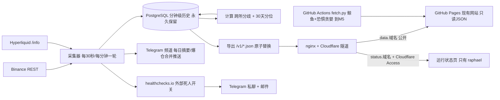

# hlens CryptoPlus · 架构与方案设计（M1 + M2）

> 日期 2026-09-19 · 状态：**v1，待 raphael 确认**（PROGRESS 任务 M1-0）。确认前不派发任何编码任务。
>
> 怎么读：**第 1 节写给 raphael**，不含术语，看完就能判断"这东西是不是我要的"；第 2–12 节写给 agent，是派活与验收的依据。需求编号 `F1`–`F12` 指 `01-FEATURES.md` 的 12 个功能；硬约束来自 `00-PROJECT.md` §7。凡标 **估算** 的数字都附了算式。凡本文与 00 / 01 不一致之处，都在该节里明写，不偷偷改。

## 1. 一页说清

一台 VPS 上跑四个东西：一个 **数据库**（存所有历史）、一个 **采集器**（每 30 秒问两所要一次价格与费率、每分钟要一次持仓量，写库、算分位、导出 JSON 文件）、一个 **文件服务器**（把 JSON 端出去）、一个 **隧道**（不用开任何公网端口）。除此之外没有别的服务。现有 GitHub Pages 网站继续跑在原地，只是在 M2 那天把"读哪里的数据"从仓库里的文件改成读这台机器的 JSON；鲸鱼与恐惧贪婪板块仍由现有的 GitHub Actions 管到 M5。

**M1 结束时 raphael 能看到**：手机上打开一个只有他能打开的运行状态页——两个数据源各自的最后写入时间、每分钟写入行数、过去 24 小时与 7 天的分钟缺口条数、磁盘、最近一次备份与恢复演练；采集停 10 分钟，手机上会同时收到 Telegram 私聊和邮件。线上站没有任何变化（F1–F6）。

**M2 结束时 raphael 能看到**：线上站变成一币一卡、两所并排，首页多一个分歧榜，每个数字后面跟一句"比过去 30 天 X% 的时候都大（n = …）"，历史不够就写"数据积累中，已有 N 天"；每天早上 8 点频道里一条不超过 12 行的摘要；大额爆仓按 5 分钟合并推送、每处都带"下界"；站上一个研究页加一份能直接跑的 notebook（F7–F12）。



## 2. 模块清单

模块之间**只通过数据库表与 `hlens-core` 契约说话，不互相 import**（接缝 3）。表名就是接口：任何一行的生产者与消费者都在下表里写明，因此任何一个模块都能被单独重写或拆成独立进程，而不动其它模块。**同一个操作系统进程里可以住多个模块**——进程数是运维选择，模块边界是表边界，两件事不混。

| 模块 | 一句话 | 读 | 写 | 里程碑 | 需求 |
|---|---|---|---|---|---|
| `adapters`（已有 Binance，M1-1 加 HL） | 一个所怎么访问、字段怎么归一 | 交易所 API | 返回契约对象（不碰库） | M1 | F1 F2 F3 F12 |
| `universe` | 每天核对两所都在交易的永续，维护采集清单 | 交易所 `exchangeInfo` / `meta` | `instruments` `coin_universe` | M1 | F1 F3 |
| `collector` | 按节奏调用适配器，把观测写成分钟行 | `coin_universe` | `market_1m` `ls_ratio` `collector_run` | M1 | F2 F3 |
| `health` | 判定源是否静默、分钟序列有没有缺口 | `market_1m` `collector_run` | `source_health` `ingest_gap` | M1 | F2 F4 F5 F6 |
| `notify` | 把静默、恢复、摘要、爆仓推送发出去 | `source_health` `ingest_gap` `metric_pctl` `liquidations` | `notify_log` | M1/M2 | F4 F10 F12 |
| `backfill` | 一次性回补 30 天公开历史，并登记"只有 N 天" | 交易所历史端点 | `market_1m` `metric_coverage` | M2 | F8 |
| `compute` | 算跨所分歧四指标与 30 天分位 | `market_1m` | `divergence_1m` `metric_pctl` `metric_coverage` | M2 | F7 F8 F10 |
| `liquidation` | 接爆仓流，按币按小时聚合，永远带下界 | 交易所 WS | `liquidations` | M2 | F12 |
| `export` | 把对外要看的东西写成版本化 JSON 文件 | 上述所有表 | `/srv/v1/*.json`（文件，不是表） | M1/M2 | F5 F6 F7 F8 F9 F12 |
| `site`（现有静态站，只改配置与模板） | 读 JSON 渲染 | `/v1/*.json` | — | M2 | F9 F5 |
| `research` | 一次性导出公开数据集 + notebook | `market_1m` `divergence_1m` | Release 附件 + notebook | M2 | F11 |
| `wallet` 协议（只定接口不实现） | 钱包数据的独立协议，与行情分开 | — | — | M1 定义 / M5 实现 | 00 §7.3 接缝 5 |

M2 结束时的仓库形态（`(已有)` = 现在就在）：

```
packages/hlens-core/        (已有) contracts · adapters · ratelimit · preflight
  └ src/hlens_core/adapters/hyperliquid.py            M1-1 新增
  └ src/hlens_core/wallet/base.py                     M1-3 只有协议，无实现
packages/hlens-collector/   新增：universe · collector · health · notify · compute
  └ backfill/ · liquidation/ · export/ · migrations/NNN_*.sql
config/venues.yaml          (已有) · config/export.yaml 新增
deploy/compose.yml · nginx.conf · scripts/{backup,restore,drill}.sh   新增
research/2026-xx-funding-spread.ipynb                 M2 新增
index.html · assets/ · config.js · scripts/fetch.py · .github/  (已有，M2 只改 config.js 与币卡模板)
docs/ 00 01 02 06 PROGRESS
```

## 3. 数据模型（只列 M1 + M2 需要的表）

通用规则：时间一律 `timestamptz`（契约里的 UTC 毫秒在入库边界转换）；价格与费率用 `numeric`（不用 float，研究要可复现）；未知写 `NULL`，**绝不写 0**；每张时序表按月 `PARTITION BY RANGE (ts)`，**采集器启动时与每天各检查一次，提前建好未来两个月的分区，并另设一个 `DEFAULT` 分区兜底**（缺分区会让写入整批失败、采集悄悄停掉；状态页显示"下月分区已就绪"）；写入用 `INSERT … ON CONFLICT DO NOTHING`。

| 表 | 粒度 | 主键 | 主要列 | 留存 | 行/天 |
|---|---|---|---|---|---|
| `instruments` | 每所每合约每个版本 | (venue, venue_symbol, valid_from) | symbol(统一名) · venue_symbol(原始名) · mult · funding_interval_h · tick · status · valid_from/valid_to | 永久 | ~0（变更时才加行） |
| `coin_universe` | 每币一段在册期 | (symbol, in_from) | in_to · reason(两所都上架/单所下架) | 永久 | ~0 |
| `market_1m` | 每所每币每分钟 | (venue, symbol, ts) | mark · index · premium · funding_rate · funding_interval_h · **funding_rate_8h** · next_funding_ts · oi_base · oi_usd · vol24h_usd · chg24h_pct · ingest_ts · src · **grid_s** · backfilled | **永久，不降采样** | 518,400 |
| `ls_ratio` | Binance 每币每 kind 每 15 分钟 | (venue, symbol, kind, ts) | long_share · period | 永久 | 69,120 |
| `liquidations` | 每笔观测到的爆仓 | (venue, symbol, ts, event_id) | side · price · size · notional_usd · **throttled_source** · completeness=`lower_bound` | 永久 | 估算 20,000 |
| `divergence_1m` | 每币每分钟（派生，可重算） | (symbol, ts) | funding_spread_8h · mark_spread_bps · oi_share_bn · vol_share_bn · n_venues | 永久 | 259,200 |
| `metric_pctl` | 每币每指标最新一点 | (symbol, metric) | value · pctl · n · window_from/to · grid_s · updated | 覆盖写 | 720 行常驻 |
| `metric_coverage` | 每（所或跨所, 指标） | (scope, metric) | first_ts · self_from · backfill_from · days_available · grid_s_min · enough(bool) | 覆盖写 | ~30 行 |
| `definition_break` | 每次口径变更 | (metric, break_ts) | symbol(可空) · old_def · new_def · note | 永久 | ~1 次 |
| `source_health` | 每（所, 能力, 传输）当前态 | (venue, capability, transport) | ok · last_ok_ts · consecutive_fail · last_error_class · latency_ms | 覆盖写 | ~20 行 |
| `ingest_gap` | 每个缺口一行 | (venue, metric, from_ts) | to_ts · minutes · detected_at · cause | 永久 | 正常 0 |
| `collector_run` | 每轮采集 | (started_at) | lane(fast/slow) · rows_written · errors · duration_ms | 永久（小） | 2,880 |
| `notify_log` | 每条已发消息 | (kind, dedupe_key) | sent_at · target · ok | 90 天 | < 300 |
| `ops_event` | 备份 / 恢复演练 / 磁盘检查 | (kind, ts) | ok · detail(jsonb) | 永久（小） | ~30 |

容量算式（**估算**，两所 × 180 币 × 每分钟）：
`market_1m` 2 × 180 × 1440 = **518,400 行/天** × 约 140 B = 72.6 MB/天 = **26.5 GB/年**；`ls_ratio` 180 × 4 kind × 96 = 69,120 行/天 = 1.8 GB/年；`divergence_1m` 180 × 1440 = 259,200 行/天 = 10.4 GB/年；`liquidations` 0.9 GB/年。小计约 **40 GB/年**，加索引与 WAL 余量 20% → **约 48 GB/年**。币数取 180（F1 验收区间 150–200 的中值）。

四件必须由数据结构本身回答的事：

1. **口径对齐可公开、原值与折算值同时可取（F3）**：`instruments` 是 SCD-2 表，`valid_from/valid_to` 本身就是版本，无需另建变更日志；`/v1/instruments.json` 由它生成并公开到 `/sources`。同一行 `market_1m` 同时存 `funding_rate`（该所原生周期原值）、`funding_interval_h`、`funding_rate_8h`（归一值，由契约自动算出），页面同屏显示两者不需要第二次查询。
2. **"这个指标只有 N 天历史"（F8）**：`metric_coverage` 每分钟刷新；`enough=false` 时页面一律显示"数据积累中，已有 N 天"，`metric_pctl` 对该指标不写 `pctl`。每行 `market_1m` 带 `grid_s`（自采 60；Binance OI 回补 300；HL 费率回补 3600；Binance 费率结算回补 28800）与 `backfilled`，所以"n 是怎么来的"永远可追溯，绝不外推。
3. **六所 → 两所的口径断点（F9b）**：`definition_break` 存切站日一行（metric=`crowding`、`oi_total`），前端据此画断点线；两段序列在不同的 `metric` 名下（`crowding_v6` 旧数据留档不更新，新序列叫 `crowding_v2venue`），**物理上就无法拼接**。
4. **爆仓的下界性质（F12）**：`liquidations.completeness` 默认 `lower_bound` 且 `throttled_source=true` 时契约禁止写 `full`（`contracts/market.py` 已有该校验）；所有聚合查询与导出都带这两列，导出字段名为 `observed_lower_bound_usd`，**导出层没有任何字段能表达"全市场总额"**。

接缝 4 的高频表（M4，**只命名、现在不建**）：`trade_tick`、`book_l2_1m`、`hf_whitelist`（按币白名单）。它们走自己的分区与自己的采集通道，打开时不碰分钟级链路。

## 4. 进程与调度

| 进程 | 类型 | 谁重启它 | 干什么 |
|---|---|---|---|
| `postgres`（容器） | 常驻 | Docker `restart: unless-stopped` | 唯一存储 |
| `collector`（容器，1 个 Python 进程 / 多个 asyncio 任务） | 常驻 | 同上 | 采集 · 健康 · 计算 · 导出 · 通知 · 每日摘要 |
| `web`（容器，nginx:alpine） | 常驻 | 同上 | 端出 `/v1/*.json` 与状态页静态文件 |
| `cloudflared`（容器） | 常驻 | 同上 | 出口隧道，无公网端口 |
| `backup.sh` | 宿主 systemd timer，每日 + 每小时 | systemd | 每日 `pg_dump` + 每小时增量 CSV → R2 |

**四个容器 + 一个定时器，没有第五个。** 每个都对得上需求：postgres = F2 留存；collector = F1–F4/F7/F8/F10/F12；web = F6 状态页与 F9 的 JSON 必须有一个 origin（nginx 是最小的那个，不是 API 服务器）；cloudflared = F6"不存口令、只有 raphael"与 F9"网站读得到"都要求一个不开公网端口的出口。`api` 容器 **M3 才加**。`collector` 内部不再拆进程：拆出去要么共享内存状态（违反接缝 3），要么多一份运维负担，而没有任何需求要求它们独立伸缩。**备份定时器故意放在宿主而不是容器里**——备份不能依赖被备份的那套东西还活着。

每分钟的采集周期与真实限速预算（`config/venues.yaml`）：

| 快慢道 | 调用 | 权重/次 | 次/分 | 权重/分 |
|---|---|---|---|---|
| 快道 30 s（价格 / 标记价 / 费率，F2 ≤ 60 s） | Binance `/fapi/v1/premiumIndex`（不传 symbol = 全市场） | 10 | 2 | 20 |
| 快道 30 s | HL `metaAndAssetCtxs`（一次拉全：markPx / funding / OI / dayNtlVlm） | 20 | 2 | 40 |
| 慢道 60 s（OI ≤ 2 min、成交份额） | Binance `/fapi/v1/openInterest`（**逐币**，180 币） | 1 | 180 | 180 |
| 慢道 60 s | Binance `/fapi/v1/ticker/24hr`（全市场，成交份额用） | 40 | 1 | 40 |
| 15 min（多空比 ≤ 15 min，只有 Binance 发布） | `/futures/data/{global,top}LongShort*` + `takerlongshortRatio` 四类 × 180 币 | 记 1 | 48 | 48 |
| 1 h | `exchangeInfo` · `fundingInfo`（独立桶）· HL `meta` | 1–20 | ~0.05 | ~1 |
| M2 常驻 | Binance WS `!forceOrder@arr`（爆仓，每符号每秒最多一条 → 下界） | 0 | 1 连接 | 0 |

**Binance 合计 ≈ 288 权重/分 = 预算 960 的 30%，官方上限 2400 的 12%；HL ≈ 40 权重/分 = 预算 1080 的 3.7%。** 一个出口 IP 完全够，余量很大：逐币 OI 是唯一随币数增长的项，Binance 预算要到约 **860 个币**才用完（(960−108)/1 ≈ 852，**估算**）。HL 在 06 §4 里"紧到 100%"是钱包工作（M5）造成的，M1/M2 的行情链路只用 4%。上机第一件事是跑已有的 `python -m hlens_core.preflight`：出口 IP / 国家 / 可达性 / 时钟偏差 < 1 s（VPS 必须开 chrony）/ 磁盘余量，任一项红就不启动采集。

## 5. 对外出口

| 方案 | 能否满足 ≤ 60 s | 判决 |
|---|---|---|
| 采集器把 JSON 提交到仓库、GitHub Pages 发布 | **不能**：一次 push → Actions 构建 → 部署约 1.5–3 分钟，且每天 1440 次提交会把仓库和 Actions 队列撑爆，还会和每 30 分钟的鲸鱼流水线抢 `concurrency: pages` | 否决 |
| **网站通过 Cloudflare 隧道读 VPS（选定）** | 能：观测 T → 导出 T+5 s → 边缘缓存 `max-age=20` → 浏览器看到的年龄 ≤ 30+5+20 = **55 s** | **选定**。成本 0（Cloudflare 免费层），复用状态页已经需要的隧道；网站只改 `config.js` 的 `dataBase` 为绝对 URL（现有代码第 331 行已经是可配置的），前端技术不动（F9） |
| 对象存储（R2 公共桶）每分钟上传 | 能（写 ≈ 17 万次/月，在免费 1M Class A 内） | 否决为主路径：多一条投递链路与一套凭据，而隧道已经存在。**留作回退**：隧道长期不稳时改用它约一天工作量 |

版本化方案：路径前缀 `/v1/` + 文件内 `{"schema":1,"generated_at":…,"as_of":{…每指标…},"coverage":{…},"data":…}`。加字段不升版本；删字段或改语义 = 新前缀 `/v2/`，`/v1/` 至少再留 30 天。文件清单：`/v1/latest.json`（约 180 币 × 两所，含分歧榜前若干行，估算 100 KB / gzip 20 KB）· `/v1/history.json`（稀疏化的 30 天序列，画卡片小图与断点线）· `/v1/instruments.json`（F3 的映射与折算规则）· `/v1/breaks.json`（F9b 断点）· `/v1/liquidations.json`（F12 列表，两档阈值）。写文件一律 **写临时文件再 `rename`**（原子替换，nginx 永远读不到半个文件）。**跨域**：网站在 GitHub Pages（另一个域名）上读 `data.<域名>`，所以 nginx 对 `/v1/*` 必须返回 `Access-Control-Allow-Origin`（只列网站自己的域名，只放行 GET）。**边缘缓存**：Cloudflare 默认不缓存 JSON，需在 `data.<域名>/v1/*` 上加一条 Cache Rule（免费层可用），按源站的 `Cache-Control: max-age=20` 缓存；不加这条规则，每个访客的请求都会打到 VPS。**VPS 或隧道不通时**：现有 `assets/app.js` 第 334 行读不到 `latest.json` 就整页报错，M2-4 要把它改成 F5 规定的行为——保留上次成功的数据、数字置灰、"更新于"一行变警示色。F5 的"更新于 X 分钟前"由前端用 `as_of` 每 30 秒自算，后端不参与；切站当天把旧站的 30 分钟口径文案统一到 10 分钟。

投递：**每日摘要** 00:00 UTC（北京 08:00）由 collector 直接调 Telegram Bot API 发到频道，≤ 12 行、单一市况模板（F10）；**爆仓推送** ≥ 100 万美元，每 5 分钟一个窗口，从 `liquidations` 表按窗口查询后**合并成一条**，`notify_log` 的 `(kind, dedupe_key=窗口起点)` 保证重启不重发（F12）；**心跳与静默告警** 用外部死人开关 healthchecks.io：三个 check（进程心跳、binance 有写入、hl 有写入），采集器每轮成功写入才 ping，grace 10 分钟，由 healthchecks 同时发 **Telegram 私聊 + 邮件**，恢复也发（F4）。这样告警不由"可能已经死了的那个进程"发出，也不需要在仓库或机器上放邮件服务凭据。若 healthchecks 免费层的 Telegram 集成不可用（**待实测**），回退：邮件仍走它，Telegram 私聊由采集器自己发（能覆盖单源静默，覆盖不了整机宕机——那一半由邮件兜）。

状态页访问（F6）：`status.<域名>` 只经 Cloudflare 隧道暴露，前面挂 **Cloudflare Access**（Zero Trust 免费层，策略 = raphael 一个邮箱 + 一次性验证码）。仓库里没有任何口令，链接发给别人也打不开。否决：HTTP Basic（口令要落盘、易进仓库）· 长随机 URL（不是访问控制，会进日志与历史）· 仅 Tailscale 可达（可行且免费，但要求手机常开 Tailscale；若 raphael 更想这样，改起来是删掉 Access 策略、十分钟的事）。状态页本身是**一张静态 HTML + 每分钟生成的 `status.json`**，没有后端框架、没有按钮。

## 6. 待评审选型的结论

| 行 | 选定 | 逼出它的需求 | 否决的备选与理由 | 以后改的代价 | 先坏在哪 |
|---|---|---|---|---|---|
| 存储引擎 | **原生 PostgreSQL 16 + 按月声明式分区，暂不装 TimescaleDB** | F2 永久保留、F8 30 天窗口查询 | TimescaleDB：压缩与 CAGG 很香，但 M1/M2 没有任何需求需要它（40 GB/年撑得住），代价是扩展与 PG 大版本绑定，且压缩任务卡死 / CAGG 刷新积压正是单人凌晨最难查的两类故障 · 文件 + Parquet：公开站要按币按时间点查，不合适 | 低：`CREATE EXTENSION` + `create_hypertable(migrate_data)`，一次维护窗口（40–80 GB 约数小时），应用不改 SQL（我们不用 Timescale 专有语法） | 磁盘。触发线：占用 > 60% 或 M4 开高频表 → 那时才装 |
| 派生数字算在哪 | **采集进程内的 Python 步骤 + SQL 聚合，落 `divergence_1m` / `metric_pctl` 小表**：每分钟重算一次 30 天分布，每 30 秒把最新值在分布里定位一次 | F7 F8 F10 | SQL 视图：导出、摘要、状态页三个读者各算一遍 · 物化视图：整表重建，算不了"最新值在窗口里的排名" · 独立计算进程：无需求 | 低（一个模块） | 30 天窗口填满那天（上线后第 30 天）：`divergence_1m` 30 天 ≈ 778 万行的扫描。若该步 > 10 s，改成增量直方图（每币每指标 O(1) 更新） |
| 备份 | **每日 `pg_dump` 全量 + 每小时把上一小时的 `market_1m`/`ls_ratio`/`liquidations` 追加导出为 CSV.gz → R2**（约 3 MB/小时，估算 2 GB/月，R2 约 0.5 美元/月） | 00 §7.1、F6（要显示最近备份与演练）、F2（没采的分钟补不回来） | 只做每日全量：RPO 24 小时 = 最多永久丢一天 HL 持仓量（HL 不可回补） · WAL 归档 / pgBackRest：RPO 更好但运维面大一圈，与"凌晨单人排障"相悖 | 低 | **RPO：原始序列 ≤ 1 小时，派生与元数据 ≤ 24 小时**（派生可重算）；RTO 约 2 小时 |
| API 形态与 Web 框架 | **M1/M2 不需要，M3 再定**。现在对外只有静态 JSON 文件 + nginx | F9 明说前端只读版本化 JSON | 现在就上 FastAPI：M1/M2 没有任何需求需要动态查询接口；早上等于白养一个容器与一套契约 | — | — |
| 前端框架 | **不选，留在"以后"**（00 §5.3）。M2 只改 `config.js` 与币卡模板 | F9 明说 M2 不换前端技术 | 现在引入 Next.js：与 F9"不换技术"直接冲突 | — | — |
| 部署 | **Docker Compose 四容器 + 宿主 systemd timer** | 00 §7.1；RTO 2 小时要求"新机器上一条命令重建" | 宿主直装 + 三个 systemd unit：日常更简单，但重建要一份手写步骤清单，演练不可验证 · k8s / Swarm：一台机器，无需求 | 中（换成 systemd 约一天） | Docker 升级或磁盘满导致容器起不来；`compose.yml` + `restore.sh` 每月演练一次即可发现 |
| 数据库访问 | **psycopg 3 + 编号 `.sql` 迁移**（一张 `schema_migrations` 表，10 行的执行器） | 接缝 3（表就是接口） | SQLAlchemy / ORM：我们的读写是批量 upsert 与窗口聚合，ORM 只添一层 · Alembic：它需要 ORM 模型才好用 | 低 | 无 |
| 研究笔记怎么读数（F11） | notebook **只读一份公开的 Parquet 快照**（GitHub Release 附件，附 sha256，约 30 MB 估算），不连生产库；raphael 自己探索时用只读 DB 账号经 SSH/Tailscale 跑 psql | F11 要求仓库里的 notebook 能"直接跑" | notebook 连生产库：外人跑不了，等于不可复现 · 把 CSV 放进仓库：约 200 MB，撑爆仓库 | 低 | Release 附件 2 GB 上限，M2 用不到 |
| 静态文件服务 | `nginx:alpine` + 一个配置文件 | F6 F9 需要一个 origin | Caddy：自动证书是它的强项，但 TLS 在 Cloudflare 终止，用不上 · 用 Python `http.server` 塞进采集器：省一个容器，却把"网页挂了"和"采集挂了"绑成一件事 | 低 | 无 |
| 错误监控 | **不引入 Sentry**：journald 日志 + `source_health`/`ops_event` 计数上状态页 | 无需求 | Sentry 免费层：没有任何已确认需求要求它 | 低 | — |

**与 00 / 01 的三处不一致，必须由 raphael 拍板**：
- 00 §7.4 与 PROGRESS 的"PostgreSQL 16 + TimescaleDB"：本文按 §7.4 原文"扩展的取舍随 M1-4 表结构设计定"，结论是**暂不装**（理由见上表）。
- 00 §7.1"GitHub Pages 同时是主站的降级模式"：切站后 `fetch.py` 的行情部分退役，Pages 上**不再有行情数据**，所以 VPS 宕机时行情的降级行为是 F5 规定的"置灰 + 显示最后成功时间"，不是"回退到 Pages 快照"。鲸鱼与恐惧贪婪的降级仍成立（到 M5）。
- **F12 在 M2 无法对 Hyperliquid 成立**：06 §2.5 已实测 HL 的 `trades` 流**不带**强平字段，逐笔强平只出现在钱包级 `userFills` 上——那是 M5 的机器。最小改法（不加组件）：M2 的爆仓事件流与总量句子写成"**Binance 已观测爆仓 ≥ $X**"（仍是"点名交易所 + ≥"，符合 F12 的不可协商条款），币卡上 HL 那一栏写"该所无公开爆仓流"；HL 在 M5 随钱包链路接入。
- **F8 的费率差回补**：各所自己的费率历史都能回补 30 天，但"两所费率差"的分钟序列回补不了（Binance 历史只有每 8 小时的结算值，HL 是每小时）。两个选项请 raphael 选：(a) 头 30 天的费率差分位建在 8 小时网格上（n ≈ 90，**估算**，句子里如实写 n 与网格），(b) 头 30 天直接显示"数据积累中，已有 N 天"。默认取 (b)，因为它不需要向用户解释第二种网格。

## 7. 容量与最低机器规格

- **磁盘**：约 48 GB/年（§3 算式，**估算**）+ 数据库自身与 OS 约 10 GB + 本地保留两份 dump 约 12 GB → 第一年约 **70 GB**。
- **内存**：分位计算希望把 30 天的 `divergence_1m`（约 0.85 GB）与近月 `market_1m` 留在页缓存里 → `shared_buffers` 1 GB + 页缓存 → **4 GB 起**；采集器 Python 约 300 MB。
- **CPU**：每 30 秒 2 个全市场请求、每分钟 180 个逐币请求 + 约 700 行 upsert + 一次窗口聚合 → 稳态远低于 1 核；峰值（爆仓级联日 + 分位重算）约 1 核。
- **最低机器（M1 + M2）**：**2 vCPU / 4 GB RAM / 80 GB SSD，非美国出口，出口 IP 不得与 hub 任一 worker 相同**（06 §4 规则 1）。40 GB 盘只够约 10 个月，不要买。
- **想一次买对（M4 也能跑）**：4 vCPU / 8 GB / ≥ 320 GB。M4 的量级差一到两个数量级：10 个白名单币的逐笔成交 + 盘口，**估算** 每天千万行级、每天 5–15 GB，即分钟链路的约 100 倍——这就是 M4 门控在容量实测上的原因，也是 TimescaleDB 压缩到那时才有意义的原因。

## 8. 故障与恢复

| 最先坏的 | 怎么发现 | 数据怎么诚实记录 |
|---|---|---|
| Binance 逐币 OI 循环撞限速（429 → 继续打就 418 封 IP 2 分钟到 3 天） | 已有的 AIMD 砍到 75% 并冻结 1 小时；`source_health.consecutive_fail`；healthchecks 的 `binance` check 超 10 分钟未 ping → TG + 邮件 | 缺的分钟不补零：`market_1m` 就是没有那些行，`ingest_gap` 记一行（F2 验收看的正是这个数） |
| 单源静默（HL 改协议、域名被封） | 同上，per-source check；状态页该源行变红并显示最后成功时间 | 另一源照常写入，页面该所数字置灰（F5 F7） |
| 30 天窗口填满后分位步骤变慢 | `collector_run.duration_ms` 上状态页 | 慢不影响正确性；超 10 s 就换增量直方图 |
| 磁盘满（约 12–14 个月，估算） | 状态页三个数字之一 + 70% 时 `ops_event` 告警 | — |
| 爆仓级联日 WS 洪峰 | 批量插入 + 5 分钟合并窗口；`notify_log` 限一条 | 每行带 `throttled_source` 与 `lower_bound`，聚合层无法丢掉这个性质 |
| 整机宕机 / 被回收 | healthchecks 心跳 10 分钟 → TG + 邮件；网站按 F5 置灰 | — |

恢复流程（每月演练一次，结果写 `ops_event`，状态页显示最近一次）：新机器 → 装 Docker → `git clone` → 填 `.env`（隧道令牌、R2 凭据、Bot token、healthchecks URL，**都不在仓库里**）→ `scripts/restore.sh`（拉最近一份 dump + 之后每小时的 CSV，`COPY` 回原始表）→ `compose up -d` → 跑 preflight → 重算派生表。**诚实的 RPO / RTO：原始分钟序列 ≤ 1 小时，派生与元数据 ≤ 24 小时（可重算），RTO 约 2 小时，无 SLA。** 丢掉的那一小时里，价格与费率理论上还能从公开历史回补，**HL 的持仓量永远补不回来**——这正是把备份从"每日"加密到"每小时增量"的唯一理由。

## 9. 后续里程碑怎么接进来

| 里程碑 | 接在哪 | 哪个接缝保证安全 | 什么会逼出重写 |
|---|---|---|---|
| M3 精简 REST API | 新加 `api` 容器，读同一批表；`/v1/*.json` 导出照旧（前端不受影响） | 接缝 3 + 前端只读 JSON | 如果现在让前端直连数据库或把业务计算写进前端 |
| M4 逐笔 / 盘口 / 现货 | 新建 `trade_tick` / `book_l2_1m` + `hf_whitelist`，独立分区与独立采集任务；适配器只补实现，协议不动（能力已声明为 unsupported） | 接缝 2 + 接缝 4 | 如果把逐笔塞进 `market_1m` 或让高频表共用分钟链路的分区策略 |
| M5 钱包 / 大户 + hub 导入 | 实现 M1-3 定义的 `wallet` 协议；新 `hl_*` 表；导入在 hub 上只读运行；HL 爆仓此时接入 F12 | 接缝 5 | 如果把钱包方法加进 `VenueAdapter` |
| M6 状态词典 / 记分板 / `/status` | 只读 `market_1m` 与 `divergence_1m`，不需要新采集 | 接缝 3 | 如果 M1 降采样或删除过分钟级历史——那就只能重新等三个月 |
| 以后：前端框架化、对外 WS（带 Redis）、更多交易所 | 新前端仍只读 `/v1/*.json`；新所 = 加一个适配器文件 | 前端接缝 + 接缝 1/2 | 如果 JSON 不做版本化 |

## 10. 建造顺序（一次只开一个模块）

M1（每条都有 raphael 不读代码就能验的检查）：

| # | 模块 | raphael 的检查 |
|---|---|---|
| M1-1 | HL 行情适配器（仅行情方法） | 跑一条命令，屏幕上打出 180 个币的统一名、原始名、标记价、每小时费率与折算后的 8 小时费率；挑一个币和 HL 官网对得上 |
| M1-3 | 适配器协议补逐笔 / 盘口能力声明（标 unsupported）+ 钱包协议只定接口 | 一张能力表打印出来：两所各能力的 `supported/mode/completeness`，逐笔与盘口是 `unsupported`，钱包不在这张表里 |
| M1-4 | 建表与迁移（§3 的表；高频表只写在文档里不建） | `\dt` 列出的表与本文 §3 表名一致，且 `market_1m` 为空表待写入 |
| M1-5 | 采集器快慢道 + universe + health（含缺口检测） | 本机跑 10 分钟：每分钟写入行数约 360、分钟缺口 0 条、币数在 150–200 之间 |
| M1-6 | Compose 上机 + preflight（**阻塞于 RB-1**） | preflight 表全绿（出口 IP、国家、两所可达、时钟 < 1 s、磁盘） |
| M1-7 | 备份（每日全量 + 每小时增量）+ healthchecks 死人开关 + 一次恢复演练 | 手动停掉采集，11 分钟内手机同时收到 Telegram 私聊与邮件，恢复后各收到一条；演练把库恢复到新机器并打出行数对账 |
| M1-10 | 运行状态页（静态 HTML + `status.json` + Cloudflare Access） | 手机上能打开并看到 §1 列的那些数字；把链接发给别人，对方打不开 |
| M1 验收 | — | 连续 14 天两源绿色 ≥ 95%、磁盘增长在 §7 估算 ±20% 内、演练完成 |

M2（M1 连续 14 天稳定之后才允许开始切站那一步）：

| # | 模块 | raphael 的检查 |
|---|---|---|
| M2-1 | 30 天回补 + `metric_coverage` | 状态页上每个指标显示"已有 N 天"：价格与费率约 30 天，Binance 持仓量约 30 天（5 分钟网格），HL 持仓量从 0 开始每天加一 |
| M2-2 | `compute`：分歧四指标 + 30 天分位 | 一张表打印分歧榜前 10 行：每行有分位百分比与 n，历史不足的行显示"数据积累中" |
| M2-3 | `export`：`/v1/*.json` + 隧道公开 | 手机浏览器打开 `data.<域名>/v1/latest.json`，里面 `as_of` 距现在 < 60 秒 |
| M2-4 | 站点升级（币卡两所并排 + 分歧榜 + 分位句 + 断点线）；**切站** | 打开任一币的拥挤度历史图看到断点线、两侧不连；鲸鱼板块照常更新；分歧榜第一行的差值他能手算出来 |
| M2-5 | 爆仓事件流（Binance）+ 5 分钟合并推送 | 大跌时首页列表每处金额旁都有"下界"、找不到"全市场"字样、5 分钟内频道最多一条 |
| M2-6 | 每日摘要 00:00 UTC | 每天早上 8 点频道一条 ≤ 12 行、无任何带动作的句子 |
| M2-7 | 首篇研究（页面 + 公开快照 + notebook） | 点研究页链接能下到 notebook 与数据快照，页面上有 n 与证据标签；结论是"没有效应"也照发 |

## 11. 故意没有的东西

| 删掉的 | 为什么没有需求需要它 |
|---|---|
| 消息队列（Redis Stream / Kafka） | 生产者与消费者在同一个进程里、节奏是每 30 秒一轮；表就是队列 |
| 缓存（Redis） | 对外只有每 30 秒重写一次的静态 JSON，Cloudflare 边缘就是缓存；Redis 按 00 §7.4 随对外 WS 推送再来 |
| 第二个数据库 / 第二台机器 | 硬约束一台 VPS；双机 HA 在"以后" |
| API 服务器（FastAPI）与 OpenAPI 契约 | M1/M2 的前端只读版本化 JSON（F9）；M3 才需要 |
| ORM / SQLAlchemy / Alembic | 读写全是批量 upsert 与窗口聚合；`.sql` 迁移 + psycopg 3 更少零件 |
| 调度框架（Airflow / Prefect / Celery）与 cron 容器 | 一个 asyncio 循环 + 一个宿主 systemd timer 就是全部调度需求 |
| Prometheus / Grafana | F6 要的是一页只读数字，不是图表面板；状态页的 `status.json` 就够 |
| Sentry / 自建监控 | 无需求；且监控自己不该住在被监控的机器上，这件事已由外部死人开关解决 |
| 前端框架、构建步骤、深色模式改造、搜索筛选 | F9 明确不做 |
| M1 的 WS 行情流、K 线表、预测费率、CoinGecko 市值、宏观表 | 30 秒 REST 已满足 F2 的新鲜度；没有任何 M1/M2 功能消费 K 线、预测费率或市值（K 线端点只在 M2 的一次性回补里用一次，不建常驻表） |
| 多空比进分歧榜、"全市场爆仓总额"、可切换分位窗口 | F7 F8 F12 明确不做——不做就不建对应的表与字段 |
| 可写的管理后台、用户系统、登录 | F6 明确只读；00 §4 核心不登录 |

## 12. 需要 raphael 回答的问题

1. **VPS**（RB-1，阻塞 M1-6）：按 §7 的最低规格（2 vCPU / 4 GB / 80 GB、非美国）还是一次买到 M4 的规格（4 vCPU / 8 GB / ≥ 320 GB）？供应商与地区？月租预算多少？
2. **域名**（RB-3，阻塞 §5 全部）：用哪个域名？两个子域名叫什么（建议 `data.` 与 `status.`）？
3. **Cloudflare 账号**：哪个邮箱作为状态页唯一可登录人（Cloudflare Access 免费层）？或者你更愿意只经 Tailscale 打开状态页？
4. **告警账号**：注册 healthchecks.io（免费）还是 Better Stack？收告警的 Telegram 私聊与邮箱各是哪个？
5. **R2 桶**：开一个，接受约 0.5 美元/月（每小时增量备份把原始数据的 RPO 从 24 小时收紧到 1 小时）；如果你想省这笔，就只做每日备份、接受最坏丢一天 HL 持仓量。
6. **Telegram**：公开频道的 id，以及确认 bot 是该频道管理员（F10 F12 发频道，F4 发私聊，是两个不同目标）。
7. **两处需求让步请拍板**（见 §6 末）：M2 的爆仓写成"Binance 已观测爆仓 ≥ $X"（HL 到 M5）；头 30 天的费率差分位选 (a) 8 小时网格带 n ≈ 90 还是 (b) 显示"数据积累中"。
8. **研究页与数据快照的对外名字**：研究页放在站上哪个路径、第一篇的标题用 F11 里那句还是你另起。
9. 不阻塞的确认：CoinGecko Demo key 在 M1/M2 **用不到**（没有功能消费市值），RB-3 里这一项可以推迟到 M3 之后。
