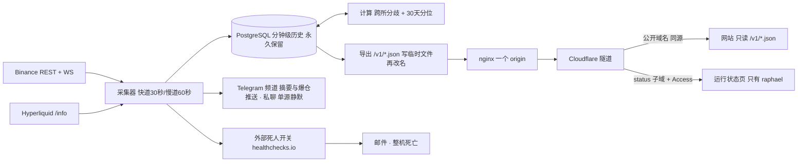

# hlens CryptoPlus · 架构与方案设计（M1 + M2）

> 怎么读：**第 1 节写给 raphael**，不含术语，看完就能判断"这东西是不是我要的"；第 2–15 节写给 agent，是派活与验收的依据。功能编号 `F1`–`F12` 指 `02-FEATURES.md`；原则与里程碑见 `01-PRODUCT.md §4`；端点、权重与限速见 `04-DATA-SOURCES.md §3` `§4`；任务编号见 `PROGRESS.md`。凡标 **估算** 的数字都附算式。需求修正集中在第 8 节，交 raphael 拍板。

## 1. 一页说清

一台 VPS 上跑四个东西：一个 **数据库**（存所有历史）、一个 **采集器**（每 30 秒问两所要一次价格与费率、每分钟要一次持仓量，写库、算分位、导出 JSON 文件）、一个 **文件服务器**（同时端出网站和 JSON）、一个 **隧道**（不开任何公网端口）。除此之外没有别的服务。

**M1 结束时 raphael 能看到**：手机上打开一个只有他能打开的运行状态页——两个数据源各自的最后写入时间、每分钟写入行数、过去 24 小时与 7 天的分钟缺口条数、分区已备到哪个月、磁盘、最近一次备份与恢复演练。采集停 10 分钟，手机上收到两条互不依赖的告警：Telegram 私聊和邮件。M1 不产生任何公开页面（F1–F6）。

**M2 结束时 raphael 能看到**：一个公开网站，一币一卡、两所并排，首页一个分歧榜，每个数字后面跟一句"比过去 30 天 X% 的时候都大（n = …）"，历史不够就写"数据积累中，已有 N 天"；每天早上 8 点频道里一条不超过 12 行的摘要；大额爆仓按 5 分钟合并推送、每处都带"下界"；站上一个研究页加一份能直接跑的 notebook（F7–F12）。

页面上的数字**最坏落后 35 秒**（观测 30 秒一次 + 导出 5 秒，第 7 节有算式），在 F2 承诺的 60 秒内。

## 2. 五个接缝（M1 要建立的东西）

这五处改起来贵，所以现在定死，其余等做到时再定；它们都还不存在，**建立它们就是 M1 的主要内容**。

| # | 接缝 | 具体形态 | 破坏它的代价 |
|---|---|---|---|
| ① | **归一化数据契约** | `packages/hlens-core/contracts`：pydantic v2 模型，价格与费率一律 `Decimal`，时间一律 UTC 毫秒整数，每条记录必带 `venue` `symbol` `ts` `ingest_ts` `source`，另带 `semantic`（这个价是标记价还是收盘价） | 两所口径混进业务代码，F3 的"原值与折算值同时可取"再也说不清 |
| ② | **带能力声明的适配器协议** | 每个能力分开声明 `supported` / `mode` / `completeness`（`01-PRODUCT.md §4.7` 的能力三问）。能力枚举里**现在就有 `trade_stream`（逐笔）与 `book_l2`（盘口）两个成员，两所都标 `unsupported`**，M4 只补实现、不改协议；爆仓类能力的 `completeness` 只能是 `lower_bound`。**钱包类能力不在这个枚举里**（归接缝 ⑤） | 加一个所要改所有调用点；M4 打开逐笔要改协议，全部适配器跟着改 |
| ③ | **模块间只通过数据库表与契约通信，不互相 import** | 表名就是接口（第 5 节每张表写明写方）。**可执行**：每模块一个子包 + ruff `flake8-tidy-imports` 的 banned-api 规则禁止跨模块 import + `tests/test_module_boundaries.py` 按 AST 断言依赖图。reviewer 的检查动作就是跑这个测试 | 任何一层都无法单独重写；进程拆分变成大改 |
| ④ | **高频数据单独建表 + 按币白名单** | `trade_tick` `book_l2_1m` `hf_whitelist` 现在只命名、不建表；它们有自己的分区与自己的采集通道 | 逐笔塞进 `market_1m`，M4 一开分钟链路跟着崩 |
| ⑤ | **钱包数据有自己的协议**，与行情适配器分开 | M1 只定义接口、无实现；行情适配器里不出现任何钱包方法或钱包能力 | M5 要动 M1 的行情代码 |
| 前端 | **前端只读版本化 JSON** | 站点只读 `/v1/*.json`，不直连数据库、不含业务计算 | M3 的 API 与以后换前端框架都会变成后端改造 |

## 3. 技术栈

| 层 | 选定 | 状态 |
|---|---|---|
| 后端语言与工具链 | Python ≥ 3.12、uv、hatchling、ruff（line 100）、mypy、pytest + pytest-asyncio + respx | **已定** |
| 后端库 | httpx、websockets、pydantic v2、pyyaml | **已定** |
| 数据库 | PostgreSQL 16，按月声明式分区，**暂不装 TimescaleDB** | **已定**（第 9 节有触发线） |
| 数据库访问 | psycopg 3 + 编号 `.sql` 迁移（一张 `schema_migrations` 表 + 约 10 行执行器） | **已定** |
| 静态文件服务 | nginx（`nginx:alpine`），一个配置文件，同时端网站与 `/v1/*.json` | **已定** |
| 部署 · 出口 · 访问控制 · 备份 | Docker Compose 四容器 + 宿主 systemd timer；Cloudflare Tunnel（无公网端口）+ Cloudflare Access（状态页）；Cloudflare R2 | **已定** |
| 前端 | 纯 HTML + CSS + 原生 JS，无构建步骤、无框架 | **已定**（M2 建站） |
| API 形态与 Web 框架 | 未选 | **推迟**：M3 之前没有任何需求需要动态接口 |
| 前端框架 · Redis | 未选 | **推迟**：前端框架等站点大到纯 HTML/CSS/JS 撑不住再评；Redis 随对外 WebSocket 推送到来 |

## 4. 模块清单

模块之间**只通过数据库表与 `hlens-core` 契约说话，不互相 import**（接缝 ③）。**同一个操作系统进程里可以住多个模块**——进程数是运维选择，模块边界是表边界，两件事不混。每张表只有一个写方；`source_health` 的观测列与判定列分属两个写方，列级写明。

| 模块 | 一句话 | 读 | 写 | 里程碑 | 需求 |
|---|---|---|---|---|---|
| `contracts` · `ratelimit` | 归一化数据契约；按公网出口 IP 记账的限速预算（权重桶 + 请求桶） | `config/venues.yaml` | — | M1 | 接缝 ① F2 F3 |
| `preflight` | 上机自检 CLI | 交易所探针 · 主机 | `source_health`（观测列） | M1 | F2 F4 F6 |
| `adapters` | 一个所怎么访问、字段怎么归一、声明了什么能力 | 交易所 API | 返回契约对象（不碰库） | M1 | F1 F2 F3 F12 |
| `universe` | 每天核对两所都在交易的永续，维护采集清单 | `exchangeInfo` / `meta` | `instruments` `coin_universe` | M1 | F1 F3 |
| `collector` | 按节奏调用适配器，把观测写成分钟行；落适配器的健康观测 | `coin_universe` | `market_1m` `ls_ratio` `collector_run` `source_health`（观测列） | M1 | F2 F3 |
| `health` | 判定源是否静默、分钟缺口、**分区够不够（拥有分区 DDL）**、磁盘 | `market_1m` `collector_run` `pg_catalog` | `source_health`（判定列） `ingest_gap` `ops_event` · 分区 | M1 | F2 F4 F5 F6 |
| `notify` | 把静默、恢复、摘要、爆仓推送发出去 | `source_health` `metric_pctl` `liquidations` | `notify_log` | M1/M2 | F4 F10 F12 |
| `backfill` | 一次性回补公开历史，并登记"只有 N 天" | 交易所历史端点 | `market_1m` `metric_coverage` | M2 | F8 F11 |
| `compute` | 算跨所分歧四指标与 30 天分位 | `market_1m` | `divergence_1m` `metric_pctl` `metric_coverage` | M2 | F7 F8 F10 |
| `liquidation` | 接爆仓流，按币按小时聚合，永远带下界 | Binance WS | `liquidations` | M2 | F12 |
| `export` | 把对外要看的东西写成版本化 JSON 文件 | 上述所有表 | `/srv/site/v1/*.json`（文件，不是表） | M1/M2 | F5 F6 F7 F8 F9 F12 |
| `site` | 读 JSON 渲染的静态站 | `/v1/*.json` | — | M2 | F5 F9 |
| `research` | 一次性导出公开数据集 + notebook | `market_1m` `divergence_1m` | Release 附件 + notebook | M2 | F11 |
| `wallet` 协议（只定接口不实现） | 钱包数据的独立协议 | — | — | M1 定义 / M5 实现 | 接缝 ⑤ |

仓库形态：`packages/hlens-core/`（contracts · ratelimit · preflight · adapters/{base,binance,hyperliquid} · wallet/base.py）· `packages/hlens-collector/`（上表其余模块 + `migrations/NNN_*.sql`）· `config/{venues,export}.yaml` · `deploy/{compose.yml,nginx.conf}` + `scripts/{backup,restore,drill}.sh` · `site/`（index.html · assets/ · `/sources` 与法律页）· `research/*.ipynb` · `docs/`。

## 5. 数据模型（只列 M1 + M2 需要的表）

通用规则：时间一律 `timestamptz`（契约里的 UTC 毫秒在入库边界转换）；价格与费率用 `numeric`（不用 float，研究要可复现）；未知写 `NULL`，**绝不写 0**（`01-PRODUCT.md §4.7`）；每张时序表按月 `PARTITION BY RANGE (ts)`。

**写入规则分两种，这是新鲜度能不能达标的关键**：`market_1m` 的每一行是"这一分钟最后一次观测"，**同一分钟内后到的观测覆盖先到的**，按列组分开判断——`ON CONFLICT (venue, symbol, ts) DO UPDATE SET <该列组> … WHERE excluded.<该列组的观测时刻> > coalesce(市场表.<同一列>, '-infinity')`。两个观测时刻列：`obs_ts_fast`（价格 / 标记价 / 费率，快道 30 秒）与 `obs_ts_oi`（持仓量，慢道 60 秒），导出的 `as_of` 按列组各取其一（F5 要求按源按指标显示落后多久）。其余表（`ls_ratio` `liquidations`）是纯追加，用 `ON CONFLICT DO NOTHING`。**代价写明**：分钟格内被覆盖的那次观测不入库；F2 只要求每分钟一点，这是分钟粒度留存的直接后果。

**分区规则（有主人，否则采集会在下个月 1 号整批失败）**：迁移里预建 3 个月；`health` 模块**拥有分区 DDL**，启动时与每天各检查一次，保证未来两个月的分区存在，并另设一个 `DEFAULT` 分区兜底。状态页显示"分区已备到 YYYY-MM"与"DEFAULT 分区行数"（后者 > 0 本身就是"有人忘了建分区"的报警）。

| 表 | 粒度 | 主键 | 主要列 | 留存 | 行/天 |
|---|---|---|---|---|---|
| `instruments` · `coin_universe` | 每所每合约每个版本（SCD-2）／每币一段在册期 | (venue, venue_symbol, valid_from) / (symbol, in_from) | symbol(统一名) · venue_symbol · mult · funding_interval_h · tick · status · valid_from/valid_to ／ in_to · reason(两所都上架/单所下架) | 永久 | ~0 |
| `market_1m` | 每所每币每分钟 | (venue, symbol, ts) | mark · index · premium · funding_rate（该所原生周期原值）· funding_interval_h · next_funding_ts · oi_base · oi_usd · vol24h_usd · chg24h_pct · **obs_ts_fast** · **obs_ts_oi** · ingest_ts · src · **semantic** · **grid_s** · backfilled | **永久，不降采样** | 518,400 |
| `ls_ratio` | Binance 每币每 kind 每 15 分钟（kind = 散户账户 / 大户持仓 / 主动买卖，**三类**） | (venue, symbol, kind, ts) | long_share · period | 永久 | 51,840 |
| `liquidations` | 每笔观测到的爆仓 | (venue, symbol, ts, event_id) `event_id NOT NULL` | side · price · size · notional_usd · **throttled_source** · **completeness=`lower_bound`** | 永久 | 估算 20,000 |
| `divergence_1m` | 每币每分钟（派生，可重算） | (symbol, ts) | funding_spread_8h · mark_spread_bps · oi_share_bn · vol_share_bn · n_venues | **35 天滚动**，老分区 drop | 259,200 |
| `metric_pctl` | 每币每指标最新一点 | (symbol, metric) | value · pctl · n · window_from/to · grid_s · updated | 覆盖写 | 720 行常驻 |
| `metric_coverage` | 每（所或跨所, 指标） | (scope, metric) | first_ts · self_from · backfill_from · days_available · grid_s_min · enough(bool) | 覆盖写 | ~30 行 |
| `source_health` | 每（所, 能力, 传输） | (venue, capability, transport) | 观测列 last_ok_ts · latency_ms · last_error_class（写方 collector / preflight）· 判定列 ok · consecutive_fail（写方 health） | 覆盖写 | ~20 行 |
| `ingest_gap` | 每个缺口一行 | (venue, metric, from_ts) | to_ts · minutes · detected_at · cause | 永久 | 正常 0 |
| `collector_run` | 每轮采集 | (lane, started_at) | rows_written · errors · duration_ms | 永久（小） | 4,320 |
| `notify_log` · `ops_event` | 每条已发消息 / 每次备份 · 演练 · 磁盘与分区检查 | (kind, dedupe_key) / (kind, ts) | sent_at · target · ok / ok · detail(jsonb) | 90 天 / 永久（小） | < 300 / ~30 |

三处键的细节：`liquidations.event_id` **NOT NULL**，交易所不给 id 时由适配器用 (ts, symbol, side, price, size) 的确定性哈希兜底（NULL 进不了主键，否则偶发插入失败）；`collector_run` 主键含 `lane`（两道同时起才不撞）；`market_1m.semantic` 记住"这个价是标记价还是 K 线收盘价"——回补的 HL 价格来自 `candleSnapshot` 收盘价，只靠 `grid_s` / `backfilled` 记不住这个口径差。

容量算式（**估算**，两所 × 180 币 × 每分钟；币数取 180 = F1 验收区间 150–200 的中值）。**单行按 250 B**：字段约 140 B + Postgres 元组头 23 B + 主键索引约 85 B（分钟级表上索引通常是堆的 40–60%），这个数字**在 M1-C 用 `pg_total_relation_size ÷ 行数` 实测校准**，买机器之前只能用估算值。`market_1m` 2 × 180 × 1440 = **518,400 行/天** × 250 B = 130 MB/天 = **47.3 GB/年**；`ls_ratio` 180 × 3 × 96 = 51,840 行/天 = 4.7 GB/年；`liquidations` 1.8 GB/年；`divergence_1m` 只保 35 天 = 259,200 × 35 × 250 B ≈ **2.3 GB 常驻、不增长**。第一年增量约 **56 GB**。

三件必须由数据结构本身回答的事：

1. **口径对齐可公开、原值与折算值同时可取（F3）**：`instruments` 是 SCD-2 表，`valid_from/valid_to` 本身就是版本；`/v1/instruments.json` 由它生成并公开到 `/sources`。表里只存 `funding_rate` 与 `funding_interval_h`，**不存折算后的 8 小时费率**——它等于 `funding_rate × 8 ÷ funding_interval_h`，由契约在读出与导出时算一次。存输入又存输出只会漂移，删列之后 F3 的"同屏显示两者"照样成立。
2. **"这个指标只有 N 天历史"（F8）**：`metric_coverage` 每分钟刷新；`enough=false` 时页面一律显示"数据积累中，已有 N 天"，`metric_pctl` 对该指标不写 `pctl`。每行 `market_1m` 带 `grid_s`（自采 60；Binance OI 回补 300；HL 费率回补 3600；Binance 费率结算回补 28800）、`semantic` 与 `backfilled`，所以"n 是怎么来的"永远可追溯，绝不外推。**跨所费率差分位按确认口径头 30 天一律显示"数据积累中"，不搭第二种网格**；标记价差可用两所 1 分钟 K 线回补到同一网格，上线即有分位；持仓量份额因 HL 不可回补，等 30 天。**F10 的市况行（全市场费率中位数）同属此列**：它要 30 天分钟级全市场序列，回补不出来，所以 `market_funding_median` 也登记进 `metric_coverage`，头 30 天照 F8 写"数据积累中，已有 N 天"。
3. **爆仓的下界性质（F12）**：`liquidations.completeness` 默认 `lower_bound`，`throttled_source=true` 时契约禁止写 `full`；所有聚合查询与导出都带这两列，导出字段名为 `observed_lower_bound_usd`，**导出层没有任何字段能表达"全市场总额"**。

接缝 ④ 的高频表（M4，**只命名、现在不建**）：`trade_tick`、`book_l2_1m`、`hf_whitelist`。

## 6. 进程与调度

| 进程 | 类型 | 谁重启它 | 干什么 |
|---|---|---|---|
| `postgres`（容器） | 常驻 | Docker `restart: unless-stopped` | 唯一存储 |
| `collector`（容器，1 个 Python 进程 / 多个 asyncio 任务） | 常驻 | 同上 | 采集 · 健康与分区 · 计算 · 导出 · 通知 |
| `web`（容器，nginx:alpine） | 常驻 | 同上 | 端出网站、`/v1/*.json` 与状态页 |
| `cloudflared`（容器） | 常驻 | 同上 | 出口隧道，无公网端口 |
| `backup.sh` | 宿主 systemd timer（每日 + 每小时 :01） | systemd | 每日 `pg_dump` + 每小时增量 CSV → R2 |

**四个容器 + 一个定时器，没有第五个。** postgres = F2 留存；collector = F1–F4 F7 F8 F10 F12；web = F6 与 F9 都需要一个 origin（nginx 是最小的那个，不是 API 服务器）；cloudflared = F6"不存口令"与 F9"网站读得到"都要求一个不开公网端口的出口。`collector` 内部不拆进程：拆出去要么共享内存状态（违反接缝 ③），要么多一份运维负担，而没有需求要求它们独立伸缩。**备份定时器故意放在宿主而不是容器里**——备份不能依赖被备份的那套东西还活着。

采集周期与真实限速预算（`config/venues.yaml`，依据 `04-DATA-SOURCES.md §3` `§4`）。**两个账本**：权重桶（Binance `REQUEST_WEIGHT`，官方 2400/分，我们预算 960）和**请求桶**（`/futures/data/*` 与 `fundingRate` 类不吃权重，但受独立的 IP 频率限制）。

| 道 | 调用 | 账本 | 每分用量 |
|---|---|---|---|
| 快道 30 s（价格 / 标记价 / 费率，F2 ≤ 60 s） | Binance `/fapi/v1/premiumIndex`（不传 symbol = 全市场，W=10） | 权重 | 20 |
| 快道 30 s | HL `metaAndAssetCtxs`（一次拉全：markPx / funding / OI / dayNtlVlm，W=20） | HL 权重 | 40 |
| 慢道 60 s（OI ≤ 2 min） | Binance `/fapi/v1/openInterest`（**逐币** 180 次，W=1） | 权重 | 180 |
| 慢道 60 s（成交份额） | Binance `/fapi/v1/ticker/24hr`（全市场，W=40） | 权重 | 40 |
| 15 min（多空比，只有 Binance 发布） | `/futures/data/{globalLongShortAccount,topLongShortPosition,takerlongshort}Ratio` **三类** × 180 币 = 540 次/15 min | **请求桶 `futures_data`** | 36 次 |
| 1 h / 8 h 对账 / 冷启动 | `exchangeInfo`（W=1）· HL `meta`（W=20）· `fundingRate` 与 `fundingInfo`（官方独立桶 500 次 / 5 min） | 权重 + 请求桶 | ~1 |
| M2 常驻 | Binance WS `!forceOrder@arr`（每符号每秒最多一条 → 下界） | 连接 | 1 连接 |

**Binance 权重合计 = 20 + 180 + 40 + 1 = 241/分 = 预算 960 的 25%、官方 2400 的 10%**；若把比率端点也保守地按 1 权重一并记账，则为 **277/分（29%）**；官方账本里它们不计权重，所以**必须有自己的桶**：`venues.yaml` 加 `futures_data`（`unit: request`，保守先定 500 次 / 5 min = 100 次/分，我们用 36 次/分 = 36%），上机后用实测校准——`04-DATA-SOURCES.md §3.1` 明说这些端点"仍受 IP 频率限制"，而那个限额没有实测数字，所以**它是唯一一个我们靠猜的常数，必须标 未验证**。HL ≈ 40 权重/分 = 预算 1080 的 3.7%（`§4` 里 HL"紧到 100%"是钱包工作造成的，M1/M2 的行情链路只用 4%）。余量（**估算**）：每增加一个币的边际成本 = OI 1 权重 + 比率 3 类 ÷ 15 分钟 ≈ 0.2 次（保守按 1 权重计）= **1.2 权重/分**；固定项 = 20 + 40 + 1 = 61 → (960 − 61) ÷ 1.2 ≈ **约 700 个币**才用完预算。够，但不当卖点。上机第一件事是跑 `python -m hlens_core.preflight`：出口 IP / 国家 / 两所可达 / 时钟偏差 < 1 s（VPS 必须开 chrony）/ 磁盘余量，任一项红就不启动采集。

## 7. 对外出口：网站与 JSON 同一个 origin

网站在 M2 从零建起，这件事简化了整条投递链路：**nginx 在同一台 VPS 上同时端出静态站与 `/v1/*.json`，同一个域名、同一个 origin**，前面只有 Cloudflare。网站自己的 fetch 是同源请求——不需要 CORS 白名单、不需要第二个部署目标、文案只改一处。

| 方案 | 判决 |
|---|---|
| **nginx 同源端出站点与 `/v1/*.json`（选定）** | **选定**。成本 0（复用状态页本来就要的隧道）；零跨域配置；一次部署；F5 的降级行为由前端一处实现 |
| 网站放 GitHub Pages、JSON 跨域读 VPS | 否决：要一份 `Access-Control-Allow-Origin` 来源白名单、一条 Cloudflare Cache Rule、两个部署目标与两套发布节奏，改文案要动两处。换来的只有"VPS 宕机时页面外壳还能打开"，而没有任何确认需求要求它 |
| 采集器把 JSON 提交进仓库、由 Pages 发布 | 否决：一次 push → 构建 → 部署约 1.5–3 分钟，满足不了 F2 的 ≤ 60 秒；每天 1440 次提交会撑爆仓库 |
| R2 公共桶每分钟上传 | 否决为主路径：多一条投递链路与一套凭据。**留作回退**：隧道长期不稳时改用它约一天工作量 |

**新鲜度算式（估算）**：观测 T → 快道每 30 秒一轮，写入用覆盖式 upsert（第 5 节），所以 :30 那次观测不会被丢掉 → 导出 T+5 s（轮结束即写临时文件再改名）→ 浏览器取到。最坏年龄 = 30 + 5 = **35 秒**，在 F2 的 ≤ 60 秒内。**边缘缓存：不加规则。** Cloudflare 免费层默认不缓存 `application/json`，所以 `/v1/*.json` 每次回源；访客每 30 秒取约 100 KB（gzip 约 20 KB），100 个并发访客 ≈ 0.07 MB/s，VPS 撑得住。若以后加一条 `max-age=20` 的 Cache Rule，最坏年龄变成 55 秒，仍达标。触发线：并发超过 100 或出网带宽吃紧，十分钟的事。

**同源的代价要说清**：站与数据现在同生共死。VPS 或隧道不通时，Cloudflare 边缘仍会命中已缓存的 HTML 与 assets（静态扩展名默认缓存），此时页面按 **F5** 显示——保留上次成功的数据（前端把最后一份 `latest.json` 存在 localStorage）、数字置灰、"更新于"一行变警示色并写明落后多久；边缘也没有缓存的冷访客会看到 Cloudflare 的错误页。没有确认需求要求页面外壳在 VPS 宕机时可用。若 raphael 以后要它，把 `site/` 另推一份到备用托管 = 半天工作量（第 15 节问题 6）。

版本化方案：路径前缀 `/v1/` + 文件内 `{"schema":1,"generated_at":…,"as_of":{…每指标每源…},"coverage":{…},"data":…}`。加字段不升版本；删字段或改语义 = 新前缀 `/v2/`，`/v1/` 至少再留 30 天。文件清单：`/v1/latest.json`（约 180 币 × 两所 + 分歧榜，**估算** 100 KB / gzip 20 KB）· `/v1/history.json`（稀疏化的 30 天序列）· `/v1/instruments.json`（F3 的映射与折算规则）· `/v1/liquidations.json`（F12 列表，两档阈值）。**四个文件，不多**：口径与覆盖度信息并进 `latest.json` 的 `coverage`，不为一行数据单开文件。写文件一律**写临时文件再 `rename`**（原子替换，nginx 永远读不到半个文件）。F5 的"更新于 X 分钟前"由前端用 `as_of` 每 30 秒自算，后端不参与。

投递：**每日摘要** 00:00 UTC（北京 08:00）由 collector 直接调 Telegram Bot API 发到频道，≤ 12 行、单一市况模板（F10）；**爆仓推送** ≥ 100 万美元，每 5 分钟一个窗口，按窗口查 `liquidations` 后**合并成一条**，`notify_log` 的 `(kind, dedupe_key=窗口起点)` 保证重启不重发（F12）。**告警的两条渠道必须真正独立（F4）**，所以分开挂：
- **Telegram 私聊由 collector 自己发**——单源静默它自己判定得出来（`source_health` 判定列），不经第三方。
- **邮件与"整机死亡"交外部死人开关** healthchecks.io：三个 check（进程心跳、binance 有写入、hl 有写入），每轮成功写入才 ping，**grace 9 分钟**。算式：最后一次成功写入 T → 第三方在 T+9 判定 → 投递 1 分钟 → **T+10 送达**，在 F4 验收的"11 分钟内"里；grace 写 10 分钟就变成 T+11 才判定，验收边界上过不了。
- **这个第三方挂了或改免费层会怎样**：邮件那条渠道静默无声，而且"监控自己挂了"没人通知我们。两道对策：① collector 自发的私聊不依赖它，所以永远还有一条渠道活着；② 每月恢复演练里手动停一次采集，验证两条渠道都到——这就是发现它悄悄失效的唯一动作，写进 `ops_event` 并上状态页。换掉它 = 改一个 URL。

状态页访问（F6）：`status.<域名>` 只经隧道暴露，前面挂 **Cloudflare Access**（Zero Trust 免费层，策略 = raphael 一个邮箱 + 一次性验证码）。仓库里没有任何口令，链接发给别人也打不开。否决：HTTP Basic（口令要落盘、易进仓库）· 长随机 URL（不是访问控制，会进日志与历史）· 仅 Tailscale 可达（可行且免费，但要求手机常开 Tailscale；若 raphael 更想这样，是删掉 Access 策略、十分钟的事）。状态页本身是**一张静态 HTML + 每分钟生成的 `status.json`**，没有后端框架、没有按钮。

## 8. 需求修正（请 raphael 拍板）

1. **F12 在 M2 对 Hyperliquid 不成立**：`04-DATA-SOURCES.md §2.5` 的实测结论是 HL 的 `trades` 流**不带**强平字段，逐笔强平只出现在钱包级 `userFills` 上——那是 M5 的链路。最小改法（不加组件）：M2 的爆仓列表、推送与摘要一律写成"**Binance 已观测爆仓 ≥ $X**"（仍是"点名交易所 + ≥"，符合 F12 的不可协商条款），币卡上 HL 那一栏写"该所无公开爆仓流"；HL 随 M5 接入。
2. **M1 不采 K 线，也不建 K 线常驻表**：12 个确认功能里没有任何 K 线消费者。K 线只在 M2 的一次性回补（标记价差的分钟网格）与 F11 的研究里各用一次，用完不留表。若 raphael 要 K 线常驻，请点出是哪个功能要它。
3. **F11 的样本不靠 M2 时的自采历史**：M2 时自采的分钟级费率差只有十几到四十几天，而 F11 要"极端之后 24 小时"的分组样本、`01-PRODUCT.md §4.3` 的"站内自验证"要 n ≥ 100。不必加组件：**研究用的序列不必是分钟级**——Binance `fundingRate` 是全史、HL `fundingHistory` 也可回补，两边在 8 小时结算网格上对齐能拿到约两年 ≈ **2,190 个点**（**估算** 730 天 × 3 点/天）的费率差序列，够 F11。站上仍按确认口径显示"数据积累中"——这也是"头 30 天不搭 8 小时网格"这个决定的第二个理由：研究要的长序列和页面要的单一读法互不干扰。
4. **M1 的规模与最低磁盘**：本文把采集核心（第 13 节 ①–⑥）计入 M1，**估算 ≈ 30 h**，因此 M1 合计 **≈ 160 h**（30 + 130）；最低机器的磁盘要 **≥ 160 GB**（第 10 节算式：单行 250 B 的估算比只数字段的算法大 80%，80 GB 撑不到第一年年底，而买机器发生在实测之前）。

## 9. 选型结论

| 行 | 选定 | 逼出它的需求 | 否决的备选与理由 | 以后改的代价 | 先坏在哪 |
|---|---|---|---|---|---|
| 存储引擎 | **原生 PostgreSQL 16 + 按月声明式分区，暂不装 TimescaleDB** | F2 永久保留、F8 30 天窗口查询 | TimescaleDB：压缩与 CAGG 很香，但 M1/M2 没有需求需要它（56 GB/年撑得住），代价是扩展与 PG 大版本绑定，且压缩任务卡死 / CAGG 刷新积压正是单人凌晨最难查的两类故障 · 文件 + Parquet：公开站要按币按时间点查，不合适 | 低：`CREATE EXTENSION` + `create_hypertable(migrate_data)`，一次维护窗口（数小时），应用不改 SQL（不用 Timescale 专有语法） | 磁盘。**触发线：占用 > 60% 或 M4 开高频表** |
| 快道节奏与写入 | **30 秒快道 + 覆盖式 upsert（分钟行保存这一分钟最后一次观测，`obs_ts_fast` / `obs_ts_oi` 判断新旧）** | F2 ≤ 60 秒、F5 按源显示落后多久 | 60 秒快道：最简单，但最坏年龄 60 + 5 = 65 秒，F2 的 60 秒当天就不达标，还要去改一条已确认的对外承诺 · 30 秒快道 + `DO NOTHING`：`:30` 那次观测被丢掉，等于白采，最坏年龄 85 秒 · 快道单独建秒级表：多一张表、多一条分区链路，而 F2 只要求每分钟一点 | 低（一条 upsert 语句 + 两列） | 覆盖式 upsert 比追加写贵一次索引查找：180 币 × 2 所 × 2 次/分 = 720 次/分，可忽略 |
| 派生数字算在哪 | **采集进程内的 Python 步骤 + SQL 聚合，落 `divergence_1m` / `metric_pctl` 小表**：每分钟重算 30 天分布，每 30 秒把最新值在分布里定位一次 | F7 F8 F10 | SQL 视图：导出、摘要、状态页三个读者各算一遍 · 物化视图：整表重建，算不了"最新值在窗口里的排名" · 独立计算进程：无需求 | 低（一个模块） | 30 天窗口填满那天（上线后第 30 天）：30 天 `divergence_1m` ≈ 778 万行的扫描。若该步 > 10 s，改成增量直方图（每币每指标 O(1) 更新） |
| 派生表留存 | **`divergence_1m` 只保 35 天，老分区 drop** | F7 要最新、F8 要 30 天 | 永久保留：10.4 GB/年 = 第一年磁盘的两成，而它自称"派生、可重算"，母表又永久保留，没有功能要求它永久 | 低（改一条 drop 任务） | 需要更长跨所序列时（F11、M6 校准）要重算一遍，一次几分钟 |
| 备份 | **每日 `pg_dump` 全量 + 每小时 :01 把上一小时的 `market_1m` / `ls_ratio` / `liquidations` / `notify_log` 追加导出为 CSV.gz → R2**；**保留策略：日 dump 留 7 份 + 每月末 1 份，CSV 留 90 天** | F2（没采的分钟补不回来）、F6（要显示最近备份与演练）、F12（去重键不能丢） | 只做每日全量：RPO 24 小时 = 最坏永久丢一天 HL 持仓量（HL 不可回补） · 不备 `notify_log`：恢复后最近 24 小时的 5 分钟去重键全丢 → 爆仓推送重发，直接违反 F12 验收，而它每天 < 300 行，加进增量是免费的 · WAL 归档 / pgBackRest：RPO 更好但运维面大一圈，与"凌晨单人排障"相悖 | 低 | **诚实的 RPO：原始序列 ≤ 70 分钟**（:01 导出上一小时，x:00 崩则最后一份只覆盖到 (x−1):00，最坏 ≈ 65 分钟），派生与元数据 ≤ 24 小时；RTO 约 2 小时。R2 成本（**估算**）：头几个月约 0.5 美元/月；第 12 个月一份压缩 dump 约 8 GB、19 份约 95 GB ≈ **1.5 美元/月**，仍在 `01-PRODUCT.md §12` 的月成本 ≤ 10 美元内 |
| 对外出口 | **同源 nginx（第 7 节）** | F2 新鲜度、F6、F9 | 见第 7 节四行 | 中（拆成两个部署目标约一天） | 出网带宽；触发线 100 并发 |
| API 形态与 Web 框架 | **M1/M2 不需要，M3 再定**。对外只有静态 JSON 文件 + nginx | F9 明说前端只读版本化 JSON | 现在就上 FastAPI：M1/M2 没有需求需要动态查询接口，等于白养一个容器与一套契约 | — | — |
| 前端框架 | **不选**。M2 用纯 HTML + CSS + 原生 JS，无构建步骤 | F9 明说 M2 不引入前端技术栈 | 现在引入 Next.js：与 F9 冲突，且一个分歧榜加一批币卡用不上组件框架 | 低（以后重写前端不动后端，因为前端只读 JSON） | 页面间出现共享复杂状态时 |
| 部署 | **Docker Compose 四容器 + 宿主 systemd timer** | 单机约束；RTO 2 小时要求"新机器上一条命令重建" | 宿主直装 + 三个 systemd unit：日常更简单，但重建要一份手写步骤清单，演练不可验证 · k8s / Swarm：一台机器，无需求 | 中（换成 systemd 约一天） | Docker 升级或磁盘满导致容器起不来；每月演练一次即可发现 |
| 数据库访问 | **psycopg 3 + 编号 `.sql` 迁移**（一张 `schema_migrations` 表，约 10 行执行器） | 接缝 ③（表就是接口） | SQLAlchemy / ORM：读写全是批量 upsert 与窗口聚合，ORM 只添一层 · Alembic：它需要 ORM 模型才好用 | 低 | 无 |
| 研究笔记怎么读数（F11）· 错误监控 | **不引入 Sentry**（无需求，日志 + `ops_event` 上状态页）；notebook **只读一份公开的 Parquet 快照**（GitHub Release 附件，附 sha256，**估算** 30 MB），不连生产库；raphael 自己探索时用只读 DB 账号经 SSH/Tailscale 跑 psql | F11 要求仓库里的 notebook 能"直接跑" | notebook 连生产库：外人跑不了，等于不可复现 · 把 CSV 放进仓库：**估算** 200 MB，撑爆仓库 | 低 | Release 附件 2 GB 上限，M2 用不到 |

## 10. 容量与最低机器规格

- **磁盘（估算，单行 250 B）**：第一年增量约 56 GB（第 5 节算式）+ PG 与 OS 约 10 GB + 本地留 1 份 dump 约 8 GB + WAL 与临时空间约 10 GB → 第一年约 **84 GB**；第二年约 **138 GB**。
- **内存与 CPU**：分位计算希望把 30 天的 `divergence_1m`（约 2 GB）与近月 `market_1m` 留在页缓存里 → `shared_buffers` 1 GB + 页缓存 → **4 GB 起**（采集器 Python 约 300 MB）；每分钟 2 次全市场请求 + 180 次逐币请求 + 约 720 次覆盖式 upsert + 一次窗口聚合 → 稳态远低于 1 核，峰值（爆仓级联日 + 分位重算）约 1 核。
- **最低机器（M1 + M2）**：**2 vCPU / 4 GB RAM / ≥ 160 GB SSD，非美国出口，出口 IP 不得与 hub 任一 worker 相同**（`04-DATA-SOURCES.md §4` `§6`：两套限速器互不知情，命中即拒绝启动）。80 GB 撑不到第一年年底，不要买。单行字节数在 M1-C 实测之后回头校准这一行。
- **想一次买对（M4 也能跑）**：4 vCPU / 8 GB / ≥ 320 GB。M4 的量级差一到两个数量级：10 个白名单币的逐笔成交 + 盘口，**估算**每天千万行级、5–15 GB/天，即分钟链路的约 100 倍——这就是 M4 门控在容量实测上的原因，也是 TimescaleDB 压缩到那时才有意义的原因。

## 11. 故障与恢复

| 最先坏的 | 怎么发现 | 数据怎么诚实记录 |
|---|---|---|
| Binance 逐币 OI 循环撞限速（429 → 继续打则 418 封 IP 2 分钟到 3 天）；比率端点的未知频率限制（`futures_data` 桶是唯一靠猜的常数） | AIMD 砍到 75% 并冻结 1 小时；`source_health` 判定列；429 计数上状态页，撞上就按实测收紧 `venues.yaml` | 缺的分钟不补零：`market_1m` 就是没有那些行，`ingest_gap` 记一行（F2 验收看的正是这个数）；多空比缺口只影响币卡上的 Binance 单所数字，不影响分歧榜 |
| 缺分区导致整批写入失败 | `health` 每天检查 + 状态页"分区已备到 YYYY-MM"；`DEFAULT` 分区行数 > 0 即告警 | `ops_event` 记一行；`ingest_gap` 记缺口 |
| 单源静默（HL 改协议、域名被封）；死人开关这个第三方自己挂了 | per-source check，状态页该源行变红并显示最后成功时间；第三方失效只能靠每月演练里手动停采集验证两条渠道（第 7 节）发现 | 另一源照常写入，页面该所数字置灰（F5 F7）；`ops_event` 记演练结果，状态页显示最近一次 |
| 30 天窗口填满后分位步骤变慢；磁盘满（约 12 个月，**估算**） | `collector_run.duration_ms` 与磁盘三个数字上状态页，磁盘 70% 时 `ops_event` 告警 | 慢不影响正确性；超 10 s 就换增量直方图 |
| 爆仓级联日 WS 洪峰 | 批量插入 + 5 分钟合并窗口；`notify_log` 限一条 | 每行带 `throttled_source` 与 `lower_bound`，聚合层无法丢掉这个性质 |
| 整机宕机 / 被回收 | 心跳 9 分钟 grace → 邮件；页面按 F5 置灰 | — |

恢复流程（每月演练一次，结果写 `ops_event`，状态页显示最近一次）：新机器 → 装 Docker → `git clone` → 填 `.env`（隧道令牌、R2 凭据、Bot token、死人开关 URL，**都不在仓库里**）→ `scripts/restore.sh` → `compose up -d` → 跑 preflight → 重算派生表。`restore.sh` 的关键一步：dump 与每小时 CSV 在小时边界会重叠，所以 **CSV 先 `COPY` 进临时表，再 `INSERT … ON CONFLICT DO NOTHING` 进正表**（裸 COPY 撞主键会整批失败）。**诚实的 RPO / RTO：原始分钟序列 ≤ 70 分钟，派生与元数据 ≤ 24 小时（可重算），RTO 约 2 小时，无 SLA。** 丢掉的那一小时里，价格与费率理论上还能从公开历史回补，**HL 的持仓量永远补不回来**——这是把备份从"每日"加密到"每小时增量"的唯一理由。

## 12. 后续里程碑怎么接进来

| 里程碑 | 接在哪 | 哪个接缝保证安全 | 什么会逼出重写 |
|---|---|---|---|
| M3 精简 REST API | 新加 `api` 容器，读同一批表；`/v1/*.json` 导出照旧 | ③ + 前端接缝 | 让前端直连数据库或把业务计算写进前端 |
| M4 逐笔 / 盘口 / 现货 | 新建 `trade_tick` / `book_l2_1m` / `hf_whitelist`，独立分区与独立采集任务；适配器只补实现，协议不动 | ② + ④ | 把逐笔塞进 `market_1m`，或让高频表共用分钟链路的分区策略 |
| M5 钱包 / 大户 + hub 导入 | 实现 M1 定义的 `wallet` 协议；新 `hl_*` 表；导入在 hub 上只读运行；HL 爆仓此时接入 F12 | ⑤ | 把钱包方法或钱包能力加进行情适配器 |
| M6 状态词典 / 记分板 / `/status`；以后：前端框架化、对外 WS（带 Redis）、更多交易所 | M6 只读 `market_1m`、需要时重算 `divergence_1m`；新前端仍只读 `/v1/*.json`；新所 = 加一个适配器文件 | ③ + 前端接缝 + ① ② | M1 降采样或删除过分钟级历史（那就只能重新等三个月）；JSON 不做版本化 |

## 13. 建造顺序（一次只开一个模块）

M1 的采集核心，六步，每步一个模块，**估算合计 ≈ 30 h**：

| # | 模块 | 内容 | 估算 |
|---|---|---|---|
| ① | 归一化契约 | `Decimal`、UTC 毫秒、每条记录带 `venue` / `symbol` / `ts` / `ingest_ts` / `source` / `semantic`；折算后的 8 小时费率由契约算出、不入库；爆仓类禁止写 `full` 的校验 | 5 h |
| ② | 限速预算 | 按**公网出口 IP** 记账，**两类桶**（权重桶 + 请求桶，见第 6 节）：滑动窗口 `reserve` / `settle`、`max_inflight` 硬顶、撞 429 的 AIMD 退避与冻结；常数全部来自 `config/venues.yaml`，**每个数字带 官方 / 实测 / 未验证 来源标签**（`futures_data` 桶是 未验证） | 7 h |
| ③ | preflight CLI | 出口 IP（与 hub 出口比对，命中即拒绝启动）、国家、两所可达性、时钟偏差、磁盘、所 × 币 × 端点覆盖矩阵，产出 `source_health` 观测列 | 4 h |
| ④ | 适配器协议与能力声明 | `supported` / `mode` / `completeness` 三问分开；枚举里有 `trade_stream` 与 `book_l2`，两所都标 `unsupported`；钱包类能力不在枚举里 | 3 h |
| ⑤ | Binance 行情适配器 | 第 6 节那张表里的端点 + WS `!forceOrder@arr` | 7 h |
| ⑥ | Hyperliquid 行情适配器 | **仅行情方法**；`liquidation_*` 声明 `lower_bound`；**钱包方法不属于它**（接缝 ⑤） | 4 h |

测试纪律（对 ①–⑥ 与之后每一个网络面函数都适用）：每个网络面函数都有**离线测试 + 一份录制的 fixture**（respx）；live 测试用 mark 标记、**默认跳过**；任何测试的请求量**不超过该所限速的 40%**。接缝 ③ 的边界测试（`tests/test_module_boundaries.py`）从 ① 起就存在。

M1 的其余步骤（每条都有 raphael 不读代码就能验的检查）：

| # | 模块 | raphael 的检查 |
|---|---|---|
| M1-A | 采集核心 ①–⑥，**完成后由 reviewer 独立过一遍** | 跑一条命令，屏幕上打出 180 个币的统一名、两所原始名、标记价、HL 每小时费率与折算后的 8 小时费率，挑一个币和 HL 官网对得上；再打一张能力表：两所各能力的 `supported` / `mode` / `completeness`，逐笔与盘口是 `unsupported`，钱包不在这张表里；另收一份审查结论与离线测试全绿的输出 |
| M1-C | 建表与迁移（第 5 节的表；高频表只写在文档里不建） | `\dt` 列出的表与第 5 节一致；下月与下下月分区已存在、`DEFAULT` 分区存在且为空；**实测单行字节数**（`pg_total_relation_size ÷ 行数`）并回填第 10 节 |
| M1-D | `universe` | 打印币清单：150–200 个，随手挑一个只有 Binance 有的币，清单里没有它 |
| M1-E | `collector` + `health`（快慢两道 + 缺口与分区检查） | 本机跑 10 分钟：每分钟写入行数约 360、分钟缺口 0 条；**本机只测 REST 并允许跳过时钟项**（本机时钟偏差超过 1 s 门槛，Binance WS 从本机连得上但不推数据，两件事都要到 VPS 上才测得准） |
| M1-F | Compose 上机 + preflight（**阻塞于 VPS**） | preflight 表全绿（出口 IP 不与 hub 重合、国家、两所可达、时钟 < 1 s、磁盘）；`futures_data` 桶的实测限额写回 `venues.yaml` |
| M1-G | 在 VPS 出口重录 Binance WS fixtures（**M2 的爆仓流建在这批 fixtures 上**） | fixture 文件里 `source` 标 `live-recorded` 而不是 `documented` |
| M1-H | 备份（每日全量 + 每小时增量）+ 死人开关 + 一次恢复演练 | 手动停掉采集，11 分钟内手机同时收到 Telegram 私聊（采集器发）与邮件（第三方发），恢复后各收到一条；演练把库恢复到另一台机器并打出行数对账 |
| M1-I | 运行状态页（静态 HTML + `status.json` + Cloudflare Access，**阻塞于域名与 Cloudflare 账号**） | 手机上能打开并看到第 1 节列的那些数字；把链接发给别人，对方打不开 |
| M1 验收 | — | 连续 14 天两源绿色 ≥ 95%、磁盘增长在第 10 节估算 ±20% 内、演练完成 |

M2（M1 连续 14 天稳定之后才开始）：

| # | 模块 | raphael 的检查 |
|---|---|---|
| M2-1 | 回补 + `metric_coverage` | 状态页上每个指标显示"已有 N 天"：价格与各所费率约 30 天，Binance 持仓量约 30 天（5 分钟网格），HL 持仓量、跨所费率差、全市场费率中位数从 0 开始每天加一 |
| M2-2 | `compute`：分歧四指标 + 30 天分位 | 打印分歧榜前 10 行：每行有分位百分比与 n；费率差那一行在头 30 天显示"数据积累中，已有 N 天"且不显示百分比 |
| M2-3 | `export` + nginx 同源 | 在预览域名上打开 `/v1/latest.json`，里面每个指标的 `as_of` 距现在 < 60 秒 |
| M2-4 | 站点（币卡两所并排 + 分歧榜 + 分位句 + F5 降级） | 在**预览地址**上看整站；分歧榜第一行的差值他能在同一页的币卡上手算出来；把采集器停掉刷新，数字置灰、"更新于"一行变警示色并写明落后多久、旧值没有被当成现时数据 |
| M2-5 | 正式域名指过去（上线） | 手机打开正式域名看到 M2-4 验过的那个站；`/sources` 上采集频率、留存与折算规则齐全 |
| M2-6 | 爆仓事件流（Binance）+ 5 分钟合并推送 | 大跌时首页列表每处金额旁都有"下界"、找不到"全市场"字样、5 分钟内频道最多一条 |
| M2-7 | 每日摘要 00:00 UTC | 每天早上 8 点频道一条 ≤ 12 行、无任何带动作的句子；头 30 天市况行显示"数据积累中，已有 N 天" |
| M2-8 | 首篇研究（页面 + 公开快照 + notebook） | 点研究页链接能下到 notebook 与数据快照，页面上有 n（8 小时网格、约两年、n 在千位）与证据标签；结论是"没有效应"也照发 |

## 14. 故意没有的东西

| 没有的 | 为什么没有需求需要它 |
|---|---|
| 消息队列（Redis Stream / Kafka）· 调度框架（Airflow / Prefect / Celery）· cron 容器 | 生产者与消费者在同一个进程里、节奏是每 30 秒一轮：表就是队列，一个 asyncio 循环 + 一个宿主 systemd timer 就是全部调度需求 |
| 缓存（Redis）· 边缘缓存规则 · CORS 头 · 第二个部署目标 | 对外只有每 30 秒重写一次的静态 JSON，回源成本算过（第 7 节），100 并发以内不需要规则；网站与 JSON 同源，没有跨域 |
| 第二个数据库 / 第二台机器 | 硬约束一台 VPS；双机 HA 在"以后" |
| API 服务器（FastAPI）与 OpenAPI 契约 · 前端框架与构建步骤 | M1/M2 的前端只读版本化 JSON（F9），M3 才需要 API；一个分歧榜加一批币卡用不上组件框架 |
| ORM / SQLAlchemy / Alembic | 读写全是批量 upsert 与窗口聚合；`.sql` 迁移 + psycopg 3 零件更少 |
| Prometheus / Grafana · Sentry · 第二个监控第三方 | F6 要的是一页只读数字，不是图表面板，`status.json` 就够；两条告警渠道已经互相独立（第 7 节），再加一个只多一处会过期的免费层 |
| 存下来的 8 小时折算费率列、口径断点表、只装一行数据的 JSON 文件 | 都是同一份信息的第二份拷贝，只会漂移；折算在读出时算，规则放 `config/export.yaml` 走 PR（`01-PRODUCT.md §4.6`） |
| 常驻 K 线表、预测费率、市值、宏观表、`ls_ratio` 的第四类 kind | 没有任何确认功能消费它们（第 8 节第 2 条）；多空比的三类已覆盖 F7 赶出分歧榜之后币卡上剩下的用法 |
| 多空比进分歧榜、"全市场爆仓总额"、可切换分位窗口 | F7 F8 F12 明确不做——不做就不建对应的表与字段 |
| 可写的管理后台、用户系统、登录 | F6 明确只读；`01-PRODUCT.md §4` 核心不登录 |

## 15. 需要 raphael 回答的问题

1. **VPS**（阻塞 M1-F）：按第 10 节的最低规格（2 vCPU / 4 GB / **≥ 160 GB**、非美国）还是一次买到 M4 的规格（4 vCPU / 8 GB / ≥ 320 GB）？供应商与地区？月租预算多少？
2. **域名**（阻塞 M1-I 与第 7 节全部）：用哪个域名？网站与 JSON 同源用主域名，状态页建议 `status.` 子域，M2-4 需要一个预览地址（建议 `preview.` 子域）——同意吗？
3. **账号与告警目标**：哪个邮箱作为状态页唯一可登录人（Cloudflare Access），或者你更愿意只经 Tailscale 打开状态页？注册 healthchecks.io（免费）；收告警的 Telegram 私聊（采集器发这条）与邮箱（第三方发这条）各是哪个？公开频道的 id，以及确认 bot 是该频道管理员（F10 F12 发频道，F4 发私聊，是两个不同目标）。
4. **R2 桶与保留策略**：接受"日 dump 留 7 份 + 月末 1 份、CSV 留 90 天"，成本从约 0.5 涨到第 12 个月约 1.5 美元/月（**估算**）；想压回 0.5 就把月末份数减到 3 份，代价是一年前的整库快照没有了。
5. **第 8 节四条需求修正拍板**：F12 在 M2 只有 Binance；M1 不采 K 线；F11 的样本走 8 小时网格的两年回补；M1 规模 ≈ 160 h 且最低磁盘 ≥ 160 GB。
6. **VPS 宕机时页面外壳**：接受"冷访客看到 Cloudflare 错误页"（现在的选择，零成本），还是要额外半天把站的静态文件推一份到备用托管？
7. **研究页与数据快照的对外名字**：研究页放在站上哪个路径、第一篇的标题用 F11 里那句还是另起。
