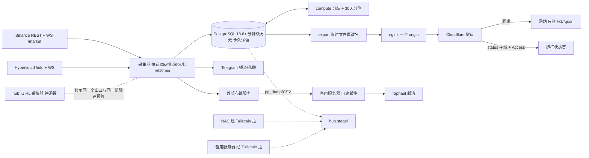

# hlens CryptoPlus · 架构与开发规范（**冻结版 v1.0 · 2026-09-19 · 依据 raphael 的 23 条决定**）

> **本文的来源**：raphael 2026-09-19 的 23 条决定（记在 `PROGRESS.md` 的决定记录里）· 五份独立审查（数据流校核 22 条必改 · 部署与迁移 · 版本与漏洞 · M4/M5 数据源与门控算术 · M3–M6 功能定义）· 一次独立评审（3 致命 + 8 高，已全部修完）。审查产出本身已按 raphael 的要求删除——**结论全部落在本文与 `01` `02` `04` 里，本文是唯一权威**。
> **怎么读**：第 1 节写给 raphael，不含术语。第 2–18 节是派活与验收的依据。功能编号 `F1`–`F31` 见 `02-FEATURES.md`；原则与里程碑见 `01-PRODUCT.md §4` `§5.2`；端点与限速见 `04-DATA-SOURCES.md`；任务编号与阻塞项见 `PROGRESS.md`。
> **详细程度分层**：**M1 + M2 细到可以直接派编码任务**；**M3–M6 只到「模块 + 新增表 + 接在哪个接缝 + 门控 + 可判定验收」**，故意不写列级细节——没有依据的细节就是给将来埋雷。
> **纪律**：每个组件都指回一条确认需求，指不回去的已删（第 17 节）。凡标 **估算** 的附算式，未证实的标 **未验证**。本文不含任何真实密钥、IP、邮箱、域名、token。
> **2026-09-19 地基级更正（已并入全文）**：**生产机不是云 VPS，而是 raphael 自己的那台 hub 物理机**（Tailscale 名 `hub`，24/7 常开、磁盘充裕、**没有 UPS**，在家 / 办公场所而不是机房）。不买 VPS，`PROGRESS.md` 的 RB-1 就此关闭。连带三件事：① **开发机（Tailscale 名 `raphael`）、hub 上那套旧的 Hyperliquid 采集器、我们的新采集器共用同一个公网出口**，因此**共用同一份交易所限速预算**（第 6.1 节重新设计）；② `01-PRODUCT.md §7` 那条「VPS 的公网出口 IP 必须与 hub 不同」**彻底作废**，`04-DATA-SOURCES.md` 开头与 §6 §7 的同一条硬规则同样作废（第 18 节列出需回填的原文）；③ 生产机是自有硬件、**没有月租**，第 12 节只列支出项、不给上限数字。
> **仓库现在只有文档，没有代码。下文一切都是要建的东西。**

## 1. 一页说清

**三台机器，全是已有的，不买新硬件**。① **hub（生产，本地物理机）**：跑四个容器——数据库、采集器、文件服务器、隧道；**不开任何公网端口**。它上面**还跑着一套旧的 Hyperliquid 采集器**，两者共存一段时间，之后旧的退役。② **fnnas（NAS，在新疆）**：每小时把 hub 的备份**拉**回去，长期保留——它与 hub 不在一地，**异地副本的性质真正成立**。③ **备用服务器（机房，已有，25 端口出站未被封）**：发告警邮件、放一份站点静态兜底、放一份可快速恢复的副本、每月在它上面做恢复演练。NAS 与备用服务器都**主动去拉**，hub 不往外推——生产机被攻陷也进不了家里。

**代价先说清**：hub 没有 UPS、走家庭 / 办公网络，**停电与 ISP 抖动会直接变成分钟缺口**，而这两件事不在我们的代码控制之内（第 13 节新增两行，第 16 节的验收口径因此重写）。换来的是零月租、零采购等待、磁盘不再是采购约束。

**M1 结束时 raphael 能看到**：手机上打开一个只有他能打开的运行状态页——两源各自最后写入时间、每分钟写入行数、24 小时与 7 天的分钟缺口、分区备到哪个月、磁盘、最近一次备份 / 拉取 / 演练、**以及这台机器所在区域能用哪些功能、不能用哪些**。采集停 10 分钟，手机上收到两条互不依赖的告警：Telegram 私聊（采集器自己发）和邮件（外部心跳服务触发、自建邮件服务器投递）。M1 不产生任何公开页面。

**M2 结束时 raphael 能看到**：一个公开网站，一币一卡、两所并排，首页一个分歧榜，每个数字后跟一句"比过去 30 天 X% 的时候都大（n = …）"，历史不够就写"数据积累中，已有 N 天"；每天早上 8 点频道一条 ≤ 12 行的摘要；大额爆仓按 5 分钟合并推送、每处带"下界"；一个研究页加一份能直接跑的 notebook。

**页面上的数字最坏落后 55 秒**：观测 30 秒一轮 + 导出 5 秒 = 文件最坏 35 秒，访客每 **15–20 秒**取一次 → 屏幕最坏 **50–55 秒**，在 F2 承诺的 60 秒内（决定 A3；原 30 秒轮询会得到 65 秒，超标）。"更新于"用 HTTP 响应头的 `Date` 当"现在"，**不用访客手机的时钟**（一块坏表会把 F5 的诚实机制全毁掉）。



## 2. 五个接缝（M1 要建立的东西）

改起来贵，所以现在定死；它们都还不存在，**建立它们就是 M1 的主要内容**。

| # | 接缝 | 具体形态 | 破坏它的代价 |
|---|---|---|---|
| ① | **归一化数据契约** | `packages/hlens-core/contracts`：pydantic v2，价格与费率一律 `Decimal`，时间一律 UTC 毫秒整数，**每条记录必带** `venue` `symbol` `ts` `ingest_ts` `source`，另带 `semantic`（标记价 / K 线收盘）。折算后的 8 小时费率由契约算出、**不入库** | 两所口径混进业务代码，F3 的"原值与折算值同时可取"再也说不清 |
| ② | **带能力声明的适配器协议** | 每个能力分开声明 `supported` / `mode` / `completeness`（`01 §4.7`）。枚举里**现在就有** `trade_stream` `book_l2` `spot`，两所都标 `unsupported`，M4 只补实现、不改协议；爆仓类 `completeness` 只能是 `lower_bound` / `partial_history`（M5 的 HL 历史段用后者）。**钱包类能力不在这个枚举里** | 加一个所要改所有调用点；M4 / M5 打开新能力要改协议，全部适配器跟着改 |
| ③ | **模块间只通过数据库表与契约通信，不互相 import** | 表名就是接口（第 5 节每张表写明写方）。**可执行**：每模块一个子包 + ruff `flake8-tidy-imports` banned-api 禁止跨模块 import + `tests/test_module_boundaries.py` 按 AST 断言依赖图。reviewer 的检查动作就是跑这个测试 | 任何一层都无法单独重写；进程拆分变成大改 |
| ④ | **高频数据单独建表 + 按币白名单 + 独立留存策略** | `trade_tick`（**按天分区，滚动 ≤ 7 天，整块 drop**）· `cvd_1m`（派生分钟序列，**永久**）· `book_l2_1m` · `spot_1m` · `hf_whitelist`。M1 只命名不建表。**整块删除高频数据不得影响任何永久保留的分钟序列**（F19 F20） | 逐笔塞进 `market_1m`，M4 一开分钟链路跟着崩；或把 30 天分位算在原始逐笔上，磁盘线性增长、门控必判负 |
| ⑤ | **钱包数据有自己的协议**，与行情适配器分开 | M1 只定义接口、无实现；行情适配器里不出现任何钱包方法或钱包能力（F23 F25） | M5 要动 M1 的行情代码 |
| 前端 | **前端只读版本化 JSON** | 站点只读 `/v1/*.json`，不直连数据库、不含业务计算。**句子在后端拼好**（F17 的语言资源在后端），前端只渲染 | M3 的对外接口与以后换前端框架都会变成后端改造 |

## 3. 技术栈与版本锁定

**镜像 tag 用大版本 + preflight 断言最低补丁版**（决定 A11）——写死小版本等于永远停在那个版本，下一条 CVE 又要改文件。

| 组件 | 锁定 | EOL | 升级触发线 |
|---|---|---|---|
| CPython | **3.12.x 为最低支持线**（`uv python pin 3.12`），CI 矩阵加 3.14；不用 free-threaded | 3.12 → 2028-10-31 | 3.12 进入仅安全修复期时评估上移 |
| uv 0.12.17 · hatchling 1.32.3 · ruff 0.16.8（line 100）· mypy 2.3.1 | 锁 | — | 滚动 |
| pytest 9.1.1 · pytest-asyncio **1.4.0** · respx 0.23.1 | 锁 | — | httpx 大版本升级后先跑 respx 测试 |
| httpx 0.28.1 · websockets 17.1 · pydantic 2.13.5 · pyyaml 6.0.3 · psycopg 3.3.6 + psycopg-pool 3.3.2 | 锁 | websockets legacy 计划 ~2030 移除 | legacy 被移除时 |
| **PostgreSQL** | **`postgres:18` 镜像 + preflight 断言 `server_version_num >= 180006`（18.6+）**，dev 与 prod **同一大版本**（决定 C5） | 18 → 2030-11-14 | 18 进入仅安全修复期 |
| nginx | `nginx:1.31-alpine`（跟 mainline），**每月演练时 `docker compose pull && up -d`** | — | 安全公告后 30 天内重拉；状态页"镜像最后更新 > 45 天"变色 |
| Docker Engine 29.8.1 · Compose v5.5.1 · cloudflared 2026.9.1（钉死） | 锁 | — | — |
| 前端 | 纯 HTML + CSS + 原生 JS，**无构建步骤、无框架**（F9） | — | 页面间出现共享复杂状态时 |
| Web 框架 / API 服务器 | **不选，M3 也不选**（见第 15 节 F13） | — | 出现需要查询参数的确认需求时 |

**测试规范（对每一个网络面函数都适用）**：每个网络面函数都有**离线测试 + 一份录制的 fixture**（respx），fixture 带 `source: documented|live-recorded`；live 测试 `@pytest.mark.live`，`pyproject.toml` 写死 `addopts = -m "not live"`（不靠人记）；任何测试请求量 ≤ 该所限速的 40%。**pytest-asyncio 1.4 默认 `asyncio_mode=strict`，`event_loop` fixture 覆盖已废弃**——需要 class/module 级事件循环用 `@pytest.mark.asyncio_event_loop`，**禁止重写 `event_loop` fixture**（旧写法现在只是 DeprecationWarning，下一个大版本直接坏，而坏法是静默用错事件循环）。httpx 一律传四段式 `Timeout(connect/read/write/pool)`，不传单个 float；不开 HTTP/2（两所是否支持 **未验证**，少一个不确定变量）。websockets 显式从 `websockets.asyncio.client` 导入。批量写库走 `cursor.copy()` 进临时表 + `INSERT … ON CONFLICT`，不逐行 `execute`。接缝 ③ 的边界测试从第一个模块起就存在。

## 4. 模块清单

模块之间**只通过数据库表与 `hlens-core` 契约说话**（接缝 ③）。**同一个操作系统进程里可以住多个模块**——进程数是运维选择，模块边界是表边界。每张表只有一个写方；`source_health` 的观测列与判定列分属两个写方。

| 模块 | 一句话 | 写 | 里程碑 | 需求 |
|---|---|---|---|---|
| `contracts` · `ratelimit` | 归一化契约；按公网出口 IP 记账的限速账本（权重桶 + 请求桶 + **resident/opportunistic 两类消费者**） | — | M1 | ① F2 F3 |
| `preflight` | 上机自检 CLI：出口哈希比对 · 三条 Tailscale 断言 · **区域判定与能力矩阵** · 时钟 · 磁盘 · PG ≥ 18.6 · 两所可达 | `source_health`（观测列）`ops_event` | M1 | F2 F4 F6 **B8** |
| `adapters` | 一个所怎么访问、字段怎么归一、声明了什么能力 | 返回契约对象（不碰库） | M1 | F1 F2 F3 F12 ② |
| `universe` | 每天核对两所都在交易的永续 | `instruments` `coin_universe` | M1 | F1 F3 |
| `collector` | 按节奏调用适配器，写分钟行；轮末直接触发导出 | `market_1m` `ls_ratio` `collector_run` `source_health`（观测列） | M1 | F2 F3 |
| `health` | 判定静默、分钟缺口、**分区 DDL**、磁盘、异地副本落后 | `source_health`（判定列）`ingest_gap` `ops_event` · 分区 | M1 | F2 F4 F5 F6 |
| `notify` | 静默 / 恢复 / 摘要 / 爆仓 / 条件告警，两阶段去重 | `notify_log` | M1/M2/M3 | F4 F10 F12 F15 |
| `backfill` | 一次性回补公开历史，**独立启停、可续跑**（决定 A7） | `market_1m`（仅 `backfilled=true` 行）`metric_coverage` `backfill_cursor` | M2 | F8 F11 |
| `compute` | 跨所分歧四指标 + 30 天分位 | `divergence_1m` `metric_pctl` `metric_coverage` | M2 | F7 F8 F10 |
| `liquidation` | 接爆仓流，有界队列，永远带下界 | `liquidations` | M2 | F12 |
| `export` | 把对外要看的东西写成版本化 JSON 文件（**句子在这里拼**） | `/srv/site/v1/*.json`（文件，不是表） | M1/M2 | F5–F10 F12 F13 F17 |
| `site` | 读 JSON 渲染的静态站 | — | M2 | F5 F9 |
| `research` | 一次性导出公开数据集 + notebook | Release 附件 | M2 | F11 |
| `wallet` 协议（只定接口不实现） | 钱包数据的独立协议 | — | M1 定义 / M5 实现 | ⑤ |

仓库形态：`packages/hlens-core/`（contracts · ratelimit · preflight · adapters/{base,binance,hyperliquid} · wallet/base.py）· `packages/hlens-collector/`（其余模块 + `migrations/NNN_*.sql`）· `config/{venues,export,lexicon.zh}.yaml` · `deploy/{compose.yaml,compose.dev.yaml,nginx.conf}` · `scripts/{backup.sh,serve-backup.sh,pull.sh,drill.sh}` + systemd 单元 · `site/` · `research/*.ipynb` · `docs/`。

## 5. 数据模型

通用规则：时间一律 `timestamptz`（契约的 UTC 毫秒在入库边界转换）；价格与费率用 `numeric`；未知写 `NULL`，**绝不写 0**；每张时序表按月 `PARTITION BY RANGE (ts)`；**每张表都带 `source` 与 `ingest_ts` 两列**（接缝 ①，2026-09-19 校核——下面的列清单只写各表特有列，这两列不再重复，但迁移里必须有）；**三张时序表（`market_1m` `ls_ratio` `liquidations`）各加 `USING brin (ts) WITH (pages_per_range=32)`**（2026-09-19 校核：health 每分钟的缺口查询与爆仓 5 分钟窗口查询否则是全分区顺序扫描，月末 5 GB；不用 btree，那是 +50 B/行）。

**`market_1m.ts` 是分钟桶**：`ts = date_trunc('minute', 观测时刻)`，**原始观测时刻只存在 `obs_ts_*` 里**（2026-09-19 校核）。照契约"ts 是这条记录的时间"直译会把交易所时间戳写进 `ts`，主键立刻退化成"每次观测一行"，整套覆盖语义作废。

**三条独立的写入语句，永远不合并**（2026-09-19 校核 2026-09-19 校核）：

| 语句 | 列组 | 守卫 |
|---|---|---|
| 快道（30 s） | `mark, index_px, premium, funding_rate, funding_interval_h, next_funding_ts, obs_ts_fast` | `WHERE excluded.obs_ts_fast > coalesce(market_1m.obs_ts_fast,'-infinity') OR market_1m.backfilled`（实时永远可以盖掉回补） |
| 慢道（60 s） | `oi_base, oi_usd, vol24h_usd, chg24h_pct, obs_ts_slow` | 同上，换 `obs_ts_slow` |
| **回补（独立语句）** | 同上两组之一，另写 `grid_s` `semantic` `backfilled=true` | `WHERE market_1m.backfilled AND excluded.grid_s <= market_1m.grid_s` |

合并会失效：另一列组是 `NULL`，`NULL > x` 为 `NULL`（假），守卫整条作废。**回补那条是本次冻结最要紧的一条**：M2-1 回补 30 天时 M1 已自采 ≥ 14 天，**重叠必然存在**；共用一条 upsert 会把 5 分钟网格的回补值整片盖掉分钟级实时观测，F8 的"n 是怎么来的可追溯"当场破产。`ON CONFLICT` 在分区表上要求冲突目标含分区键——PK 含 `ts`，成立。**任何回补任务结束后必须重算受影响时间段的 `divergence_1m` 与 `metric_pctl`**（2026-09-19 校核.7）。

**分区规则**：迁移预建 3 个月；`health` **拥有分区 DDL**，启动时与每天各查一次，保证未来两个月分区存在，另设 `DEFAULT` 分区兜底。**分区检查同时挂一个宿主 systemd timer，不依赖采集器活着**（2026-09-19 校核）。**分区边界一律写成带 `+00` 的字面量，容器 `TZ=UTC`、`timezone=UTC`**——否则 `timestamptz` 边界按会话时区解析，月界整体平移几小时。**`DEFAULT` 分区行数 > 0 是立即告警，不是状态页上的一个数字**（2026-09-19 校核）：DEFAULT 里已有行之后再建正式分区会**直接报错**，必须走"锁 DEFAULT → 建带 CHECK 的表 → `DELETE … RETURNING` 搬运 → `ATTACH PARTITION`"，期间该时段写入阻塞，所以 DEFAULT 越小越好。`divergence_1m` drop 老分区用 `DETACH CONCURRENTLY` 再 `DROP`。

| 表 | 粒度 | 主键 | 特有列 | 留存 | 行/天 |
|---|---|---|---|---|---|
| `instruments` · `coin_universe` | 每所每合约每版本（SCD-2）／每币一段在册期 | (venue, venue_symbol, valid_from) / (symbol, in_from) | symbol · venue_symbol · mult · funding_interval_h · tick · status · valid_from/to ／ in_to · reason | 永久 | ~0 |
| `market_1m` | 每所每币每分钟 | (venue, symbol, ts) | mark · index_px · premium · funding_rate（该所原生周期原值）· funding_interval_h · next_funding_ts · oi_base · oi_usd · vol24h_usd · chg24h_pct · **obs_ts_fast** · **obs_ts_slow** · semantic · grid_s · backfilled | **永久，不降采样** | 518,400 |
| `ls_ratio` | Binance 每币每 kind 每 5 分钟点（三类 kind） | (venue, symbol, kind, ts) | long_share · period | 永久 | 155,520 |
| `liquidations` | 每笔观测到的爆仓 | (venue, symbol, ts, event_id) `event_id NOT NULL` | side · price · size · notional_usd · throttled_source · **completeness**（`lower_bound`/`partial_history`）· **ingest_path**（`binance_ws` / `hl_wallet_derived`，2026-09-19 校核/M5） | 永久 | 估算 40,000 |
| `divergence_1m` | 每币每分钟（派生，可重算） | (symbol, ts) | funding_spread_8h · mark_spread_bps · oi_share_bn · vol_share_bn · n_venues | **35 天滚动**，老分区 drop | 259,200 |
| `metric_pctl` | 每 scope 每指标最新一点 | **(scope, metric)** | value · pctl · n · window_from/to · grid_s · updated | 覆盖写 | ~900 行常驻 |
| `metric_coverage` | 每 scope 每指标 | **(scope, metric)** | first_ts · self_from · backfill_from · days_available · grid_s_min · enough(bool) | 覆盖写 | ~40 行 |
| `source_health` | 每（所, 能力, 传输） | (venue, capability, transport) | 观测列 last_ok_ts · latency_ms · last_error_class（写方 collector/preflight）· 判定列 ok · consecutive_fail（写方 health） | 覆盖写 | ~25 行 |
| `ingest_gap` | 每个缺口一行 | (venue, metric, from_ts) | to_ts · minutes · **cause（十值封闭枚举，见下）** · **symbols_expected** · **symbols_present** | 永久 | 正常 0 |
| `collector_run` | 每轮采集 | (lane, started_at) | **status**(`running`/`ok`/`failed`) · rows_written · errors · duration_ms | 永久（小） | ~5,000 |
| `backfill_cursor` | 每个回补任务的续跑位点 | (job, venue, symbol, metric) | cursor_ts · done(bool) · updated | 直到任务结束 | ~1,500 |
| `notify_log` · `ops_event` | 每条已发消息 / 每次备份 · 拉取 · 演练 · 检查 | (kind, dedupe_key) / (kind, ts) | sent_at · target · **ok**（两阶段）／ ok · detail(jsonb) | 90 天 / 永久（小） | < 300 / ~40 |

**`ingest_gap.cause` 是一个十值封闭枚举，每个值都有明确的写方**（评审修正：原枚举只有五个值，而第 16 节的两个验收口径引用了四个不在枚举里的值，等于验收永远判不了）：

| cause | 写方 | 什么时候写 | 计入口径 A 的排除集？ |
|---|---|---|---|
| `venue_error` | collector | 该源返回非 2xx 或 WS 静默 | 否 |
| `rate_limit` | ratelimit | 429 后冻结 | 否 |
| `ip_ban` | ratelimit | 418 后停该所全部车道 | 否 |
| `backpressure` | liquidation | 有界队列溢出丢弃 | 否 |
| `ws_reconnect` | liquidation | WS 断线到重连之间 | 否 |
| **`power_loss`** | **collector 启动时**（下段） | `pg_controldata` 显示上次非正常关闭 | **是** |
| **`host_restart`** | **collector 启动时** | 宿主 uptime < 停机区间，或容器被 OOM / `compose pull && up -d` 重建（`docker inspect` 的 `OOMKilled` / 新容器 id） | **是** |
| **`egress_down`** | health | 出网探测连续失败而本机与库都正常 | **是** |
| **`egress_change`** | preflight / health | 出口哈希与 `EXPECTED_EGRESS_HASH` 不符 | **是** |
| **`unknown`** | **collector 启动时** | 上面三条判据都判不出 | **否 —— 故意的**：把它计进排除集，它就会变成逃生口，什么都往 `unknown` 里塞就能让绿色率好看 |

**scope 值域的裁决（两张表共用一套，本文一次性定义）**。A3 建议 `metric_pctl` 主键改 `(scope, metric)`，scope 取 `BTC` / `binance:BTC` / `market`；而 `metric_coverage` 的 scope 语义是「所 / 跨所」。两者必须同域，否则 M2 当场就会出现两套读法。**裁决：scope 是一个 `text` 列，语法固定为两段，两张表完全相同**：

```
scope := <venue>:<symbol>
venue  ∈ { binance | hyperliquid | x }     -- x = 跨所
symbol ∈ { 统一币名 | * }                   -- * = 全市场（不指定币）
CHECK (scope ~ '^(binance|hyperliquid|x):([A-Z0-9]{1,15}|\*)$')
```

`binance:BTC`（单所单币）· `x:BTC`（跨所单币，费率差 / 标记价差）· `x:*`（**F10 的市况行 `market_funding_median` 存在这里**）· `hyperliquid:*`（M5 大户面）。**理由**：① A3 的三种形态有三种解析规则，且"跨所 BTC"与"币 BTC"在 `BTC` 这一个字面量上分不开；② 它装不下"某一所的全市场"，而 F10 与 M5 的大户面都需要；③ 固定两段语法只需一条 `CHECK`、一套解析、一个索引，两张表可以直接 join 对齐"这个分位有没有足够覆盖"；④ 它同时就是导出 JSON 的键，**在日志里可 grep**——凌晨排障时这一点比省一个字符值钱。**否决两列 `(venue_scope, symbol_scope)` 的写法**：每一处 join 与每一处导出都要重新拼接，而收益只是省掉一个正则。

**热小表的膨胀参数必须写进建表迁移**（2026-09-19 校核）：`market_1m` `fillfactor=80`（每逻辑行每分钟被写 3 次，默认 100 走不了 HOT，每次更新都写新索引条目）；`metric_pctl` / `source_health` / `metric_coverage` `fillfactor=70` + `autovacuum_vacuum_scale_factor=0` + `autovacuum_vacuum_threshold=100` + `autovacuum_analyze_threshold=100`（`metric_pctl` 是 900 行的表、每天约 200 万次更新，默认参数必膨胀）。

**容量算式**（**估算**，两所 × 180 币；单行 **340 B**，算式见第 12 节）：`market_1m` 518,400 行/天 × 340 B = 176 MB/天 = **64.3 GB/年**；`ls_ratio`（决定 A8 改 10 分钟轮询 + `limit` 取回中间点，密度 5 分钟）155,520 行/天 × 135 B = **7.7 GB/年**；`liquidations` **估算 1.5 GB/年**；`divergence_1m` 259,200 × 35 × 145 B = **1.3 GB 常驻、不增长**。**第一年增量 ≈ 74.8 GB**。

**三件必须由数据结构本身回答的事**：
1. **口径对齐可公开（F3）**：`instruments` 是 SCD-2 表，`valid_from/valid_to` 就是版本；`/v1/instruments.json` 由它生成。**只存 `funding_rate` 与 `funding_interval_h`，不存折算后的 8 小时费率**（= `funding_rate × 8 ÷ funding_interval_h`，契约读出时算一次）。
2. **"这个指标只有 N 天历史"（F8）**：`metric_coverage` 每分钟刷新；`enough=false` 时页面一律写"数据积累中，已有 N 天"，`metric_pctl` 对该指标不写 `pctl`。每行 `market_1m` 带 `grid_s` `semantic` `backfilled`，n 的来源永远可追溯，绝不外推。**冷启动口径按 A6 重新表述**：Binance K 线与 `fundingRate` 是全史、`openInterestHist` 可回补 30 天（5 分钟网格）；**Hyperliquid `candleSnapshot` 只保留最近 5000 根，1 分钟粒度只有约 3.5 天**（A6 §4-3），因此——**跨所标记价差 `x:*`/`x:<币>` 的分钟级分位也回补不出来**，与跨所费率差、HL 持仓量份额、`market_funding_median` 一样，**头 30 天一律显示"数据积累中"**。（原文"标记价差上线即有分位"作废。）**不搭第二种更粗的网格凑样本**（F8 原则）。
3. **爆仓的下界性质（F12 F26）**：`completeness` 默认 `lower_bound`，`throttled_source=true` 时契约禁止写 `full`；`ingest_path` 区分 Binance WS 与 M5 的 HL 钱包派生样本——**导出层据此拒绝把两者相加**；导出字段名 `observed_lower_bound_usd`，**导出层没有任何字段能表达"全市场总额"**。`mult` 未知（新上市币还没进 `instruments`）时 `notional_usd = NULL`，**不是 0、不是默认 1**，推送阈值跳过 NULL 行（2026-09-19 校核）。

**M4/M5/M6 新增表只列名与归属，不写列**（见第 15 节）：M4 `trade_tick`(按天分区/≤7 天) `cvd_1m`(永久) `book_l2_1m` `spot_1m` `hf_whitelist` · M5 `hl_position` `hl_fill` `hl_leaderboard` `whale_board` `wallet_optout` · M6 `state_term` `state_event` `prereg_group` `scoreboard_row`。

## 6. 进程、调度与限速账本

| 进程 | 类型 | 谁重启 | 干什么 |
|---|---|---|---|
| `postgres`（容器） | 常驻 | `restart: unless-stopped` | 唯一存储 |
| `collector`（容器，**1 个 Python 进程 / 多个 asyncio 任务**） | 常驻 | 同上 | 采集 · 健康与分区 · 计算 · 导出 · 通知 · 回补（可独立启停） |
| `web`（容器，nginx） | 常驻 | 同上 | 端出网站、`/v1/*.json` 与状态页 |
| `cloudflared`（容器） | 常驻 | 同上 | 出口隧道，**无公网端口** |
| `hlens-backup.timer`（宿主） | 定时 | systemd | 每日 `03:17 UTC` 全量 + 每小时 `*:01 UTC` 增量 → `stage/` |
| `hlens-partition.timer`（宿主） | 定时 | systemd | 分区兜底检查（不依赖采集器活着，2026-09-19 校核） |

**生产（hub 上）= 4 个常驻容器 + 2 个宿主定时器，没有第五个容器**；旧采集器是第五个进程，但它不是我们的，且会退役。 NAS = 1 个拉取定时任务。备用服务器 = nginx + MTA + 2 个 cron（拉取、每日邮件自测）。**备份定时器故意放在宿主**——备份不能依赖被备份的那套东西还活着。**`collector` 内部不拆进程**：拆出去要么共享内存状态（违反接缝 ③），要么多一份运维负担，而没有需求要求它们独立伸缩。**这里最简单的办法就够了**：调度 = 一个 asyncio 循环 + 两个 systemd timer；表就是队列。

| 道 | 调用 | 账本 | 每分用量 |
|---|---|---|---|
| 快道 30 s（F2 ≤ 60 s） | Binance `/fapi/v1/premiumIndex`（全市场，W=10） | 权重 | 20 |
| 快道 30 s | HL `metaAndAssetCtxs`（W=20） | HL 权重 | 40 |
| 慢道 60 s（OI ≤ 2 min） | Binance `/fapi/v1/openInterest` 逐币 180 次（W=1） | 权重 | 180 |
| 慢道 60 s | Binance `/fapi/v1/ticker/24hr`（全市场，W=40） | 权重 | 40 |
| **10 min**（多空比，决定 A8） | `/futures/data/{globalLongShortAccount,topLongShortPosition,takerlongshort}Ratio` 三类 × 180 币，**带 `limit` 一次取回窗口内全部 5 分钟点** | 请求桶 `futures_data` | 54 次 |
| 1 h / 8 h / 冷启动 | `exchangeInfo`(W=1) · HL `meta`(W=20) · `fundingRate`/`fundingInfo`（独立桶 500 次/5 min） | 两桶 | ~1 |
| **导出** | **由快道轮末直接触发**（2026-09-19 校核），不挂独立定时器 | — | — |
| M2 常驻 | Binance WS `!forceOrder@arr` | 连接 | 1 |

**Binance 权重合计 = 20 + 180 + 40 + 1 = 241/分 = 官方 2400 的 10%。** `/futures/data/*` **不吃权重、自己一个桶**：官方页面明写 **1000 次/5 分钟 = 200 次/分**（`官方`，A2/A6 已核实；**原文「唯一一个靠猜的常数」这句作废并删除**），我们用 54 次/分 = **27%**。**余量：约 266 个币，瓶颈在 `futures_data` 桶而不是权重桶**（评审修正，原「约 700 个币」只算了权重那一路）。两路各算一次，取小者：① **权重桶**——每增一个币 = OI 1 权重/分，固定项（premiumIndex 20 + ticker24hr 40 + 元数据 1）= 61 → `(960 − 61) ÷ 1 = 899 个币`；② **`futures_data` 请求桶**——每增一个币 = 3 类 × 1 次/10 分钟 = **0.3 次/分**，固定项 0 → `80 ÷ 0.3 = 266 个币`。**min(899, 266) = 266。** 再往前推一步：按第 6.1 节定的 `reserve = 常驻 × 1.11`（重试余量），留够余量后的**实际**上限是 `80 ÷ 0.3 ÷ 1.11 ≈ **240 个币**`——266 是撞墙点，240 是还能安全退避的点。当前 180 币用掉该桶 54/80 = 67.5%，是所有桶里最紧的一个。不当卖点，但要知道：想加币先看这一路。

### 6.1 出口是共享的：一份预算，两个互相看不见的消费者

**新采集器与 hub 上那套旧的 Hyperliquid 采集器在同一台机器、同一个公网出口**；交易所按出口 IP 记账，**两者共用同一份预算，且互相看不见对方用了多少**。这不是风险提示，是限速账本的设计前提。

**选定的机制：静态配额划分 + 启动时扣减 + 退役时回收。** `config/venues.yaml` 增一段 `reserved:`，逐所写明「留给谁、留多少、来源标签」；limiter 的可用上限 = `官方上限 × 使用比例 − Σ reserved`。preflight 启动时把扣减过程与结果整张打印出来，写进 `source_health` 与 `status.json`；**`reserved` 段缺失、或与运行中的旧采集器对不上，即拒绝启动**。

**天花板口径（评审修正）**：`reserved` 与我们可用量相加，**必须落在「出口合计上限」之内，而不是官方上限之内**。按 `04` 开头硬规则 ②，出口合计上限 = Binance 官方 × 40%、Hyperliquid 官方 1200 × **90% = 1080**。下表的「出口合计上限」列就是这个天花板，**最后一列必须等于它**。

| 所 | 官方上限 | **出口合计上限（天花板）** | 留给 hub 旧采集器 | 新采集器过渡期可用 | M1+M2 实际用量 | 合计 |
|---|---|---|---|---|---|---|
| Binance 合约权重 | 2400/分 | **960/分**（40%） | **0**（旧采集器只采 Hyperliquid，**不碰 Binance**——这条假设必须由 preflight 每次启动核对，见下） | 960/分 | 241/分 | 960 = 天花板 ✓ |
| Binance `futures_data` | 200/分 | **80 次/分**（40%） | **0** | 80 次/分 | 54 次/分 | 80 = 天花板 ✓ |
| **HL `/info` 权重** | 1200/分 | **1080/分**（90%） | **960/分 —— `未验证`，保守占位** | **120/分**（同为占位） | **44/分** | **960 + 120 = 1080 = 天花板 ✓** |
| HL WS | 10 连接 · 1000 订阅 · **10 个不同 user** | 8 连接 · 800 订阅 · 8 user | 旧采集器已占的连接与 user 席位数 **未验证** | 剩余 | 1 订阅 | 上机第一件事就是数 |

**为什么占位值是 960 而不是 1080**：960 + 120 = 1080 = 90% 的天花板，**给整个出口留下 120 权重/分的退避余量**。写成 1080 + 120 = 1200 就是把出口打到官方 100%——AIMD 砍到 75% 之后两个消费者仍然贴线，互相把对方推过限，这正是 429 → 418 的走法。

**先说清楚 960 这个数字的来历，因为它撑着下面所有结论。** 它**不是实测值，是保守占位**。此前文档里流传的「hub 已把 HL 预算打到接近 100%」经核查是一条**循环引用**——`03` 说它记在 `04 §4`，而 `04` 全文从无此记载（2026-09-19 核查 git 原始文件确认）。**旧采集器的真实占用是未知数**，因此这里按"它可能几乎用满"来预留，宁可我们受限，也不要两套一起撞 429 → 418。

**在实测回填之前，下面的结论都是条件性的**：按占位值，过渡期我们只有 120 权重/分——M1/M2 的 44/分装得下（37%）；M4 再加 `spotMetaAndAssetCtxs` 的 20/分 → 64/分（53%）仍装得下；**M5 的 200 地址 × `clearinghouseState` = +80/分 装不下（144 > 120）**，因此**按当前占位值，M5 的 HL 现采门控于旧采集器退役**（第 15 节）。这并不别扭：M5 要做的钱包轮询正是旧采集器在做的事，退役与接手本来就是同一件事的两面。

**M1-B 的第一件事就是把这个占位值换成实测值**（读旧采集器**自身的账本与日志**，不要为了测它而去打交易所——那是在花我们自己要省的预算；日常 / 回补 / 高波动三档各取 p95）。实测回填后，`reserved.hyperliquid.hub_legacy` 改成真实值、重跑 preflight，M5 的门控结论**随之重算**：若旧采集器实际只用掉一小部分，M5 可能根本不必等它退役。**在那之前，不要把「M5 必须等退役」当成已经成立的事实，也不要假装有 1080 权重/分可用。**

**否决的备选**：① **两个采集器共享一个动态令牌桶**（例如拿一张 Postgres 表当桶）——要改旧采集器的代码，而它几周后就退役；且每次请求多一次数据库往返，为一个会消失的问题引进一条永久的热路径。② **只靠 429 退避、不做静态划分**——在共享 IP 上这是最糟的协调方式：Binance 的 429 继续打会升级成 **418 封整台机器的 IP**，一次就把旧采集器的生产采集和我们一起打死；「撞了再说」不能用来协调共享资源。③ **给新采集器换出口**（VPN / 代理 / 第二条宽带）——新增一个常驻组件与一个新的失败面，还把「生产就在 hub 上」这个简化优势吐回去。**留作退路**：若实测发现 120 权重/分连 M1 都撑不住，换出口是唯一不改旧代码的出路，**估算**半天工作量。

**共享出口的连带规则**：
- **任何一次 HL 429，新采集器除了自己退避，还必须发一条 F4 私聊**——在共享 IP 上，429 意味着「另一个消费者可能也在挨打」，它是需要人看一眼的事件，不是可以静默吞掉的常规退避。
- **Binance 的 418 停掉该所全部车道**（下文），在共享出口下这条更硬：418 封的是整台机器。
- **「旧采集器不碰 Binance」必须被断言，不能靠记忆**：`config/egress-consumers.yaml` 由 raphael 维护（每个共用出口的消费者一行：名字 · 采哪个所 · 预留额 · 来源标签），preflight 读它做扣减并把整张表打印出来。它对不上现实时，错的方式是「我们以为有 960 权重其实没有」——所以这张表的每一次改动都要在 `ops_event` 留一行。
- **旧采集器退役的回收流程**（三步，不改任何代码）：① 确认旧采集器进程已停且不会被拉起；② `venues.yaml` 里 `reserved.hyperliquid.hub_legacy` 由 960 改 0；③ 重跑 preflight，确认打印出的 HL 可用预算变成 **1080/分（整个 90% 天花板）**，写 `ops_event(kind=budget_reclaimed)`，状态页「当前保留额」那一行跟着变。**回收之前不得开 M5 的 HL 现采。**
- **开发机也在这个出口上**（第 8 节）：dev 的 live 预算为 0，不再只是「别挤 hub」，而是「别挤生产自己」。

**Binance 合约 WS 地址已拆分（A6 §4-1，影响 M1/M2 不只 M4）**：legacy `wss://fstream.binance.com/stream` **官方已于 2026-04-23 永久停用**，现分三组——`/public`（`@depth` `@bookTicker`）· `/market`（`@aggTrade` `@markPrice` `@kline_` `@ticker` **`@forceOrder`**）· `/private`。**M1/M2 用到的 `!markPrice@arr` 与 `!forceOrder@arr` 都在 `/market` 组**；M4 的 `@depth` 在 `/public`，届时**至少两条连接**。`config/venues.yaml` 里三个 base URL 分开配，标 `官方`。

**限速账本分两类消费者（2026-09-19 校核，决定 A7）**：
**优先级是三层，不是两层**（评审修正：原先把「快道保底」和「resident 保底」写成了同一个数，于是保底 50 < 常驻稳态 54，公式算出负数）：**快道 > 其余 resident（慢道、比率、universe、WS）> opportunistic**。

- **保底的定义**：`reserve` 是**留给 resident 的地板，必须 ≥ resident 的稳态用量**，否则「常驻保底」这四个字不成立（决定 A7）。
- **opportunistic 的公式改为** `可用 = 天花板 − max(reserve, resident 实际用量)`，再取一个硬顶。原公式 `预算 − 保底 − 常驻实际用量` 是把 resident 减了两遍。

| 桶 | 天花板 | resident 稳态 | `reserve`（算式） | opportunistic 可用 | 硬顶 |
|---|---|---|---|---|---|
| Binance 权重 | 960/分 | 241/分（其中快道 20） | **300/分** = 241 × 1.25（25% 重试余量，5xx 风暴会让请求数翻倍而 AIMD 只对 429 生效）；其中**快道地板 120/分**，任何时刻不被其余 resident 挤占 | 960 − max(300, 241) = **660/分** | **200/分**（留 460 的退避余量；Binance 侧的 opportunistic 只有 K 线回补，用不到更多） |
| `futures_data` | 80 次/分 | **54 次/分**（3 类 × 180 币 ÷ 10 分钟） | **60 次/分** = 54 + 6。6 次/分的重试余量只有 11%，比权重桶的 25% 低，理由是**这一路的漏请求会自愈**：数据是 5 分钟网格，下一次轮询用 `limit` 会把上一窗口漏掉的点一并取回，所以重试不必抢在本窗口内完成 | 80 − max(60, 54) = **20 次/分** | **20 次/分**——**它现在等于算式结果，不再是一个另写的、和公式打架的数** |
| HL 权重（过渡期） | 120/分（我们那一份） | 44/分 | **60/分**（快道 40 + 元数据与重试 20） | 120 − max(60, 44) = **60/分** | **20 权重/分**——**故意压得比算式低**：HL 那 120 是从共享出口里切出来的，把它吃满等于把整个出口顶到 1080 的天花板，一点退避余量都不剩 |
| HL 权重（退役回收后） | 1080/分 | 44/分（M5 后 124/分） | 200/分 | **880/分** | 400/分 |

**这个裁决的两个可验证后果**：① **M2-1 的 30 天 Binance OI 回补** = `openInterestHist` limit=500、每币 18 次 × 180 币 = **3,110 次 ÷ 20 次/分 ≈ 156 分钟 ≈ 2.6 小时**（可续跑，不影响分钟链路）。② **F11 的 HL 两年费率回补** = 157,680 权重 ÷ 20 权重/分 ≈ **5.5 天**（可续跑，跑几天是设计内的，不是故障）；旧采集器退役、预算回收到 880/分之后，同一个回补缩到**约 3 小时**——**这是把 F11 排在退役之后做的具体理由**。**在 80 次/分的红线内凑得出来，不需要提高红线。**

**其余不变**：**任何 429 让 opportunistic 停 1 小时，resident 只降速（AIMD 砍到 75%）**；回补必须分块、可续跑（`backfill_cursor`），允许跑几天。
- **418 行为（2026-09-19 校核，原文只字未提）**：见 418 → 读 `Retry-After` → **停掉该所全部车道**（不是只砍 25%）→ `ingest_gap(cause=ip_ban)` → 立即发 F4 私聊。`futures_data` 与 `fapi` 共用一个 IP，429 之后继续打会升级成 418 封整个 IP，连快道一起死。
- **突发整形**：10 分钟车道的 540 次请求必须**匀速摊到窗口内**（54 次/分），不许在窗口首秒打完。
- **WS 重连**：Binance 每 IP 每 5 分钟 ≤ 300 次连接、24 h 强制断开，重连风暴要记账并退避。

## 7. 对外出口与投递

**nginx 在同一台机器（hub）上同时端出静态站与 `/v1/*.json`，同一个域名、同一个 origin**，前面只有 Cloudflare。网站自己的 fetch 是同源请求——不需要 CORS、不需要第二个部署目标、文案只改一处。否决：GitHub Pages 跨域读 hub（要来源白名单 + Cache Rule + 两个部署目标，换来的只有「hub 宕机时页面外壳还在」，而那件事现在由备用服务器承担）· 采集器把 JSON 提交进仓库（push→构建→部署 1.5–3 分钟，满足不了 F2；每天 1440 次提交撑爆仓库）· 对象存储公共桶每分钟上传（多一条链路与一套凭据）。

**新鲜度算式（估算）**：观测 T → 快道 30 秒一轮，覆盖式 upsert 保证 `:30` 那次不丢 → 导出 T+5 s（**轮末直接触发**）→ 文件最坏 **35 s** → 访客每 **15–20 s** 取一次 → 屏幕最坏 **50–55 s** ≤ F2 的 60 秒。带宽：访客每次约 100 KB（gzip 20 KB），100 并发 ≈ 0.14 MB/s，撑得住。**边缘缓存不加规则**（免费层默认不缓存 `application/json`）；若以后加 `max-age=20`，最坏变 75 s，**那时必须同时把轮询压到 10 s 或改承诺**。触发线：并发 > 100 或出网带宽吃紧。

**版本化**：路径前缀 `/v1/` + 文件内 `{"schema":1,"generated_at":…,"as_of":{…每指标每源…},"coverage":{…},"data":…}`。加字段不升版本；删字段或改语义 = 新前缀 `/v2/`，`/v1/` 至少再留 30 天。M1/M2 文件清单：`/v1/latest.json`（**估算** 100 KB / gzip 20 KB）· `/v1/history.json` · `/v1/instruments.json` · `/v1/liquidations.json` · `/v1/status.json`。写文件一律**写临时文件再 `rename`**（nginx 永远读不到半个文件）。**"更新于"用 HTTP 响应头 `Date` 当"现在"**（决定 A3），后端只给 `as_of`。

**站点静态兜底（决定 A14 / C4）**：备用服务器上一个 nginx，端出它自己拉来的最近一份 `site/` 与 `/v1/*.json`。免费层**没有自动 failover**，隧道长期不通时 raphael 在 Cloudflare 手动把主域 DNS 改指备用服务器（**估算** 2 分钟、手机上可做）；那份数据是陈旧的，**按 F5 置灰并显示 `as_of`**——这正是 F5 存在的理由。备用服务器对外开 443 与邮件端口，**是一台有公网端口的机器**：它不持有任何生产密钥、读不到生产库。

**投递**：每日摘要 00:00 UTC 发频道（≤ 12 行，F10）；爆仓推送 ≥ 100 万美元、每 5 分钟一个窗口合并成一条（F12）。**`notify_log` 改两阶段（2026-09-19 校核，致命项）**：① `INSERT (kind, dedupe_key, ok=false) ON CONFLICT DO NOTHING RETURNING 1`——没抢到就是别人发过了，跳过；② 发送；③ `UPDATE SET ok=true, sent_at=now()`。重启时把 `ok=false` 且超过 N 分钟的行按同一 key 重试。**F4 静默告警的 `dedupe_key` 必须用稳定值 `(venue, capability, last_ok_ts)`**，否则崩溃重启循环会按"每次重启一条"刷屏。爆仓推送的 `dedupe_key` = 窗口起点。

**状态页访问（F6）**：`status.<域名>` 只经隧道暴露，前面挂 **Cloudflare Access**（免费层，策略 = 一个邮箱 + 一次性验证码）。仓库里没有任何口令，链接发给别人也打不开。否决：HTTP Basic（口令要落盘）· 长随机 URL（不是访问控制，会进日志与历史）· 仅 Tailscale 可达（可行且免费，但 F6 的验收原文是"把链接发给别人，对方打不开"，Tailscale 下那个链接对外根本不是可点的地址，验收动作本身变含糊）。**状态页本身是一张静态 HTML + 每分钟生成的 `status.json`，没有后端框架、没有按钮**——最简单的办法在这里就够了。每月演练必须用无痕窗口试开一次，**必须被拒**。

## 8. 开发环境（本机）

**WSL2 里装原生 Docker Engine，dev 与 prod 共用一套 compose**（决定 A10），差异只由 `compose.dev.yaml` 覆盖。否决 Docker Desktop（多一个 Windows 侧守护进程与自己的存储驱动，与生产不是同一套）· 宿主裸装 PostgreSQL（compose 的网络、资源限制、日志轮转、容器内 `pg_dump` 路径全部测不到，上机当天第一次跑）。

**硬规则**：① 仓库与 volume 必须在 `/home/…`（ext4），**绝不放 `/mnt/c`**（9p 的 fsync 开销让 PG 写入慢一个量级，测出的容量与耗时全是假数）。② 端口映射一律写 `127.0.0.1:8080:80`，**不许写 `8080:80`**（WSL2 的 localhost 转发可能经 Windows 主机暴露，按"会暴露"处理）。③ 时钟偏差在 dev **允许跳过并打黄**，prod 为红即拒启。④ dev 的 timer 只验证脚本可跑，**不用来验证 RPO**。⑤ `uv python pin 3.12`。

**开发期出口按最保守处理（决定 A15）**：`HLENS_ENV=dev` 时 **HL 与 Binance 双双归零**——limiter 对两所的 live 预算都是 0，**拒绝**（不是警告）任何 live 行情调用；**dev 禁止开 WS**。要做真实 live 验证只能切手机热点换出口，跑前重跑一次出口哈希比对，且需显式 `HLENS_EGRESS_OVERRIDE=hotspot`。`HLENS_LIVE_BUDGET_PCT` dev 上限 0、prod 上限 40，**由 limiter 硬顶，不靠测试自觉**。**这条理由在地基更正之后变得更硬**：开发机与 hub 在同一个网络、**同一个公网出口**，而生产就在 hub 上——本机跑一次 live 采集，挤掉的不再是「别人的预算」，而是**我们自己生产链路的预算**，并且会同时把旧采集器推过限。**这不是保守作风，是共享出口下的正确性要求。**

**出口判定反过来了**：原来的断言是「与 hub 相同即判红」，**现在与 hub 相同是预期状态**——生产就在 hub 上。哈希机制保留（两端同一条命令取出口 IP，算 `SHA256(EGRESS_SALT || ip)` 取前 12 hex；**必须加盐**，IPv4 只有 2^32、裸哈希可穷举反推；报告与状态页只打印「一致 / 不一致」与前 6 位，**永不打印 IP**），但**判定改成三条**：① 出口哈希等于 `EXPECTED_EGRESS_HASH`（这是用来发现 ISP 换了公网 IP 的，见第 13 节）；② `egress-consumers.yaml` 与 `venues.yaml` 的 `reserved` 段存在且对得上；③ **扣减后的可用预算已算出并打印**。任一不满足即拒启。

**开发库是一次性的，不迁入生产**（决定 A9）。`docker compose down -v` 随时可执行，**开发环境不备份**。三条理由：① 本机 live 预算为 0、间歇运行，这段序列的缺口成因与生产完全不同、不可复现；② 本机间歇运行，序列全是洞，而 `metric_coverage.days_available` 会把覆盖率 3% 的一天也数成"一天"，F8 的"已有 N 天"就变成谎话；③ `01 §5.2` 明写 M6 的三个月时钟"从采集上线那天开始走"，用开发数据起表等于伪造起点。带走的是代码、迁移、fixture、`.env.example`（只有键名）——那是 git 的事。

**本机做不了的**：M1-F preflight 全绿（时钟 1.35 s > 1 s 门槛）· M1-G Binance WS fixture（本机连得上但不推数据，一律标 `documented`，到 hub 上重录改 `live-recorded`）· 隧道与 Access · 备份链路的拉取方向与 ACL · 14 天磁盘增长。**任何性能数字必须在 hub 上复测**：本机 15 GB 内存能把 30 天 `divergence_1m` 整个放进页缓存，而 hub 给 PG 的 `shared_buffers` 只有 1 GB。**hub 的 CPU / 内存 / 可用磁盘目前 未验证**，M1-F 的 preflight 要把这三个数字打出来并回填第 12 节。

## 9. 生产环境与迁移手册

四容器一网络（bridge），**生产端 `ports:` 一条都没有**；cloudflared 按服务名访问 `web:80`，collector 访问 `postgres:5432`。**机器 = hub（自有物理机，不采购）**：24/7 常开、磁盘充裕、**没有 UPS**、在家 / 办公场所。CPU / 内存 / 可用磁盘 **未验证**，由 M1-F 的 preflight 打出来并回填第 12 节。**与旧采集器共存**：两者跑在同一台机器上，除了共享出口（第 6.1 节）还共享 CPU、内存与磁盘 IO——因此 `postgres` 与 `collector` 的 `mem_limit` 必须设死，不许「机器有多少用多少」。每个服务 `logging: {driver: json-file, max-size: 10m, max-file: 3}`——不写这条，"磁盘满"会以最蠢的方式提前到来。`postgres` `mem_limit: 2g` / `shared_buffers=1GB`；`collector` 512m；`web` / `cloudflared` 各 64m。**宿主不装 postgresql-client**，`pg_dump` 从容器里跑。

**SSH 走 Tailscale**：hub 与 NAS 本来就在 tailnet 上，备份也必须走它，「为 SSH 单装一个第三方」这条否决理由作废。形态取最无聊的那个——**普通 OpenSSH**，`ListenAddress` 只绑 tailnet 地址、仅公钥、`PasswordAuthentication no`，**公网仍然零端口**。否决 Tailscale SSH 功能本身（把认证搬进 ACL，凌晨排障多一层要读的配置）· 否决隧道 `ssh://` + Access（与状态页共命运，隧道挂掉时正是最需要进机器的时候）。**保底**：hub 是本地物理机，Tailscale 自己坏了直接走它的键盘显示器——这比云 VPS 的串口控制台还简单，是「生产搬到 hub」附带的好处之一。**必须对三台机器关闭 Tailscale key expiry**（默认 180 天过期会同时静默掐断备份拉取和 SSH）。ACL：`tag:hlens-nas` 与 `tag:hlens-standby` 允许连 `tag:hlens-prod:22`，**反向不通**（这是「拉」优于「推」的主要理由）。hub 上那把公钥再加 forced command，拉取方连 shell 都拿不到。**注意 ACL 的方向在新布局下含义变了**：以前堵的是「云主机被攻陷后打进家里」，现在 hub 本身就在家里，堵的是「hub 被攻陷后打进新疆的 NAS 与机房的备用服务器」——那是异地副本和告警投递的最后一道，方向反而更值得堵。

**密钥（全部占位符）**：三处 `0600` 的 env 文件——hub `/opt/hlens/.env`（compose 读）· hub `/etc/hlens/ops.env`（宿主脚本读）· 备用服务器 `/etc/hlens-mail/mail.env`。**每一把都要写轮换方式，不能只写存在哪（评审修正：原先 15 把里只有 `TS_AUTHKEY_*` 有生命周期）。**

| 键 | 存哪 | 轮换周期 | 轮换动作（按顺序做） |
|---|---|---|---|
| `TUNNEL_TOKEN` | hub `.env` | 泄露时；否则不定期 | Cloudflare 删 tunnel 重建 → 改 `.env` → `up -d cloudflared`；**期间站点与状态页都不可达**，放进演练窗口 |
| `POSTGRES_PASSWORD` | hub `.env` | 年度 + 泄露时 | `ALTER ROLE … PASSWORD` → 改 `.env` → 重启 collector（postgres 不必重启） |
| `TELEGRAM_BOT_TOKEN` | hub `.env` | 泄露时 | BotFather `/revoke` → 改 `.env` → 重启 collector → **发一条测试消息到私聊与频道各一次** |
| `TELEGRAM_ALERT_CHAT_ID`（私聊 F4）· `TELEGRAM_CHANNEL_ID`（频道 F10/F12，**两个不同目标**） | hub `.env` | 不轮换（非密钥，但属个人信息，同样不进仓库） | 变更即改 `.env` 并重发一条测试消息 |
| `HC_PING_URL_{PROC,BINANCE,HL,EXPORT}`（**四个**，第 11 节） | hub `.env` | 年度 + 泄露时 | 心跳服务上 regenerate 四个 URL → 改 `.env` → 重启 collector → **手动停一次采集确认渠道 2 仍到**（不确认就等于把唯一的整机死亡告警换成了一个没试过的 URL） |
| **`EGRESS_SALT`** | hub `.env` | 年度 | **换盐必须与重算 `EXPECTED_EGRESS_HASH` 在同一次提交里完成**——盐一换，期望值立刻失配，preflight 判红拒启。顺序：生成新盐 → 用新盐在 hub 上重算一次哈希 → 两个值一起写进 `.env` → 重跑 preflight 确认绿。**这是唯一一把「改一半就让生产起不来」的键** |
| `EXPECTED_EGRESS_HASH` | hub `.env` | 随 `EGRESS_SALT`，以及 **ISP 换公网 IP 时**（第 13 节最后一行） | 重算并回填；变更写 `ops_event`，否则第 13 节那条告警会一直响 |
| `TS_AUTHKEY_{HUB,NAS,STANDBY}` | 各机 `/etc/hlens/bootstrap.env` | 一次性 | 不可重用、1 小时过期、带 tag，**入网成功后立刻删掉该行**；撤销走 Tailscale 后台。hub 与 NAS 已在 tailnet 上，这一把只对新入网的机器需要 |
| `BACKUP_PULL_KEY` | 私钥只在 NAS 与备用上，hub 只有公钥 | 年度 + 任一拉取方换机时 | 在拉取方生成新密钥对 → 把新公钥加进 hub 的 `authorized_keys`（带 forced command）→ 验证一次拉取成功 → **再删旧行**（顺序反了就会把自己锁在外面） |
| `DKIM_PRIVATE_KEY`（文件，不是变量） | 备用 `/etc/hlens-mail/` | 年度 | 生成新 selector → **先发 DNS 记录，等生效，再切发件** → 旧 selector 保留 7 天再删（切早了当天的告警邮件全部 DKIM 失败 → 进垃圾箱 → 渠道 2 静默） |
| `MAIL_FROM` / `MAIL_TO` | 备用 `mail.env` | 不轮换 | 改了要重跑一次投递自测并让收件方重新加白名单 |
| `ALERT_WEBHOOK_SECRET` | 心跳服务与备用服务器各一份 | 年度 + 泄露时 | 两端同时改；**改的那一刻告警链是断的，必须在演练窗口里改并立刻验一次** |

**已删：对象存储的四把凭据。** **每月演练里加一项轮换演练**：每次演练挑上表里的**一把**真的轮换一遍（12 个月正好轮完一圈），结果写 `ops_event`——没演练过的轮换步骤等于没有轮换步骤。 不用 Vault / SOPS / docker secrets（主密钥最后还是落在同一台机器的一个文件里，只是多一层）。**仓库防护只选最轻的一种：CI 里一条 grep step**，`.gitignore` 从 `.env` 扩到 `.env*` + `!.env.example`；否决 pre-commit 本地钩子（不随仓库分发，`--no-verify` 一句就绕过，agent 尤其容易绕）。

**上机步骤（dev → hub，阻塞项标出）**：① **在 hub 上清点家底**——可用磁盘、CPU、内存、旧采集器的进程与它采哪个所、它已占的 HL WS 连接与 user 席位，结果填进 `config/egress-consumers.yaml`（**替代了原来的「下单 VPS」，RB-1 关闭**）；② 确认 hub 已在 tailnet、**关掉它的 key expiry**、写 ACL（`tag:hlens-nas` 与 `tag:hlens-standby` → `tag:hlens-prod:22`，反向不通）、sshd 绑 tailnet 地址、装受限公钥；③ 装 Docker Engine + Compose，确认 chrony 在同步；④ 跑出口哈希与**三条断言**（默认路由不是 `tailscale0` · 无 exit node · 哈希 = `EXPECTED_EGRESS_HASH`）以及**预算扣减表**，全过才继续；⑤ `git clone` + 填两个 `.env`，**给 `/srv/hlens/stage` 留 ≥ 35 GB**（第 10 节算式）；⑥ 建隧道、配主域 / `status.` / `preview.` 三条路由、配 Access（只覆盖 `status.`）**阻塞于 RB-2 域名**；⑦ `up -d` → 跑迁移 → **preflight 全绿**（含 PG ≥ 18.6、能力矩阵、预算扣减）；⑧ 装两个宿主 timer（`OnCalendar` 写 `UTC`）并手跑一次；⑨ NAS 与备用各装 `pull.sh` 定时任务，验证第一次拉取成功并写回 `last_pull.json`；⑩ 备用服务器装 MTA，配 **PTR / SPF / DKIM / DMARC** 与 webhook 接收端；心跳服务四个 check，grace **8 分钟**（**25 端口出站未被封，这一条不再是阻塞项**）；⑪ 备用服务器拉 `site/` 起 nginx，验证手动切 DNS 后页面按 F5 置灰；⑫ M1-G 在 hub 出口重录 WS fixture；⑬ M1-H 验两条告警渠道；⑭ 第一次完整恢复演练；⑮ **一次计划内断电演练**（见第 13 节）。**现在唯一的外部阻塞是域名（RB-2）**——机器、异地副本与备用服务器都已经在手上，这是这次更正带来的最大变化。

**preflight 的能力矩阵与区域判定（决定 B8，新需求）**：preflight 除"红 / 绿"之外，必须输出一张**按区域判定的能力表**并写进 `status.json`，状态页常驻显示：出口国家（Cloudflare trace 的国家码）· 每个端点族的可达性（`fapi.binance.com` 在美国出口返回 451，`www.binance.com/fapi/*` 与 `data.binance.vision` 两地都通，见 `04 §6`）· 由此推出的**功能可用 / 不可用清单**（例：`F12 爆仓流 = 不可用（该区域 WS 被拒）`、`F9 返佣入口 = 隐藏（美国与受制裁地区，01 §4.9）`）。**它不是一个新组件，是 preflight 已有输出多加一张表 + 状态页多一块**。任一"M1 必需能力"判定不可用则**拒绝启动采集**，并写 `ops_event`。

## 10. 备份、恢复与演练

**只用 NAS 与备用服务器，经 Tailscale 从 hub 拉取；不使用对象存储**（决定 C2）。**NAS 在新疆，与 hub 不在一地，所以「异地」这个词在这里是名副其实的**——这是地基更正带来的一处净收益：原方案里 NAS 与云 VPS 的地理关系反而说不清。**hub 侧只负责生产暂存，不负责保留策略。** 宿主一个定时器两个时刻（全部 UTC）：每日 `03:17` → `docker compose exec -T postgres pg_dump -Fc -Z6` → `stage/daily/`（**只留最新一份**）+ `.sha256`；每小时 `*:01` → 四表（`market_1m` `ls_ratio` `liquidations` `notify_log`）→ `stage/incr/<YYYY>/<MM>/<DD>/<HH>/<table>.csv.gz` + `.sha256`，**窗口用水位**（导出 `[watermark, 上一个整点)`，成功后推进）——固定"上一小时"窗口下任何一次失败都会留下**永久**空洞，水位下一次自动补齐。

**CVE-2026-19385（`pg_dump` 堆缓冲区溢出，CVSS 8.8）在 18.6 已修复**——本项目每日全量直接踩这条，这就是 preflight 断言 `server_version_num >= 180006` 必须是**红即拒启**而不是警告的原因。

**NAS 与备用服务器各自主动拉**（每小时一次，同一个脚本、同一把受限 key、同一个方向）：`rsync -e ssh` 拉走 `stage/`，逐文件校验 sha256，**校验通过才算成功**，成功后把 `last_pull.json` 写回 hub。**保留策略在 NAS 上执行**：日 dump 7 份 + 每月末 1 份、CSV 90 天。**备用服务器只留 1 份最新 dump + 7 天 CSV**，外加一份 `site/` 与 `/v1/*.json`。

**双层 RPO（诚实算式）**：**hub 本机副本** ≈ **61.5 分钟**（`:01` 导出覆盖到上一个整点，崩在 `H:00:59` 时已备份边界是 `(H−1):00:00`，加导出耗时 **估算** 30 s）——但它与 hub 同生共死，只对「库坏了而机器还在」有意义；**在一台没有 UPS 的机器上，「机器还在」这个前提比云主机上弱**。**异地副本（"整机没了"时的真实 RPO）** = 61.5 + 拉取间隔 60 + 传输 **估算** 3 ≈ **2.1 小时（正常情况）**。**设计不提供上界**：家里断网 / NAS 关机 / Tailscale 掉线三天，异地副本就落后三天；上界由"多久发现 + 多久修好"决定。`01-PRODUCT.md §7` 的 "RPO ≤ 24 小时" 应改成这个双层写法（**由 raphael 改，本文不改产品文档**）。

**"NAS 多久没来拉就告警"**：拉取间隔 1 小时，阈值 **26 小时**（保证最多只错过一份每日全量，同时容忍一次整夜断网加第二天早上修复）。检测走 collector 的健康任务读 `last_pull.json`，超阈值就写 `ops_event` + 状态页那一行变色 + **走渠道 1（Telegram 私聊）**——「NAS 没来拉」意味着 hub 还活着，collector 自己发得出去；渠道 2 留给整机死亡。两个拉取方各自独立计时；**拉取成功但 sha256 校验失败，一律按"没拉到"计**。

**暂存要多大（算式，340 B/行；评审修正，原算式用的是决定 A8 之前的 `ls_ratio` 行数）**：行数/天 = `market_1m` 518,400 + `ls_ratio` **155,520**（A8 改 10 分钟轮询 + `limit` 取回 5 分钟点之后的值，与第 5 节同源；原文误用 15 分钟网格的旧值 51,840）+ `liquidations` **估算** 40,000 = **713,920 行/天** × 340 B = **243 MB/天**。每小时 CSV = 713,920 ÷ 24 = 29,747 行 × 340 B = 10.1 MB → gzip **估算** 4× ≈ 2.5 MB/小时 = **60 MB/天**。第 12 个月每日 dump **估算** 12.6 GB（压缩比 **估算** 6×，**未验证**，M1-C 实测）。N 天不拉 = 12.6 × 2 + 0.060 × N → N=90 → **30.6 GB**。**暂存分区给 35 GB**（30 GB 按修正后的算式已经不够，而暂存写满之后每小时增量会静默失败，它是异地 RPO 的唯一来源）。

**恢复演练每月一次，在备用服务器上做，不在 NAS 上做**——判定标准第 ⑤ 条就是「必须用异地副本且不是 hub 本地那份」；而且 hub 就在 raphael 身边、NAS 在新疆，演练放在机房那台才既异地又不依赖谁在哪儿。流程：备用服务器起一个 `-p hlens-drill` 的 PG 18.6 容器 → 用它自己拉来的 dump 恢复 → **CSV 先 `COPY` 进临时表再 `INSERT … ON CONFLICT DO NOTHING` 进正表**（PG 的 `COPY` 没有 upsert，dump 与 CSV 在小时边界必然重叠，裸 COPY 撞主键会整批失败）→ 三条对账 SQL → 结果经 Tailscale 写回 hub 的 `ops_event`。**五条判定全过才算通过**：① 每张表在同一 `ts` 截止点下行数与源库相等；② `market_1m` 的 `COUNT(DISTINCT date_trunc('minute', ts))` 等于期望分钟数；③ `notify_log` 的 `dedupe_key` 恢复后无重复（丢了它 F12 的 5 分钟去重会重发）；④ 总耗时 < 上次 × 1.5；⑤ 用的是备用服务器那份副本且 sha256 与原件一致。**新增第 ⑥ 条（无 UPS 的直接后果）**：`docker compose kill -s SIGKILL postgres` 之后重启，PG 必须自动完成崩溃恢复、`pg_controldata` 显示一致状态、且事后对账行数不少于 kill 之前——这条每月只要几分钟，是我们唯一能主动验证「停电之后库还在」的动作。**演练同时做六件事**：手动停采集验两条渠道都到 · 邮件落**收件箱**而非垃圾箱的人工判定 · 无痕窗口试开状态页必须被拒 · `docker compose pull && up -d` · 检查回补任务是否留下未重算的派生段 · **轮换第 9 节表里的一把密钥并验证（每月一把，12 个月轮完一圈）**。

**RTO（诚实算式，全部 估算）**：开机器 5 + 装 Docker/Tailscale 8 + clone 填 .env 10 + 拉 dump + `pg_restore -j2` 55–90 + CSV 导入 10 + `up -d` 与 preflight 5 + 重算派生表 10–20。**在备用服务器上重建**（它本地就有副本，无需传输）→ **95–140 分钟**，但那是**降级形态**：备用服务器只端静态站，不跑生产采集。**在 hub 原机或一台新本地机器上重建**，副本要从新疆的 NAS 或机房的备用服务器拉回来（家庭 / 办公下行 **估算** 100 Mbps、**未验证**）：12.6 GB ≈ 17 分 → **120–165 分钟**；若只能走对端上行的窄边（**未验证**）再 +1～1.5 小时。诚实写法：**≤ 6 个月且从备用服务器 ≈ 2 h；第 12 个月 ≈ 2.5 h；只能走家庭上行再 +1.5 h；第 24 个月 ≥ 4 h**。**触发线：压缩 dump > 15 GB 时改 `pg_dump -Fd -j4` 目录格式并行恢复**，否则 RTO 无声地一年比一年长。

## 11. 告警与可观测

**渠道 1** = collector 自发 Telegram 私聊（单源静默它自己判定得出来，不经第三方）。**渠道 2** = **外部心跳服务判定 → webhook → 备用服务器上的自建 MTA → raphael 的外部邮箱**（决定 C1）。判定逻辑仍在我们控制之外，F4"两条渠道不能同死"严格成立；换服务商只改一个 URL。

**心跳 check 有四个**（2026-09-19 校核）：进程心跳 · binance 有写入 · hl 有写入 · **导出成功**。第四个是新加的：导出挂掉而入库正常时，站点静默变陈旧，**零告警**。**grace 从 9 分钟改 8 分钟**（决定 C1 的连带）：自建投递比第三方直发多两跳——判定 → webhook **估算** ≤ 10 s → MTA 排队与出站 **估算** 5–20 s → 收件方接受并推送 **估算** 10–60 s，投递合计 **估算** 25–90 s。`T+8` 判定 + 投递上限 3 分钟 = **T+11 硬边界**，正常 ≈ **T+9.5**，在 F4 验收的"11 分钟内"里。渠道 1 的健康判定**必须挂在 30 秒快道那一跳**：最坏 T+10.5 + 投递 5 s = **T+10.6** ✓；挂 60 秒节拍则 T+11.05，**超出验收**。**两条渠道阈值不对称**（邮件按 8 分钟静默触发，Telegram 按 10 分钟判定），8–10 分钟的抖动只会来邮件——这是已知且接受的。

**共同故障点只有一个**：raphael 的那一部手机（两条都推到同一台设备，无法消除）。hub 整机死（含停电）/ 出网链路死 → 渠道 2 活；备用服务器死或心跳服务死 → 渠道 1 活。**但代价要说清**：渠道 2 从"一个第三方"变成"心跳服务 AND 备用服务器 AND 投递成功"三者串联，独立性没丢，**绝对可靠性下降了**。**新增的静默面**：备用服务器挂了，心跳服务的 webhook 连接失败而不会告诉我们。缓解（零新增常驻组件）：**备用服务器每天给自己发一封测试信，把「发出 + 落入收件箱」的结果经 Tailscale 写进 hub 的 `ops_event`，状态页"邮件自测最后成功时间 > 26 h 变色"**——把静默上限从 30 天（到下次演练）压到 26 小时，代价是一行 cron。

**自建投递的新单点**：SPF / DKIM / DMARC / PTR 与 IP 信誉。前置硬条件：**PTR 反解与发件域一致**（缺 PTR 的 IP 被绝大多数收件方直接拒）· SPF · DKIM 2048 位 · DMARC `p=quarantine` 且 `rua` 指向自己。**"收不到"与"进垃圾箱"记为同一种失败**，每月演练必须人工判定并把 `inbox`/`spam`/`missing` 与实测耗时填进 `ops_event`，只有 `inbox` 算通过；机械判定（演练时手跑）：DMARC 聚合报告过去 30 天 `spf=pass && dkim=pass` **< 100% 即判红**。**灰名单是预算救不回来的失败模式**——收件方第一次见到这个发件 IP 时典型延迟 5–15 分钟，任何 grace 值都无效，唯一对策是在收件方把发件地址加进联系人。

**状态页（F6，M3 扩成 F18）显示的东西**：两源最后写入时间与每分钟行数 · 24 h / 7 d 分钟缺口 · 限速拒绝与 429/418 计数 · 分区备到哪个月 · **DEFAULT 分区行数** · 磁盘三个数字 · 最近一次备份 / **异地副本最后同步时间（两个拉取方各一行）** / **邮件自测最后成功时间** / 演练 · 最近一次成功导出的时间与体积 · 镜像最后更新日期 · **preflight 的区域与能力矩阵**。**仍然只读，一个按钮都没有。**

## 12. 容量与机器（hub 已有硬件，不采购）

**单行 340 B 的算式（估算，±20%）**：字段 `venue` text≈10 + `symbol`≈6 + `ts` 8 + 8 个 `numeric`×12=96 + `funding_interval_h` 2 + 4 个 `timestamptz`=32 + `src`+`semantic`≈16 + `grid_s` 2 + `backfilled` 1 = 173，对齐填充 +10 = 183；元组头 + 空位图 24 + 行指针 4 → 堆 211；PK 索引条目 tid 8 + 头 4 + 键 24 = 36，B 树页 70% 填充 → 51；**`fillfactor=80`** 保 HOT → 堆 211/0.8 = 264；加 autovacuum 留下的 10% 空洞 → **≈ 340 B**。（原文 250 B 少算了第 8 个 numeric、两个 text 的 varlena 头与 fillfactor。）**M1-C 实测必须在 ≥ 100 万行、经历过覆盖式 upsert、VACUUM 之后测**，否则量出来的就是没有更新痕迹的乐观值——等于自我验证一个错数。

**增长曲线（估算，与磁盘是否充裕无关，仍要给）**：库第一年增量 ≈ **74.8 GB**（第 5 节算式）+ PG/OS 10 + WAL/临时 10 + 暂存 30 = **第 12 个月 ≈ 125 GB**；**第 24 个月 ≈ 200 GB**；此后每年约 +75 GB。M4 若开 10 个白名单币：逐笔中档 3.24 GB/天、**滚动 7 天留存的稳态约 23 GB**（高档 68 GB），盘口与现货合计只占 0.4%。

**磁盘不再是采购约束，但必须变成一个可判定的门槛。** hub 的可用空间 `D_free` 目前 **未验证**（还要扣掉 hub 已有的 Hyperliquid 数据集与旧采集器仍在写入的增量），由 M1-F 的 preflight 量出来、写进 `status.json`、并回填这一行。三条基于 `D_free` 的线，取代原来的「320 GB 撑多久」：

| 线 | 判定 | 动作 |
|---|---|---|
| **M4 门控线** | `trade_tick` 滚动 7 天稳态占用 ≤ `D_free × 15%`，且分钟链路 + 高频合计 ≤ `D_free × 50%` | 不满足就不开白名单，或砍币数（F19 的门控本来就允许判负） |
| **压缩触发线** | 我们这一套的总占用 > `D_free × 60%` | **评估装 TimescaleDB 压缩**（第 14 节那一行的触发线原文就是「占用 > 60% 或 M4 开高频表」，现在以 `D_free` 为分母） |
| **告警线** | > `D_free × 70%` | `ops_event` + 状态页变色 + F4 私聊 |

**内存与 CPU**：`shared_buffers` 1 GB + 页缓存；稳态远低于 1 核，峰值（爆仓级联日 + 分位重算）约 1 核。**但 hub 上还跑着旧采集器**，所以 `mem_limit` 必须设死（`postgres` 2g、`collector` 512m），不许按「机器有多少用多少」配——否则两套东西会在同一台机器上互相饿死，而这种故障最难在凌晨看出来。

**月成本上限 ≤ 25 美元（raphael 2026-09-19 定）。** 生产机是自有硬件、没有月租，所以这个上限在当前形态下有大量余量；它的作用不是省钱，是继续充当那条「要不要再加一个服务」的拒绝理由。 已知的现金支出项只有两项：① **域名年费摊月**（**待定**）· ② **备用服务器**（**已有**，机房；它同时承担邮件投递、站点静态兜底与一份副本，是否为本项目单独计费由 raphael 判断）。零成本项：Cloudflare Tunnel / Access 免费层 · 外部心跳服务免费层 · NAS（自有，只耗电）· 对象存储（已删）。

## 13. 故障与恢复

| 最先坏的 | 怎么发现 | 数据怎么诚实记录 |
|---|---|---|
| 逐币 OI 循环撞限速（429 → 418 封 IP） | `X-MBX-USED-WEIGHT-1M` + 429/418 计数上状态页；resident 保底配额保住快道 | 缺的分钟不补零，`ingest_gap` 记一行；**部分失败按 `symbols_present < symbols_expected` 判定**（2026-09-19 校核，否则"180 币只缺 3 个"检测不到） |
| 采集器在一轮中途被 kill | `collector_run` 轮首 INSERT(`status=running`)、轮末 UPDATE；`started_at` 用**真实微秒时间戳**（截到整秒会在重启循环里撞主键） | 缺口检测**按列组**判（`obs_ts_fast IS NULL` / `obs_ts_slow IS NULL`），不是"这一分钟有没有行"——OI 循环打到一半时 360 行都在、只是 90 个币的 `oi_*` 是 NULL |
| 缺分区 / DEFAULT 被写进行 | health 每天检查 + 宿主 timer 兜底；**DEFAULT 行数 > 0 立即告警** | `ops_event(partition_default_hit)`；搬运流程见第 5 节 |
| 导出挂掉而入库正常 | **第四个心跳 check（导出成功才 ping）** + 状态页"最近一次成功导出" | `ops_event(export_failed)`；nginx 继续端出上一份好文件 |
| 爆仓级联洪峰 | 有界 asyncio 队列 + 批量插入；队列满时**丢弃必须记数** | `ingest_gap(cause=backpressure)`；**WS 重连必须写 `ingest_gap(cause=ws_reconnect)`**——Binance 组合流没有断点续传，断线期间的爆仓永久丢失，`lower_bound` 在口径上能吸收，但必须留痕 |
| 30 天窗口填满后分位变慢 | `collector_run.duration_ms` 上状态页 | 慢不影响正确性；**分位重算改自适应间隔**（下段） |
| 单源静默 / 心跳服务自己挂了 | per-source check；第三方失效只能靠每月演练发现 | 另一源照常写入，页面该所数字置灰 |
| 整机宕机 | grace 8 分钟 → 邮件；页面按 F5 置灰（隧道长期不通则手动切 DNS 到备用服务器） | — |
| **停电（hub 没有 UPS）** | 心跳三个 check 同时停 → grace 8 分钟 → 渠道 2 邮件 | **PG 的 `fsync=on` 与 `full_page_writes=on` 保持默认，绝不为性能关掉**——非正常断电正是这两个参数存在的唯一理由；重启后 PG 自动崩溃恢复，collector 启动前先跑一次一致性检查（`pg_controldata` 状态 + 最近一小时行数对账），之后走下面那条**无条件回写**。**这些分钟不补零、不回补**（Binance 的价格与费率理论上补得回来，HL 的持仓量永远补不回来）。每月演练做一次 `SIGKILL postgres` 当演习（第 10 节判定 ⑥）。**UPS 是唯一能真正消除这一行的东西；它是一次性硬件支出，列进第 18 节由 raphael 决定，不是本架构的组件** |
| **家庭 / 办公网络：ISP 抖动与动态公网 IP** | preflight 每小时复跑可达性、国家判定与出口哈希比对 | **对隧道：无影响**——cloudflared 是出站长连接，IP 变了自己重连，这正是「不开公网端口」的附带好处。**对 NAS / 备用服务器拉取：无影响**——Tailscale 按节点身份而不是 IP 寻址，必要时走中继。**对交易所：两种后果**：① 短抖动 = 分钟缺口，写 `ingest_gap(cause=venue_error)`；② **公网 IP 变了** = 交易所侧的用量计数器归零，本地账本会高估用量（偏安全方向），但**新 IP 可能落进被地理拒绝或已被别人打到 418 的地址段**——所以出口哈希一变就立即重跑可达性与国家判定，变红即熔断该源、发 F4 私聊、写 `ingest_gap(cause=egress_change)`。**旧采集器与我们一起换 IP，第 6.1 节的静态配额假设不受影响** |

**启动缺口回写是 collector 每次启动的无条件动作（评审修正）**，不是「停电时才做的那一步」。原文只给停电这一条路径，于是容器被 OOM 杀掉、每月演练的 `compose pull && up -d`、宿主重启这三种停机**没有任何写方**——第一次月度演练当天，口径 B 的「缺口可解释率 100%」就必然不通过。规则：

1. collector 每次启动，先读 `market_1m` 里最后一行的 `ts`，若 `启动时刻 − 该 ts > 2 分钟`，就为这个区间写一行 `ingest_gap`，并把所有 `status=running` 的悬挂 `collector_run` 标 `failed`。
2. `cause` 由三条判据依次判定，**判不出就写 `unknown`**：① `pg_controldata` 显示上次是非正常关闭 → `power_loss`；② 宿主 uptime 短于停机区间，或容器 `OOMKilled=true` / 容器 id 与上次记录的不同（`compose pull && up -d` 会换 id）→ `host_restart`；③ 出口哈希与 `EXPECTED_EGRESS_HASH` 不符 → `egress_change`。
3. **`unknown` 不计入口径 A 的排除集**（第 5 节那张表的最后一行），所以它只会让数字变难看，不会让人有动机往里塞东西。

**分位重算改自适应间隔（2026-09-19 校核）**：原「每分钟重算 30 天分布」在 `shared_buffers` 只有 1 GB 的配置下跑不动（7.78M 行 ≈ 1.3 GB，与当月 `market_1m` 抢页缓存，每分钟从磁盘读约 1 GB），**而且本身没有意义**——一分钟只让样本变化 1/43,200 = **0.0023%**，分位连小数点后一位都不会动。**改为：每 N 分钟重算一次分布、每 30 秒只把最新值在已存的分布里定位一次**，N 由 `collector_run.duration_ms` 自适应（起始 5）。n 仍是窗口内全部 43,200 个点，F8 的诚实性不受影响。只有在这仍然超时时才上增量直方图。

## 14. 选型结论表

| 行 | 选定 | 逼出它的需求 | 否决的备选与理由 | 改动代价 | 先坏在哪 |
|---|---|---|---|---|---|
| 存储引擎 | **原生 PostgreSQL 18.6+ + 按月声明式分区，不装 TimescaleDB** | F2 永久保留、F8 30 天窗口 | TimescaleDB：M1/M2 没有需求需要它（75 GB/年撑得住），代价是扩展与 PG 大版本绑定，且压缩任务卡死 / CAGG 刷新积压正是单人凌晨最难查的两类故障 · 文件 + Parquet：公开站要按币按时间点查 | 低：`CREATE EXTENSION` + `create_hypertable(migrate_data)`，一次维护窗口 | 磁盘。**触发线：我们这一套的总占用 > hub 可用空间的 60%，或 M4 开高频表**（第 12 节） |
| PG 大版本 | **统一 18.6+，dev 与 prod 同版本**（决定 C5） | 备份链路踩 CVE-2026-19385；演练要真 | 保持 16：其前提是"生产已在 16 上"，而生产尚未建立，作废 · dev 18 / prod 16：18 的 `pg_dump` 无法恢复进 16，演练是假的 | 高（大版本升级要停机） | PG18 的异步 I/O 默认值；**不要为分位变慢去调 `io_method`**，先等 `duration_ms` 真超 10 s |
| 快道节奏与写入 | **30 秒快道 + 三条独立的列组 upsert**（第 5 节） | F2 ≤ 60 s、F5 按源显示落后多久、F8 可追溯 | 60 秒快道：最坏 65 s，F2 当天不达标 · `DO NOTHING`：`:30` 那次白采 · 一条共用 upsert：回补盖掉实时观测，F8 破产 · 秒级表：多一张表一条分区链路，而 F2 只要每分钟一点 | 低（三条语句 + 两列） | 覆盖式 upsert 每分钟多 720 次索引查找，可忽略 |
| 派生数字算在哪 | **采集进程内的 Python 步骤 + SQL 聚合**，落 `divergence_1m` / `metric_pctl` | F7 F8 F10 | SQL 视图：三个读者各算一遍 · 物化视图：算不了"最新值在窗口里的排名" · 独立计算进程：无需求 | 低（一个模块） | 上线第 30 天窗口填满；缓解见第 13 节自适应间隔 |
| 派生表留存 | **`divergence_1m` 只保 35 天，老分区 `DETACH CONCURRENTLY` 后 drop** | F7 要最新、F8 要 30 天 | 永久保留：它自称"派生、可重算"，母表又永久保留，没有功能要求它永久 | 低 | F11 / M6 需要更长跨所序列时要重算一遍，几分钟 |
| 备份 | **每日 `pg_dump` 全量（本地只留 1 份）+ 每小时水位式增量 CSV.gz → NAS 与备用服务器经 Tailscale 各自拉取**（决定 C2） | F2（没采的分钟补不回来）、F6、F12（去重键不能丢） | 对象存储推送：多一套凭据，且"推完即异地"在它挂了的时候没人知道 · 只做每日全量：最坏永久丢一天 HL 持仓量（不可回补） · 不备 `notify_log`：恢复后 5 分钟去重键全丢 → 爆仓重发，违反 F12 · WAL 归档 / pgBackRest：RPO 更好但运维面大一圈 · 本地留多份 dump：互相冗余且与 hub 同生共死，对异地 RPO 零帮助 | 中（换回推送模型约半天） | **家里断网 / NAS 关机**——异地 RPO 无上界，靠 26 小时告警兜住 |
| 对外出口 | **同源 nginx**（第 7 节）+ 备用服务器静态兜底 | F2 F5 F6 F9 | 见第 7 节四行 | 中（拆成两个部署目标约一天） | 出网带宽；触发线 100 并发 |
| SSH 与备份链路 | **Tailscale（普通 OpenSSH 绑 tailnet），拉取方向 NAS / 备用 → hub** | C2；F4 要求隧道挂掉时还能进机器 | 隧道 `ssh://` + Access：与状态页共命运 · Tailscale SSH 功能：认证搬进 ACL，排障多一层 · 推送式备份：hub 需要对外的出站权限，被攻陷即横向打进 NAS 与备用服务器 | 低 | Tailscale key expiry（**必须关**）或控制面故障；保底走 hub 的本地键盘 |
| **共享出口的限速协调** | **静态配额划分**：`egress-consumers.yaml` 声明每个消费者，limiter 上限 = 官方上限 × 使用比例 − Σ reserved，preflight 启动时扣减并打印（第 6.1 节） | 生产与 hub 旧采集器同机同出口，交易所按 IP 记账，两者互相看不见 | 共享动态令牌桶：要改即将退役的旧代码，且每次请求多一次 DB 往返 · 只靠 429 退避：共享 IP 上 429→418 会把两套一起打死 · 给新采集器换出口：多一个常驻组件与一个失败面 | 低（改一行配置 + 重跑 preflight） | **HL 侧过渡期只有 120 权重/分**；`egress-consumers.yaml` 与现实脱节时，错的方式是「以为有预算其实没有」 |
| 告警渠道 2 | **外部心跳触发 + 自建 MTA 投递**（决定 C1） | F4 两条渠道不能同死 | 心跳服务自带邮件：少两跳、更可靠，但 raphael 要自建 · 完全自建看门狗：判定逻辑搬回我们机器上，F4 当场不成立 | 低（改一个 webhook URL） | **投递率**（SPF/DKIM/PTR/灰名单），必须进每月演练 |
| API 形态与 Web 框架 | **M1/M2 不需要，M3 也不需要**（第 15 节 F13）。对外只有静态 JSON + nginx | F9 F13 明说只读版本化 JSON、无查询参数 | FastAPI：F13 明确不做筛选 / 任意窗口 / 任意聚合，没有动态查询，等于白养一个容器与一套契约 | 低（真出现动态需求时加一个容器约一天） | 出现必须带查询参数的确认需求时 |
| 前端框架 | **不选**。纯 HTML + CSS + 原生 JS | F9 | Next.js 等：与 F9 冲突，一个分歧榜加一批币卡用不上组件框架 | 低（前端只读 JSON，重写不动后端） | 页面间出现共享复杂状态时 |
| 部署 | **Docker Compose 四容器 + 两个宿主 timer** | 单机约束；RTO 要求「新机器上一条命令重建」；**hub 上还住着旧采集器，容器化是把两套东西隔开的最便宜方式** | 宿主直装 + systemd unit：日常更简单，但重建要一份手写步骤清单，演练不可验证，且与旧采集器共用宿主的 Python 与依赖 · k8s / Swarm：一台机器，无需求 | 中（换成 systemd 约一天） | Docker 升级或磁盘满导致容器起不来；每月演练即可发现 |
| **生产机** | **hub（自有物理机），不买 VPS** | 一台机器的硬约束；机器已经 24/7 开着、磁盘充裕、旧采集器也在上面 | 云 VPS：月租 + 采购等待 + 出口与 hub 分离带来的两份预算假设，而那个假设本来就要靠人维护 · 双机：`01 §5.3` | **高**：换回云主机要重新分配出口与预算、重配 Tailscale 与隧道，**估算** 一天 | **停电（没有 UPS）与 ISP 抖动**——它们不在代码控制内，因此 M1 验收口径必须重写（第 16 节） |
| 数据库访问 | **psycopg 3 + 编号 `.sql` 迁移**（一张 `schema_migrations` + 约 10 行执行器） | 接缝 ③（表就是接口） | SQLAlchemy / ORM：读写全是批量 upsert 与窗口聚合 · Alembic：需要 ORM 模型才好用 | 低 | 无 |
| 研究怎么读数（F11） | notebook **只读一份公开的 Parquet 快照**（Release 附件 + sha256，**估算** 30 MB），不连生产库 | F11 要求仓库里的 notebook 能"直接跑" | 连生产库：外人跑不了，等于不可复现 · CSV 进仓库：**估算** 200 MB，撑爆仓库 | 低 | Release 附件 2 GB 上限，用不到 |

## 15. M3–M6 怎么接进来

**只写模块 + 新增表 + 接在哪个接缝 + 门控 + 可判定验收。每一条都指回 `02-FEATURES.md` 的 F13–F31 的功能编号；指不回去的已删。**

| 里程碑 | 新增 / 改动模块 | 新增或改动的表 | 接缝 | 门控与可判定验收 |
|---|---|---|---|---|
| **M3 产品化** | `export` 扩（F13 F16）· `site` 扩（F14 F16）· `notify` 扩长轮询收命令（F15）· 新 `lexicon` 语言资源（F17）· 状态页扩（F18） | `alert_rule`(会话标识, 币, 条件, 阈值, 启停)（F15）· `notify_log` 复用两阶段去重 · `daily_health`(按日绿色率 / 限速拒绝 / 缺口)（F18） | ③ + 前端 | 契约测试全绿 + 告警链路端到端真实触发一次（`01 §5.2`）。**F15 的每人规则条数上限未定 → 投递量与限流预算无法估算，列入第 18 节** |
| **M4 重数据** | `adapters` 补 `trade_stream` / `book_l2` / `spot` 实现（协议不动）· 新 `hf` 采集任务（独立车道）· `compute` 加 `cvd_1m` 与其 30 天分位 | **新建** `trade_tick`（**按天分区，滚动 ≤ 7 天，整块 drop**）· `cvd_1m`（**永久**）· `book_l2_1m` · `spot_1m` · `hf_whitelist` | **④**（整块删除高频数据不得影响任何永久分钟序列）+ ② | **整块门控（F19）**：试运行 **14 天**，四条同时成立才通过——① 前 7 天每日增量与限速占用在容量表内；② **第 8 天起滚动删除真的在执行**（`trade_tick` 最早一条记录的时间每天前移，占用不再增长）；③ 第 14 天与第 8 天的占用差在误差带内；④ `cvd_1m` 每日增量与表一致**且未被一起删掉**。任一不成立即整块回滚，站上高频面同时消失、币卡那块变回"该币未开启逐笔与盘口采集"。**判稳态占用，不判线性年度投影** |
| **M5 大户** | 实现 M1 定义的 `wallet` 协议 · 新 `import`（hub 只读导入，**不进生产实时链路**）· 新 `whale`（五块板与钱包页的派生）· `liquidation` 接 HL（F26）· `share`（F27，一个 Pillow 脚本画固定版式，**不引入无头浏览器**） | 新 `hl_position` `hl_fill` `hl_leaderboard`（导入）· `whale_board`（派生）· `wallet_optout` · `liquidations` 用上 `ingest_path='hl_wallet_derived'` 与 `completeness='partial_history'` | **⑤**（钱包方法绝不进行情适配器）+ ④ | **同进同退（F23 F24）**：导入与展示任一未达验收，站上不出现任何大户面 / 钱包页 / 大户分享卡。验收 = 五块板上每个数字能由导入数据用**同一脚本**重算出同值，且展示窗口整体晚于 hub 采集的 P95 延迟（滞后量对外可见）。**大额账户 = 按账户价值取 TOP N，N 取到样本 n ≥ 100 为止**（决定 C3），规则公开写进 `/sources`，**不可由用户调整**；`F24` `F25` `F29` 共用这一条口径；N 每次变更记入变更日志。**三条阻塞：hub 安全修复（B9）· opt-out 邮箱（B6）· 以及 hub 旧采集器退役**——M5 的 200 地址轮询需要 +80 HL 权重/分，而过渡期只有 120/分且已用掉 64/分（第 6.1 节），**退役并回收预算之前 M5 的 HL 现采开不了** |
| **M6 可信层** | `compute` 加词命中与记分板结算 · `export` 加四页（F31）· `lexicon` 扩状态词表 | 新 `state_term`（定义 · 冻结起始日 · 标签 · 校准状态）· `state_event`（每次命中一行，n 从这里数）· `prereg_group`（注册日期 + 当时的 N）· `scoreboard_row` | ③ + 前端 | **时间门控**：统计类输出需 ≥ 3 个月自采历史，不足时输出"数据积累中，已有 N 天"与 `样本不足`，**不降阈值、不换更粗网格凑样本**。验收拆两半（F28）：① 词典里标 `站内自验证` 的词与校准报告覆盖的词**两张清单一模一样**，其余一个不落都标 `启发式`；② 已校准那部分四项（预注册分组 / BH-FDR / 块 bootstrap / Wilson 区间）逐项写着；③ 下限——**至少有一个词走完四项并升级**，一个都没有则 M6 不算完成。`/status` **在采集停止时仍必须可访问**（它只读静态文件，天然满足） |

**几处"最简单的办法就够了"，写明以免后来的 agent 加东西**：
- **F13 不需要 API 服务器。** 它要的是"一组固定的只读地址，字段与站上同名，自带 `as_of` 与版本号"，并且**明确不做筛选、任意窗口、任意聚合**。那就是 `export` 多导出几个固定路径的静态 JSON（`/v1/coins/<symbol>.json` 等）加一页字段说明。**原文"M3 新加 api 容器"已删。**
- **F14 是纯前端 + localStorage，服务端零改动。** 强平价按该所公开公式在**访客自己的设备上**算（决定 A17），公式与参数说明是静态文案；服务端从头到尾不需要知道任何一条仓位的存在——这既是 §4.8，也是它能保住"纯本地"的原因。数据层的 `模型估算` 性质由前端渲染时强制附加，**展示层丢不掉**。
- **F16 是一个导出文件**（`/v1/overnight.json`，两档固定窗口），不是一条新的定时推送——地址附在 F10 每日摘要末尾。
- **F17 的句子在后端 `export` 里拼好**，语言资源是 `config/lexicon.<lang>.yaml`（决定 A16：**状态词表与句子模板必须可整套替换，不得把中文写死在代码里**）；换语言 = 再给一套资源 + 多导出一份 `/v1/*.<lang>.json`，不改句子逻辑。M3 只交付中文一套。
- **F30 不需要新表**：热力图区间由 `hl_position` 每 5 分钟现算后直接进导出文件；它只有 Hyperliquid 一所（Binance 的保证金档位需签名、账户级持仓根本不公开），Binance 那栏写"该所未公开保证金档位与账户级持仓"。

## 16. 建造顺序与任务清单

**M1 采集核心，六步，一次只开一个模块，估算合计 ≈ 33 h**：① 归一化契约 5 h · ② 限速账本（两类桶 + **resident/opportunistic 两类消费者** + AIMD + **418 行为**）8 h · ③ preflight CLI（出口哈希 · 三条断言 · **共享出口的预算扣减表** · **区域与能力矩阵** · 时钟 · 磁盘 `D_free` · PG ≥ 18.6 · 覆盖矩阵）6 h · ④ 适配器协议与能力声明 3 h · ⑤ Binance 行情适配器（**WS 用 `/market` 组**）7 h · ⑥ Hyperliquid 行情适配器 4 h。

| # | 模块 | raphael 不读代码就能验的检查 |
|---|---|---|
| M1-A | 采集核心 ①–⑥，**完成后由 reviewer 独立过一遍** | 一条命令打出 180 个币的统一名、两所原始名、标记价、HL 每小时费率与折算后的 8 小时费率，挑一个币和 HL 官网对得上；再打一张能力表（逐笔 / 盘口 / 现货是 `unsupported`，钱包不在表里）；收一份审查结论与离线测试全绿输出 |
| M1-C | 建表与迁移（第 5 节；高频表只写文档不建） | `\dt` 与第 5 节一致；下月与下下月分区已存在、`DEFAULT` 存在且为空；BRIN 索引在；`fillfactor` 与 autovacuum 参数在；**灌 ≥ 100 万行 + 跑过覆盖式 upsert + VACUUM 之后实测单行字节数**并回填第 12 节 |
| M1-D | `universe` | 打印币清单 150–200 个，随手挑一个只有 Binance 有的币，清单里没有它 |
| M1-E | `collector` + `health` | 本机跑 10 分钟：每分钟写入行数约 360、分钟缺口 0 条；**本机两所 live 预算为 0、时钟项打黄跳过**（第 8 节，开发机与生产同出口），所以这一步跑的是录制 fixture，验的是代码路径不是采集量 |
| M1-B | **在 hub 上清点家底**（新增第一步，替代原来的「下单 VPS」） | 打出：可用磁盘 `D_free` · CPU · 内存 · 旧采集器采哪个所、占了多少 HL WS 连接与 user 席位；结果填进 `config/egress-consumers.yaml`，并回填第 12 节 |
| M1-F | Compose 上 hub + preflight（**只剩域名一个外部阻塞**） | preflight 表全绿；**预算扣减表打印出来**（HL 可用 120 权重/分，Binance 960/分）；**能力矩阵那一块列出本区域可用 / 不可用的功能**；`futures_data` 的实测限额写回 `venues.yaml`（官方 1000 次/5 分为起点）；**全程不得让旧采集器出现 429** |
| M1-G | 在 hub 出口重录 Binance WS fixtures（**M2 的爆仓流建在这批上**） | fixture 里 `source` 标 `live-recorded` 而不是 `documented`；连的是 `/market` 组地址 |
| M1-H | 备份 + 两个拉取方 + 心跳四个 check + 一次恢复演练 | 手动停采集，**11 分钟内**手机同时收到 Telegram 私聊与邮件，**邮件落收件箱不是垃圾箱**；演练在**备用服务器**上做完五条判定并打出行数对账 |
| M1-I | 运行状态页（静态 HTML + `status.json` + Access，**阻塞于域名**） | 手机上能打开并看到第 11 节列的那些数字；把链接发给别人，对方打不开 |
| M1-J | **一次计划内断电演练**（新增，无 UPS 的直接后果） | 约定一个时刻直接断电，来电后：PG 自动恢复、`ingest_gap(cause=power_loss)` 有一行且区间与断电时长对得上、状态页那一行显示得出来、两条告警渠道都到过 |
| M1 验收 | — | 见下（**raphael 2026-09-19 决定：加装 UPS，保留 14 天 ≥ 95%**） |

**M1 验收：raphael 已决定加装 UPS 并保留原口径「连续 14 天两源分钟级采集绿色 ≥ 95%」。UPS 成为 `M1-F` 上机的前置条件——没有它这条验收测的是电不是代码。** 下面这段是做出该决定时摆在桌面上的分析，保留它是因为**UPS 解决停电、解决不了 ISP 中断**：14 天 = 20,160 分钟，5% = 1,008 分钟 ≈ 16.8 小时；家庭 / 办公宽带若在这两周里累计断线超过这个数，这条依然会判负，而那同样不是代码的错。因此**口径 A / B 不再是替代验收，降为诊断手段**：验收看 95%，出事时用它们区分「代码坏了」还是「电/网断了」，两个数字都上运行状态页。原分析如下。

原文是「连续 14 天两源分钟级采集绿色 ≥ 95%」。14 天 = 20,160 分钟，5% = **1,008 分钟 ≈ 16.8 小时**的允许缺口。在一台**没有 UPS、走家庭 / 办公网络**的机器上，一次数小时的停电加上几次 ISP 中断就能吃掉大半，而这两件事既不在我们的代码里，也不是 raphael 能在 14 天内保证的。更糟的是它**测不出我们想测的东西**：这个数字合格与否主要反映那两周家里的电和网，而不是采集器写得对不对。继续挂着它，结果要么是为了好看去放松口径，要么是在一份完全正确的实现上判负。**替代验收（两个口径，都可判定）**：

| 口径 | 定义 | 门槛 |
|---|---|---|
| **A · 系统自身** | 分母**排除**整机不可用的分钟（`ingest_gap.cause ∈ {power_loss, host_restart, egress_down, egress_change}` —— 这四个值与它们的写方在第 5 节那张表里逐条定义；**`unknown` 不在排除集里**） | **≥ 99%**，连续 14 天。这是唯一能判定「我们写的东西对不对」的数字，门槛比原来的 95% 更严 |
| **B · 端到端** | 分母含全部 20,160 分钟，如实公布（它就是 `/status` 上那条 30 天可用率的前身，F31） | **不设通过门槛**，但要求**可解释率 100%**：B 口径里缺的每一分钟，都能在 `ingest_gap` 里找到一条带 `cause` 的记录。**出现一分钟解释不了就算不通过**——那才是真正的 bug |

另外两条不变：磁盘增长在第 12 节估算的 ±20% 内；完成一次恢复演练（含第 10 节判定 ⑥ 的 `SIGKILL` 与 M1-J 的断电演练）。**这个改法需要 raphael 点头**，因为它动了 `01-PRODUCT.md §5.2` 的一条已确认验收（第 18 节）。

**M2（M1 连续 14 天稳定之后才开始）**：M2-1 回补 + `metric_coverage`（**回补走 opportunistic 配额，可续跑；跑完必须重算受影响段的派生表**；状态页显示每指标"已有 N 天"）· M2-2 `compute` 分歧四指标 + 30 天分位（分歧榜前 10 行每行带分位与 n；**费率差、跨所标记价差、HL 持仓量份额、市况行头 30 天一律"数据积累中"**）· M2-3 `export` + nginx 同源（预览域名上 `/v1/latest.json` 每个 `as_of` 距现在 < 60 秒）· M2-4 站点（币卡两所并排 + 分歧榜 + 分位句 + F5 降级；停掉采集后数字置灰、"更新于"变警示色且**用 `Date` 头算**）· M2-5 正式域名指过去 · M2-6 爆仓事件流 + 5 分钟合并推送（每处带"下界"、找不到"全市场"、5 分钟内频道最多一条，**重启不重发也不静默丢**）· M2-7 每日摘要 00:00 UTC · M2-8 首篇研究（8 小时网格、约两年、n 在千位；结论是"没有效应"也照发）。

## 17. 故意没有的东西

| 没有的 | 为什么没有需求需要它 |
|---|---|
| 消息队列 · 调度框架（Airflow / Prefect / Celery）· cron 容器 | 生产者与消费者在同一个进程里、节奏是每 30 秒一轮：表就是队列，一个 asyncio 循环 + 两个宿主 timer 就是全部调度需求 |
| 缓存（Redis）· 边缘缓存规则 · CORS 头 · 第二个部署目标 | 对外只有每 30 秒重写一次的静态 JSON，回源成本算过；网站与 JSON 同源 |
| 第二个数据库 / 第二台生产机 | 硬约束一台机器；备用服务器不跑生产链路、不持有生产密钥；双机 HA 在「以后」 |
| **API 服务器（FastAPI）与 OpenAPI 契约** | M1/M2 的前端只读版本化 JSON（F9），**M3 的 F13 也没有任何查询参数**——静态文件就是它的接口 |
| 前端框架与构建步骤 · 前端做业务计算 | F9；句子在后端拼好（F17），前端只渲染 |
| ORM / SQLAlchemy / Alembic | 读写全是批量 upsert 与窗口聚合；`.sql` 迁移 + psycopg 3 零件更少 |
| Prometheus / Grafana · Sentry · 第二个监控第三方 | F6/F18 要的是一页只读数字，`status.json` 就够；两条告警渠道已经互相独立 |
| 对象存储与它的四把凭据 · 本地留多份 dump · 第五个 systemd timer（镜像更新）· 密钥管理器（Vault/SOPS/docker secrets）· pre-commit 本地钩子 · 开发环境备份 | 见第 9、10 节；镜像更新并进每月演练 + 状态页一行日期；`0600` 文件与密钥管理器等价，只是少一层；pre-commit 不随仓库分发且 `--no-verify` 一句就绕过 |
| 存下来的 8 小时折算费率列 · 口径断点表 · 只装一行数据的 JSON 文件 | 同一份信息的第二份拷贝，只会漂移；折算在读出时算，规则走 PR |
| 常驻 K 线表 · 预测费率 · 市值 · 宏观表 · `ls_ratio` 的第四类 kind | 没有任何确认功能消费它们；K 线只在 M2 回补与 F11 研究里各用一次，用完不留表 |
| 多空比进分歧榜 · "全市场爆仓总额" · 可切换分位窗口 · 原始逐笔的永久留存与历史回补 · 原始逐笔的对外展示 | F7 F8 F12 F19 F20 明确不做——不做就不建对应的表与字段 |
| 可写的管理后台 · 用户系统 · 登录 · 站内账号 | F6 F13 F15 明确只读 / 无 key / 按会话标识识别；`01 §4` 核心不登录 |
| 大户的实时流 · 盈利排行榜 · 钱包分享卡 · 跟单 · 用户可调筛选 | F24 F25 F27 明确不做（§4.10 与 §5.4） |

## 18. 仍待 raphael 提供的参数

1. **三份上位文档需要你自己回填**（我不改它们）：① `01-PRODUCT.md §7` 的「出口 IP 必须与 hub 不同」**整条作废**，改成「本项目与 hub 旧采集器共用同一个出口 IP，因而共用同一份交易所限速预算，划分办法见 `03 §6.1`」；② `01-PRODUCT.md §7` 与 §11 的「月成本 ≤ 10 美元」改成「生产机为自有硬件、无月租；现金支出只有域名与备用服务器」，**不必给新上限数字**；③ `04-DATA-SOURCES.md` 开头硬规则 ①、§6 末、§7 第 1 条里同样那句「采集器出口 IP 不得与 hlens-hub 相同」全部作废，改成本文 §6.1 的预留额机制。
2. **M1 验收口径的改法要你点头**（第 16 节）：14 天 ≥ 95% 在一台没有 UPS、走家庭网络的机器上测的是电和网，不是代码；我改成「口径 A 机器活着时 ≥ 99%」+「口径 B 端到端如实公布、缺口可解释率 100%」。它动了 `01 §5.2` 的一条已确认验收。
3. **要不要给 hub 配一个 UPS**（一次性硬件支出，不是本架构的组件）——它是唯一能真正消掉第 13 节「停电」那一行的东西；不配也能跑，代价就是那一行。
4. **hub 的家底数字**（阻塞 M1-B / M1-F，但只要开机就能测）：可用磁盘 `D_free` · CPU · 内存 · 旧采集器占了多少 HL WS 连接与 user 席位 · **旧采集器预计什么时候退役**（它决定 M5 的 HL 现采能不能开，见第 6.1 节与第 15 节）。
5. **域名后缀**（**现在唯一的外部阻塞**，卡住 M1-I 与第 7 节全部）：站名 `hlens-cryptoplus` 已定，顶级后缀待定；仍需 `status.` 与 `preview.` 两个子域。
6. **Telegram**：bot token · 频道 id · 私聊 chat id（**频道与私聊是两个不同目标**）。
7. **法律页联系邮箱 · 钱包 opt-out 邮箱**（B6）——M2 的四页法律页卡在这里；因 M5 的同进同退条款，**整个 M5 一起卡住**。
8. **hub 安全修复（B9）**——仍未做，继续阻塞 M5 的 hub 导入。
9. **`F15` 的固定条件清单与每人规则条数上限**——不定则投递量与限流预算无法估算。
10. **两个标签问题**：① 状态词校准后升级为 `已验证` 还是 `站内自验证`（本文按 `01 §4.3` 写成 `站内自验证`）；② "校准四项"是否就是预注册分组 / BH-FDR / 块 bootstrap / Wilson 区间（`01 §10` 的读法）——**§5.2 的 M6 验收原文就是"校准四项验收全过"，这是 M6 能不能判完成的唯一标尺**。
11. **家庭 / 办公网络的下行带宽与公网 IP 是否动态**（**未验证**）——前者决定重建时从新疆 NAS 拉回副本的耗时（第 10 节 RTO），后者决定第 13 节最后一行多久触发一次。
12. **头像 / logo**（`01 §10` 已记，不阻塞开发）。

## 19. 本次冻结删掉了什么

1. **Cloudflare R2 与它的四把凭据、整条推送式备份链路** → 改 NAS/备用服务器经 Tailscale 拉取（决定 C2）。省约 1.5 美元/月与一套凭据，换来的代价是异地 RPO 没有上界。
2. **隧道 `ssh://` + Access 这条 SSH 路径**，以及 **Tailscale SSH 功能本身** → 普通 OpenSSH 绑 tailnet 地址。
3. **M3 的 `api` 容器与 Web 框架** → F13 没有任何查询参数，静态 JSON 文件就是它的接口。这是本次删得最值的一条：省掉一个常驻容器、一套契约与一份要维护的 OpenAPI。
4. **"每分钟重算 30 天分布"** → 自适应 N 分钟（起始 5）。一分钟只改变样本 0.0023%。
5. **`/futures/data/*` 是"唯一一个靠猜的常数"整段** → 官方已明写 1000 次/5 分钟，占用率 36% → **27%**（并因决定 A8 把轮询从 15 分钟改 10 分钟）。
6. **"标记价差可回补到同一网格、上线即有分位"** → HL `candleSnapshot` 只保留最近 5000 根，1 分钟粒度约 3.5 天，回补不出来；它加入"头 30 天数据积累中"的名单。
7. **`metric_pctl` 的 `(symbol, metric)` 主键**、**`obs_ts_oi` 这个列名**、**共用一条 upsert 的写入规则**、**单行 250 B 与由它推出的全部容量数字**、**legacy WS 地址 `/stream`**、**grace 9 分钟**、**15 分钟多空比轮询**、**"大额账户按固定金额门槛"** → 全部按 A3 / A6 / A4 与 23 条决定替换。
8. **原始逐笔的永久留存与历史回补**（决定 A1）· **本地多份 dump** · **第五个 systemd timer** · **开发环境备份** · **Docker Desktop** · **宿主裸装 PostgreSQL** · **密钥管理器** · **pre-commit 本地钩子** · **前端用 `Date.now()` 算"更新于"** → 全删。
9. **确认继续不加**：Sentry · Prometheus/Grafana · 第二个监控第三方 · WAL 归档 / pgBackRest · HTTP Basic · 长随机 URL · 消息队列 · 缓存 · ORM · 前端框架。
10. **地基更正（2026-09-19 晚）删掉的东西**：**云 VPS 的采购与它的全部规格论证**（2 vCPU / 4 GB / ≥ 320 GB、供应商、地区、月租）· **「出口 IP 必须与 hub 分离」这条硬规则与建立在它之上的两份独立预算假设**（改成一份预算两个消费者，第 6.1 节）· **preflight 里「与 hub 出口相同即判红」的断言**（现在相同是预期状态）· **月成本的新上限数字**（自有硬件无月租，只列支出项）· **「备用服务器是否封 25 端口」这个未验证的阻塞项**（已确认未封）· **以 320 GB 为分母的全部磁盘百分比**（改以 hub 实测 `D_free` 为分母）· **「连续 14 天绿色 ≥ 95%」这条单一验收**（拆成口径 A / B，见第 16 节）。**新增的只有三样**：`config/egress-consumers.yaml` 这一个配置文件 · 每月演练里的 `SIGKILL postgres` 判定 · 一次性的 M1-J 断电演练。**没有新增任何常驻进程。**
11. **本次唯一新增的运行部件**：备用服务器上一行 cron（每日邮件自测）+ 宿主一个分区兜底 timer + 状态页四个字段（异地副本最后同步时间 ×2、邮件自测最后成功时间、区域能力矩阵）。对应需求：F4 的独立性条款（一条能静默死 30 天的渠道等于不存在）· 2026-09-19 校核（分区不该依赖采集器活着）· F6/B8。

## 20. 评审后修正（A5 独立评审，2026-09-19）

2026-09-19 的独立评审 查出 3 致命 + 8 高，其中 6 条落在本文。逐条列出改了什么：

| # | 评审结论 | 本文怎么改的 |
|---|---|---|
| **评审项**（致命） | HL 预算 1080 + 120 = 1200 = 官方 **100%**，与 `04` 硬规则 ②「90% 是整个出口 IP 的合计上限」冲突，退避余量为零 | 第 6.1 节的表加一列**「出口合计上限（天花板）」**，HL 天花板 = 1200 × 90% = **1080**；`reserved.hyperliquid.hub_legacy` 的保守占位由 1080 改 **960**，我们可用仍 120，**960 + 120 = 1080 = 天花板**，整个出口留下 120 权重/分的退避余量。退役回收流程里的「由 1080 改 0」同步改成「由 960 改 0」，回收后可用 1080 = 整个 90% 天花板。占位值仍是 `未验证`，M1-B 实测回填——那段文字原样保留，只改数字与口径 |
| **评审项**（致命） | `ingest_gap.cause` 枚举缺 4 个值，第 16 节两个验收口径都判不了；OOM / `compose pull` / 宿主重启三种停机没有写方 | ① 第 5 节把 `cause` 写成**十值封闭枚举**并配一张「值 · 写方 · 什么时候写 · 是否计入口径 A 排除集」的表，补齐 `power_loss` `host_restart` `egress_down` `egress_change` `unknown`；② 第 13 节把「启动时按 `[最后一行 ts, 启动时刻)` 写一行缺口」从停电那一行**提升为 collector 每次启动的无条件动作**，`cause` 由 `pg_controldata` / 宿主 uptime 与容器 id 与 `OOMKilled` / 出口哈希三条判据依次判定，判不出写 `unknown`；③ **`unknown` 不计入口径 A 的排除集**，并在表里写明理由（否则它就是逃生口） |
| **评审项**（高） | 暂存算式用的是决定 A8 之前的 `ls_ratio` 行数 | 610,000 → **713,920 行/天**（518,400 + 155,520 + 40,000）、207 → **243 MB/天**、52 → **60 MB/天**、N=90 → **30.6 GB**，结论由「给 30 GB」改成**「给 35 GB」**；第 9 节上机步骤 ⑤ 同步改 ≥ 35 GB |
| **评审项**（高） | 「约 700 个币」只算了权重桶，漏了 `futures_data` | 改成两路各算一次取小者：权重桶 `(960 − 61) ÷ 1 = 899`、`futures_data` `80 ÷ 0.3 = 266` → **min = 266，瓶颈在 `futures_data` 而不是权重**。**另外我把这条再推了一步（评审没算到）**：留够 11% 重试余量后实际上限是 `80 ÷ 0.3 ÷ 1.11 ≈ **240 个币**`——266 是撞墙点，240 才是还能安全退避的点 |
| **评审项**（高） | `futures_data` 保底 50 < 常驻稳态 54，opportunistic 公式算出 −24，与硬顶 20 打架，M2-1 回补配额恒为 0 | **裁决：优先级改三层（快道 > 其余 resident > opportunistic），公式改 `可用 = 天花板 − max(reserve, resident 实际用量)`，`reserve` 必须 ≥ resident 稳态用量。** `futures_data`：`reserve = 54 + 6 = 60`（6 次/分 = 11% 重试余量，比权重桶的 25% 低，因为这一路漏掉的点会被下一窗口的 `limit` 自愈），opportunistic = `80 − 60 = 20 次/分`——**硬顶 20 现在是算式结果，不再是另写的一个数**。可验证后果：M2-1 的 3,110 次 OI 回补 ÷ 20 = **约 2.6 小时**；F11 的 HL 两年费率回补 157,680 ÷ 20 = **约 5.5 天**（可续跑），退役回收后缩到约 3 小时。**在 80 次/分的红线内凑得出来，不需要提高红线** |
| **评审项**（高） | 15 把密钥只有存放位置，没有轮换方式 | 第 9 节把密钥清单改成表，加「轮换周期 / 轮换动作」两列逐把填。**`EGRESS_SALT` 写死**：换盐必须与重算并回填 `EXPECTED_EGRESS_HASH` 在同一次提交里完成，否则 preflight 立刻失配拒启；`BACKUP_PULL_KEY` 与 `DKIM_PRIVATE_KEY` 写明「先加新、验证通过、再删旧」的顺序。**每月演练加一项：真的轮换一把（12 个月轮完一圈）** |
| **评审项**（高，只需确认） | `EXPECTED_EGRESS_HASH` 与 `HUB_EGRESS_HASH` 两个名字 | **已确认：本文全文只有 `EXPECTED_EGRESS_HASH`（6 处），`HUB_EGRESS_HASH` 0 处。** `04` 那两处由协调方改 |

**不在本文范围、需由别人改的**：评审项（`AGENTS.md` 第 9/3/14/15/29 条与 `PROGRESS.md` 的 RB-1/5/6/12、M1 任务号换成 A–J）· 评审项（多空比 15 分钟验收，建议改「16 分钟」，要动 `01 §4.5` / `02 F7` `F9`）· 评审项（`01 §4.5` 的大户 ≤ 5 分钟要拆成「现采持仓类 ≤ 5 分钟 / 导入派生的事件类按滞后窗口」）· 评审项（`01 §6` 的真实 Tailscale 地址与绝对路径要删，`PROGRESS` RB-9 的漏洞细节不入库）。**评审项 我附议并加重**：本文第一行就写着「不含任何真实 IP」，而 `01` 里那个地址加上 `PROGRESS` 里「admin 端点绑 0.0.0.0、明文密钥」的描述，合起来是一份公开的入侵指引，**这件事比其余任何一条都该先做**。
